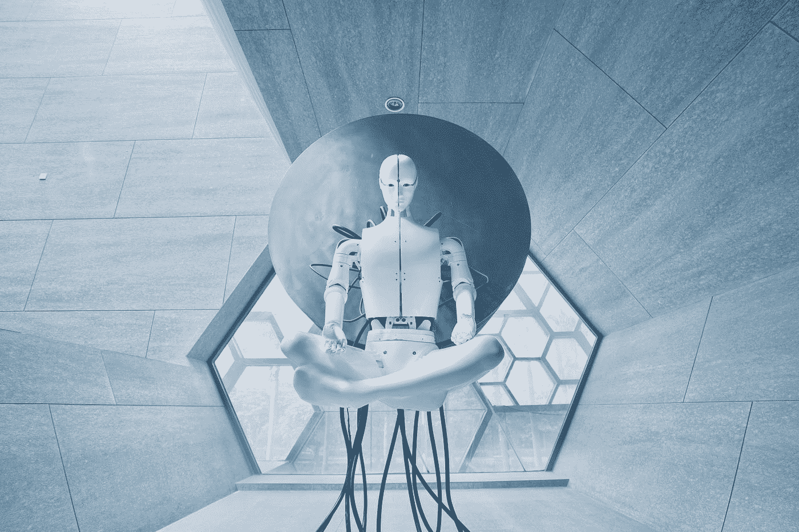

# 聊天 GPT 会取代你的程序员工作吗？

> 原文：<https://medium.com/codex/will-chat-gpt-replace-your-job-as-a-programmer-3492ad2cf449?source=collection_archive---------0----------------------->

[艾迪尔·华](https://unsplash.com/@aideal?utm_source=medium&utm_medium=referral)在 [Unsplash](https://unsplash.com?utm_source=medium&utm_medium=referral) 上的照片

## 这是我们应该问的问题吗？

现在我知道你一定听说过 Chat GPT，你一定听说过到处都在谈论这个令人印象深刻的未来人工智能将成为下一件大事，它将如何取代许多传统工作，以及你(作为一名程序员)应该如何找到其他事情做，因为你的工作可能不会持续很长时间。

照片由[你好我是 Nik](https://unsplash.com/@helloimnik?utm_source=medium&utm_medium=referral) 上 [Unsplash](https://unsplash.com?utm_source=medium&utm_medium=referral)

如果你像乔一样，你可能会感到害怕和担忧。我的意思是…如果一些聪明的软件能够在很短的时间内做我能做的事情，我为什么要学习如何编码呢？在正常情况下，我对这个问题的回答是不，但是在你来问我之前，让我告诉你为什么这个问题不容易回答。

# 聊天 GPT 是怎么回事？

很有可能，如果你点击了这篇文章，那么你可能已经知道什么是聊天 GPT3，并且你一定已经使用过它。但是万一你不知道那是什么，

*ChatGPT 是 OpenAI 开发的一个原型人工智能聊天机器人，专门进行对话。聊天机器人是一个大型语言模型，通过监督和强化学习技术进行微调。它基于 OpenAI 的 GPT-3.5 模型，是 GPT-3 的改进版本。*

简单来说，ChatGPT 是 OpenAI 在 11 月发布的一个 AI chatbot 系统，用于测试一个非常大的强大的 AI 系统可以完成什么。现在让我告诉你…它可以完成很多事情。

# 你为什么要在乎？

我认为现在更好的问题是，你为什么不在乎？我这样说是因为 ChatGPT 非常好，

你可以问任何问题，尽管你可能得不到答案。OpenAI 建议了几个类别，比如解释物理，征求生日派对的想法，以及获得编程帮助。

我让它写一首诗，它写了，尽管我不认为任何文学专家会对此印象深刻。然后我让它变得更刺激，瞧，ChatGPT 用诸如战场、肾上腺素、雷霆和冒险之类的词给它打气。

我记得当我第一次使用它时，我立刻感到继续学习编码的动力不足，因为这个软件对我扔给它的技术问题做出了很好的回答。

# 它会取代我的工作吗？

马丁·比约克在 [Unsplash](https://unsplash.com?utm_source=medium&utm_medium=referral) 上的照片

现在我可以继续不停地说这个软件有多神奇，但这并不是每个人心中的问题。看这个软件能多好的回答很多问题。最重要的问题是这会让我失业吗？

我对这个问题的回答是否定的，我为什么这么说呢？嗯…

程序员的工作不仅仅是写代码，程序员还必须处理将想法转化为期望的解决方案。我发现很难相信这个程序员能够有效地复制你那个价值百万美元的想法，就像你希望的那样。

另一点我想指出的是，聊天 GPT 不是无所不知。ChatGPT 可以给你错误的答案。有时，有益的是，它会特别提醒你它的缺点。这是如此普遍，以至于栈溢出已经禁止软件中的解决方案。它能以非常权威的方式给出你的问题的答案，但这并不意味着它们总是正确的。

所以你不应该被所有关于聊天 GPT 最终会如何取代你的工作的文章、点击诱饵视频和迷因所困扰。

# 结论

正如我在每一点上所陈述的，ChatGPT 是惊人的，可以用于很多事情。最重要的是把它看作是一个**工具**，而不是个人的替代品。

作为一名开发人员，您可以将它视为 GitHub copilot 的另一种形式，在构建样板代码或类似的东西时会派上用场。

审查 ChatGPT 答案的准确性需要一些工作，因为它只是给你一些没有链接或引用的原始文本。但它可能是有用的，在某些情况下会发人深省。你可能不会在谷歌搜索结果中直接看到类似 ChatGPT 的东西，但谷歌已经建立了自己的大型语言模型，并在搜索中广泛使用人工智能。

因此，ChatGPT 无疑展示了我们技术未来的发展方向。