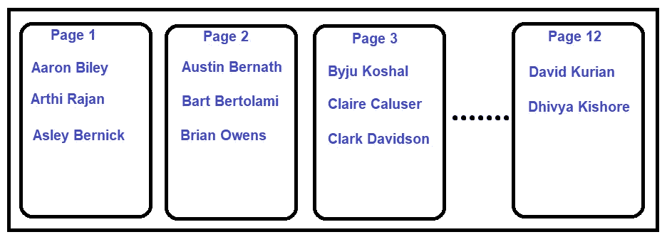

# 填充因子会解决 SQL Server 中的索引碎片问题吗？

> 原文：<https://medium.com/codex/will-fill-factor-solves-index-fragmentation-in-sql-server-421a1c4fa55e?source=collection_archive---------18----------------------->

碎片是指索引页中的空白空间以及索引页的逻辑和物理顺序的差异。请阅读我之前的[帖子](https://ganeshkamalakannan.medium.com/index-fragmentation-in-sql-server-83b0f8c5708e)来了解索引碎片以及它是如何发生的。

填充因子是解决索引碎片的建议之一。我想分享我在尝试解决索引碎片时使用填充因子的经验。

填充因子是我们可以在数据库级别或每个索引级别定义的索引属性之一。基本上，它是一个百分比，告诉 SQL Server 一个叶级页面可以用多少百分比的数据填充。

数据库级默认值为 0，这意味着 SQL Server 可以填充 8KB 的最大页面大小。假设我们将其值设置为 90%,那么 SQL Server 将只占用索引叶级别中每个页面的页面大小的 90%。

让我们以用于索引碎片的同一个例子来理解填充因子。有一个电话目录表，如图 1 所示。Ashlee Wilson 刚搬到这个城市，她的详细信息必须插入第 1 页 Arthi Rajan 和 Asley Bernick 之间。但是第 1 页上没有空间了，除了最后一页(第 9 页)索引中的所有页面都满了。SQL Server 将添加一个新页面，并将页面 1 的 50%移动到页面 10，这称为页面拆分。阿什莉·威尔逊将被添加到第 1 页。这会导致电话目录索引出现碎片。

图 1:电话目录索引

类似地，当 Arthi Rajan 得到另一部电话时，SQL Server 必须添加另一个页面，将第 1 页的 50%移动到第 10 页，并容纳第 1 页中的更改。这也会导致索引碎片。

让我们把这个索引的填充因子改为 75%，电话目录现在看起来像图 2。所有页面仅填充了 75%,数据分布在 12 个页面上。无论 Arthi Rajan 获得额外的电话还是 Ashlee Wilson 搬到城市，第 1 页都有空间，因此不需要拆分第 1 页数据。这避免了索引上的碎片。

图 2:填充系数为 75%的电话目录索引

以前，要从该索引中读取所有数据，SQL Server 必须读取 9 页，但在填充因子为 75%的情况下，SQL Server 必须读取额外的 3 页，这增加了查询的 IO 成本。同样，它会占用更多的内存。

使用 100%填充因子，当无序插入发生或数据更新扩展现有行数据时，会发生页拆分，这会降低数据插入或更新的性能。从磁盘读取数据时，外部碎片也可能会降低读取性能。

另一方面，较小的填充因子会增加页面空间的浪费，并使内部碎片永久化。由于每页上剩余的额外可用空间会占用更多的磁盘和内存空间，索引的总页数会增加。当从磁盘和内存中读取数据时，这会影响读取性能。像 stats update、backup 和 index rebuild \ index reorganize 这样的维护任务需要处理更多的页面，这增加了维护时间。

让我们讨论几个索引类型，看看我们应该对碎片有多担心，以及我们是否需要将填充因子作为一个选项来考虑。当聚集索引键是一个标识时，无序插入不会发生，外部碎片也不会由于插入而发生。如果表没有很多可变长度的列，换句话说，由于数据更新而导致的行扩展的可能性不大，由于更新而导致的碎片也将是最小的，如果我们有像索引重组和重建这样的常规索引维护策略，这不会降低读取性能。

当聚集索引键是一个像 GUID 这样的随机值时，将会发生无序插入，这会在页面填满时导致碎片。如果表中有许多可变长度的列，并且对现有行的数据更新很常见，那么它会扩展行大小，从而导致页拆分\索引碎片，在这种情况下，最好为将来的扩展留出一些空间。

选择填充因子时，我们应该小心百分比。正确的百分比没有硬性规定。这取决于索引类型以及数据更新会导致多少碎片，因此应该通过适当的测试在不同的百分比之间进行调整来确定。

让我们以这种方式结束这篇文章，填充因子将在一定程度上解决索引碎片问题，但它也有副作用。只有从磁盘读取数据时，外部碎片才会降低读取性能。从磁盘或内存中读取数据时，索引页中额外的可用空间会影响性能。如果我们试图回答“填充因子会解决索引碎片并提高性能吗？”最好的答案可能是，“这要看情况！”。