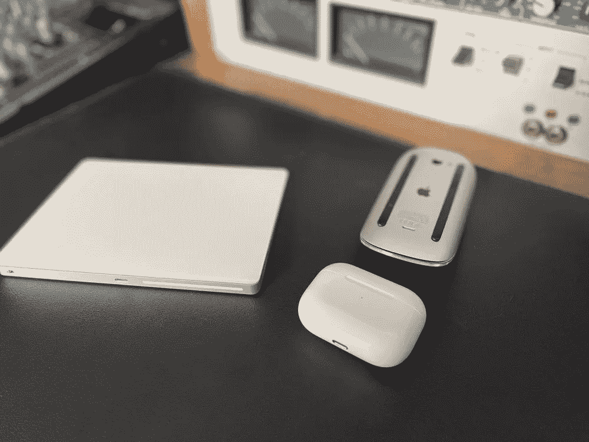
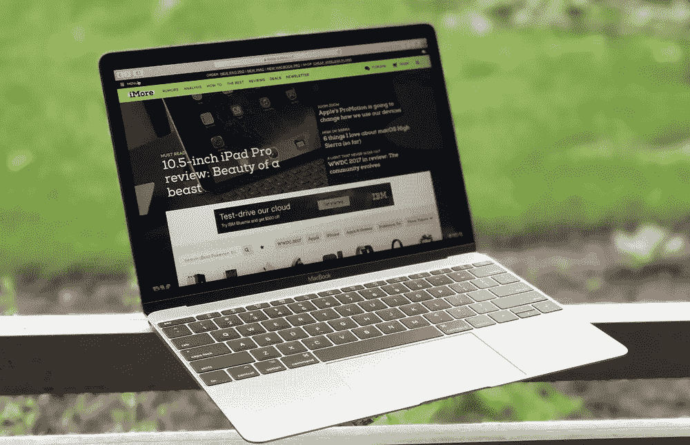
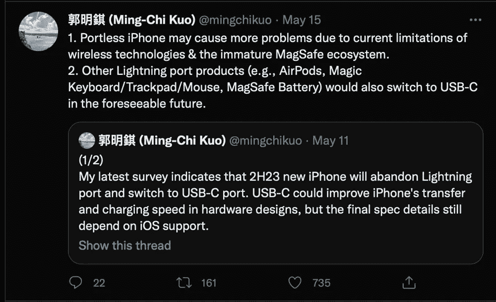
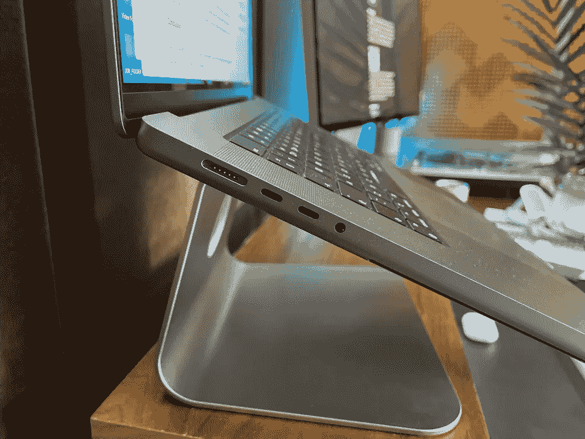
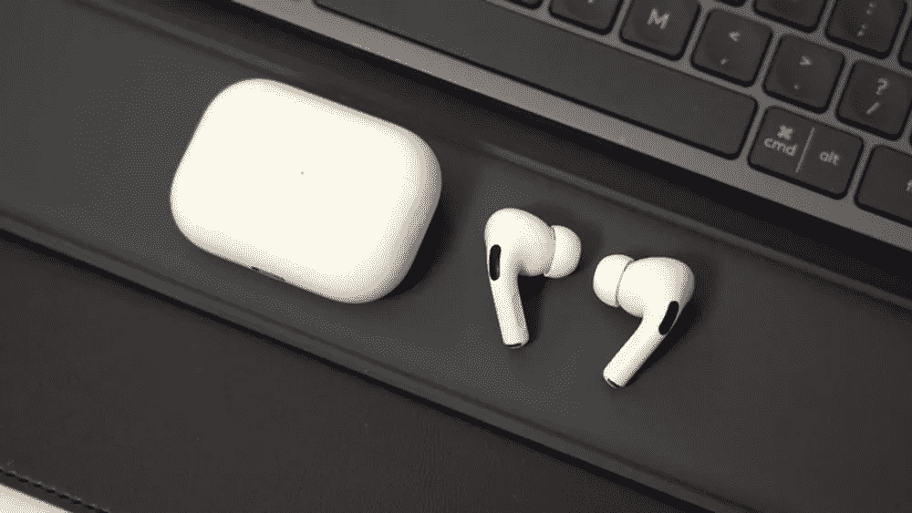

# iPhone 15 会是第一个带 USB-C 的吗？会让它变得完美吗？

> 原文：<https://medium.com/codex/will-iphone-15-be-the-1st-with-usb-c-will-it-make-it-perfect-1a007d72fb14?source=collection_archive---------10----------------------->

## 我们距离今年的 iPhone 14 发布还有好几个月的时间，但正如科技领域经常出现的情况一样，我们已经在关注 2023 年发布的 iPhone 可能会带来什么。具体会不会第一次把 USB-C 口带到 iPhone 上？

## 为什么要改变？

目前，众所周知，我们被 iPhone 上的 Lightning 端口卡住了。当然，对于苹果世界的我们来说，iPhone 并不是唯一拥有闪电的产品，但它确实是一种痛苦。从一个非常基本的角度来看，这意味着桌子上多了一根电缆。现在，对于像我这样的“洁癖者”来说，这是一个足够好的理由，我们应该摆脱它。但是，当然，还有其他更重要的原因需要改变，比如数据传输速度和收费。稍后会详细介绍。

## 无线的未来

当 AirPods 发布时，我们第一次听到苹果谈论他们对无线未来的愿景。不清楚他们是否只是在谈论他们业务中的耳机部分是免费的，还是全部免费。苹果，当然是在 Jony Ive 时代，当设计有时比功能更重要时，端口是成对的。还记得无端口 MacBook 吗？未来是隔空投送。如今，人们仍在谈论对无端口 iPhone 的渴望，但我认为这还没有成为现实。

 [## 证明苹果生态系统伟大的 6 个理由

### 我们都听说过生态系统——今天我突然意识到它是多么真实

medium.com](/codex/6-reasons-that-prove-the-apple-ecosystem-is-great-bf5ee37007f2) 

## 为什么现在用 USB-C？

受信任的泄密者郭明志最近在推特上说，闪电端口将在 2023 年下半年被解除职责，转而支持 USB-C。然而，我不认为这是苹果倾听和反应的情况，而是它的手臂被强行扭曲。[欧盟对苹果使用其专有的 Lightning 线缆不太感兴趣，并正在推动所有小型设备尽快使用标准的 USB-C 端口。苹果显然有足够的资金进行政治游说，但是，压力越来越大，而且不仅仅来自欧盟。澳大利亚、英国、韩国都对苹果和闪电港表示担忧。如果他们明年真的停止使用这个新港口，那么后果可能是广泛的。](https://www.europarl.europa.eu/news/de/press-room/20220412IPR27115/common-charger-meps-agree-on-proposal-to-reduce-electronic-waste)

 [## 让我的 M1·马克斯 MacBook 成为头号创意机器

### 我的 M1 Max MacBook Pro 上必备的五款创意应用

medium.com](/codex/making-my-m1-max-macbook-the-1-creative-machine-aa4483668c63) 

## 不全是关于 iPhone

抛弃 Lightning 而支持 USB-C 听起来很简单，但事实并非如此。它会出现在明年的专业 iPhones 上，还是会出现在整个系列中？苹果产品线中目前使用 Lightning 的其他“神奇”产品呢？我们不得不考虑神奇的键盘和鼠标，AirPods，AirPods Max，Magic Track Pad，所有这些都是由闪电推动的。

如果苹果被迫改变，有一个快速简单的解决办法，他们可能会探索，以“躲避子弹”。他们可以简单地为每部 iPhone 配备一个适配器/加密狗。他们也有这方面的形式。例如，在法国，他们被告知 iPhone 必须附带耳机，他们只需将一副旧的有线耳机附在盒子上。这是另一场政治风暴的快速解决方案。不过，他们会用 USB-C 做这个吗？我对此表示怀疑，因为这真的不符合他们圆滑、时尚的生活方式形象。挂在 1300 iPhone 14 背面的加密狗并不酷。无论如何，我认为当新的立法通过时，它将声明港口必须是完整的。

然后就是区域 iPhone 的说法。因此，在欧盟出售的手机将拥有 USB-C，而世界其他地区保留 Lightning。同样，这似乎也不太可能。我认为，单独的加工成本会排除这种可能性。

苹果游说反对维修权，但最终不得不默许。变化会到来，那么是以什么形式呢？

 [## Premiere Pro 和 M1 MacBook Pro 工作流程

### 最新的 M1 MacBook Pro 和 Adobe 的 Premiere Pro 配合得如何？

medium.com](/codex/premiere-pro-and-m1-macbook-pro-workflow-ae62d1be343c) 

## 对速度的需求

Lightning 的数据传输速度低得可怜，只有 480Mbps，而 USB-C 可以达到 40Gbs！充电也是如此。我刚买了一台新的 MacBook Pro，上面堆满了 USB-C 端口。然而，刚刚在 MBP 上花了 3500 多英镑，我被迫又花了 25 英镑买了一根 Lightning > USB-C 线，以便在办公桌上给我的手机充电。

不过，Lightning 的最大瓶颈是数据传输。我大约一周三次感到这种疼痛。在我的工作室有了摄像机之前，我的[频道](https://www.youtube.com/c/DavidLewistalkingtechandaudio)的所有视频都是以 24fps、10 位 Log V3 拍摄的。这意味着文件是*大*。我经常需要从 iPhone 中导出和传输一个 20Gbs 或更多的文件。隔空投送应付不来，所以我用了闪电线和 Mac 上的图像捕捉。它确实起作用了……但是*非常非常*慢。这种情况会变得更糟。你可能会说是时候我买一台相机了…我很快就会买的，但是同样地，有传言说苹果无论如何都要提高标准，8K 视频即将问世。我们已经有了 ProRes 文件，所以苹果需要解决这个问题。他们必须想办法从我们的设备上获取这些海量文件。USB-C 及其固有的减速带似乎是答案。在某个时候，他们将不得不咬紧牙关，而且似乎是，宜早不宜迟。

## 无港无意义

因此，渴望一个没有电缆和端口的 iPhone，尽管我很喜欢它(洁癖的我！)，似乎因为一个简单的事实而被推翻——从 iPhone 到桌面的数据传输和大文件获取。苹果正在让他们的相机越来越强大，所以一个无端口的 iPhone 似乎是一种浪费…除非…

## 结论

我不是工程师，我肯定我会让自己跌倒，但我有一个想法。iPhone 上的 SD 卡槽怎么样？只是一个想法。

如果你知道为什么不能这样做，请告诉我，我洗耳恭听。

## 在你走之前

[**加入我的幕后邮件列表**](https://www.talkingtechandaudio.com)

*原载于 2022 年 5 月 25 日 https://talkingtechandaudio.com***。**