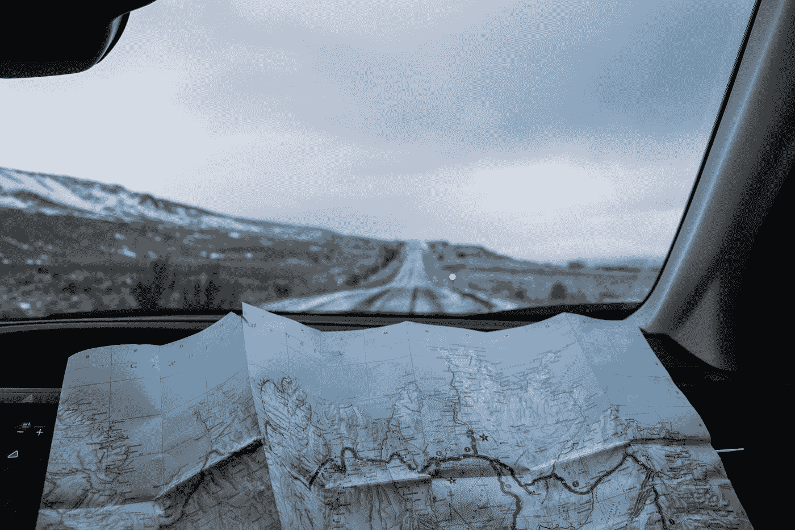

# 原生地图会与竞争对手谷歌地图不相上下吗？

> 原文：<https://medium.com/codex/will-native-maps-be-on-par-with-competing-google-maps-4061652a447c?source=collection_archive---------3----------------------->

## 他们没有多大机会

在 [Unsplash](https://unsplash.com?utm_source=medium&utm_medium=referral) 上由 [Tabea Schimpf](https://unsplash.com/fr/@tabeaschimpf?utm_source=medium&utm_medium=referral) 拍摄的照片

如今，几乎每部智能手机上都可以找到地图应用。这是一个非常重要的软件，它可以让你更容易找到周围的路，充当导航系统，并确保你不会迷路。