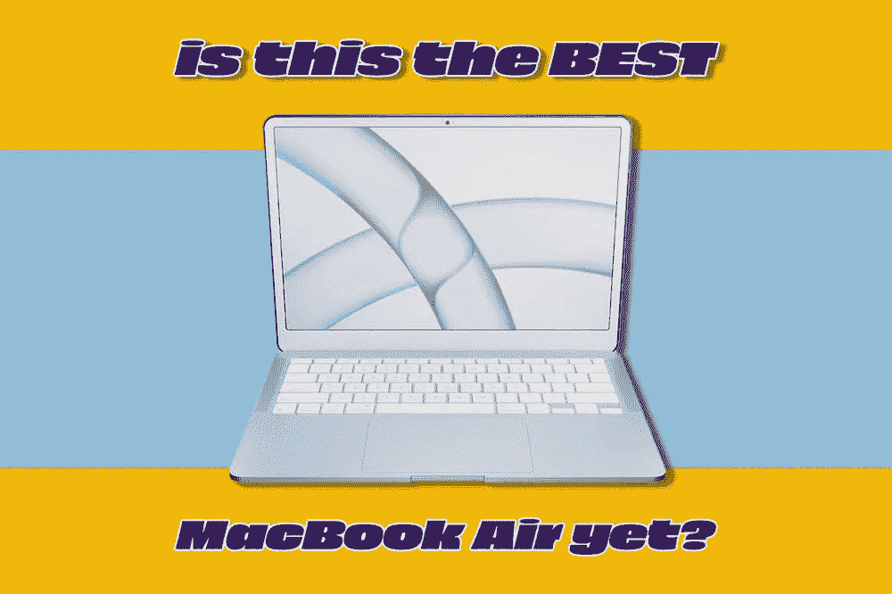
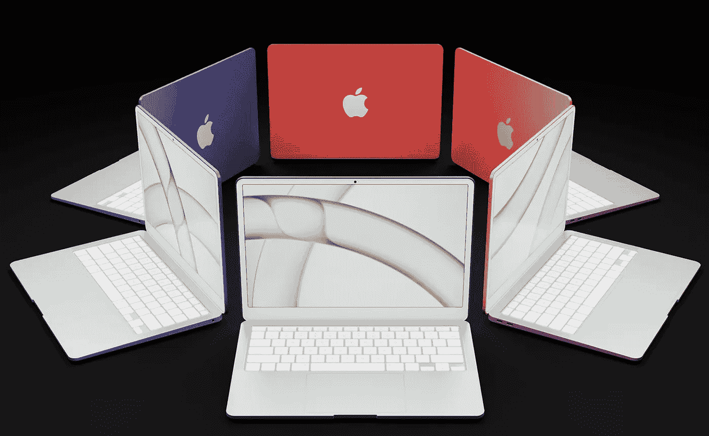
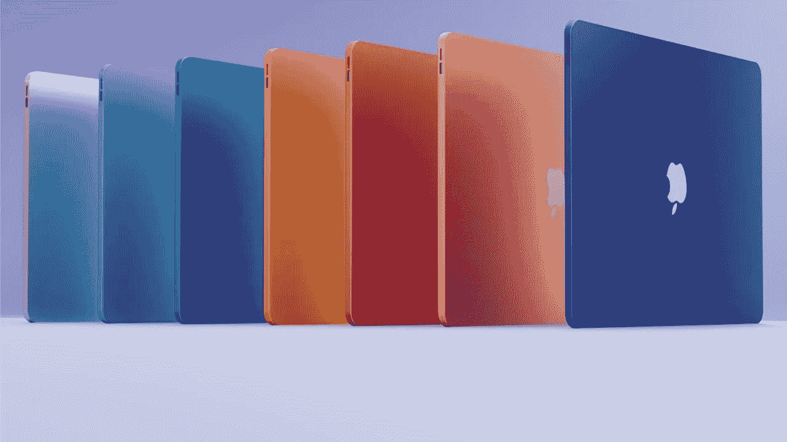
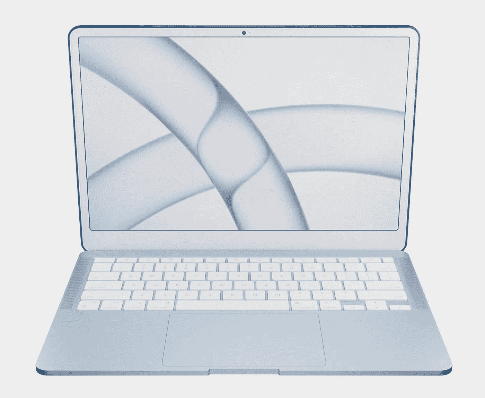
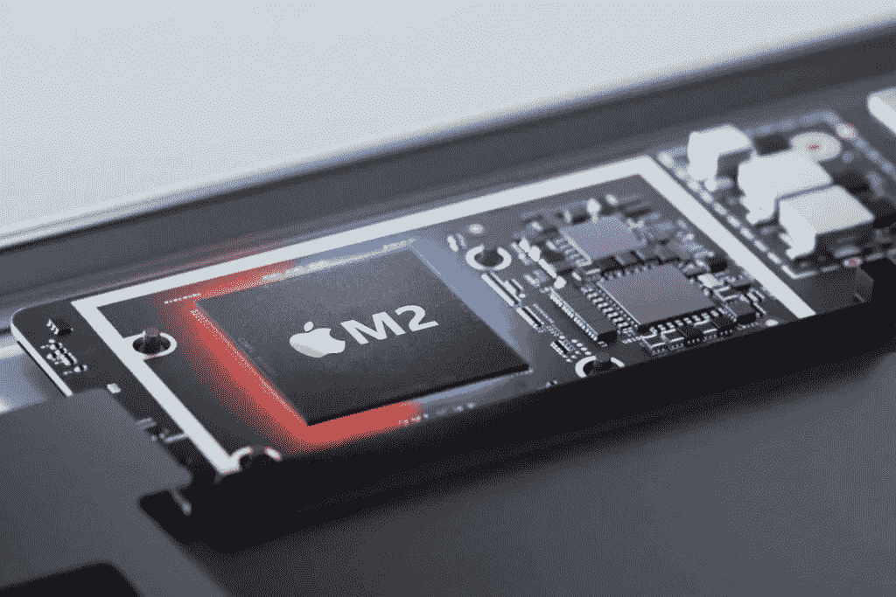
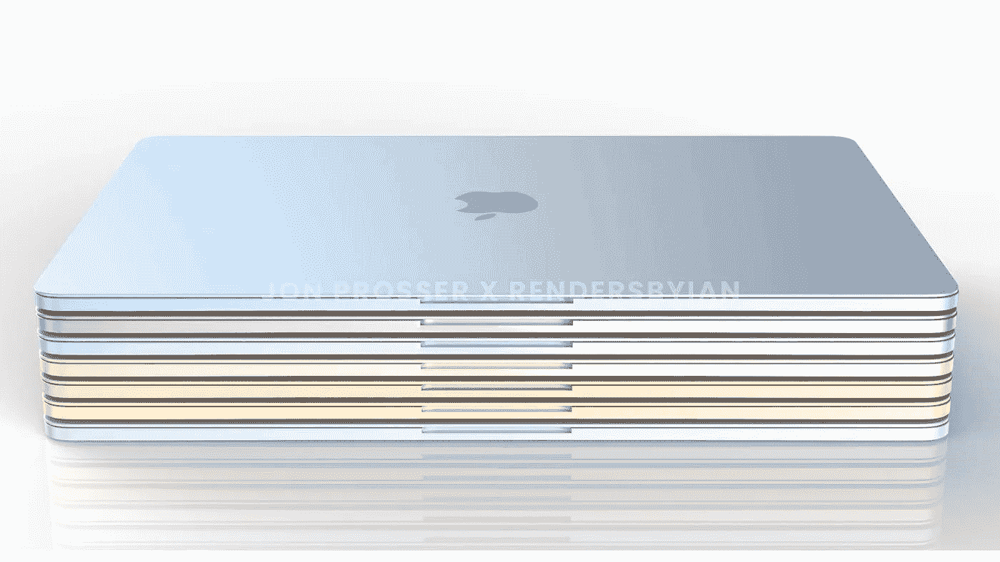
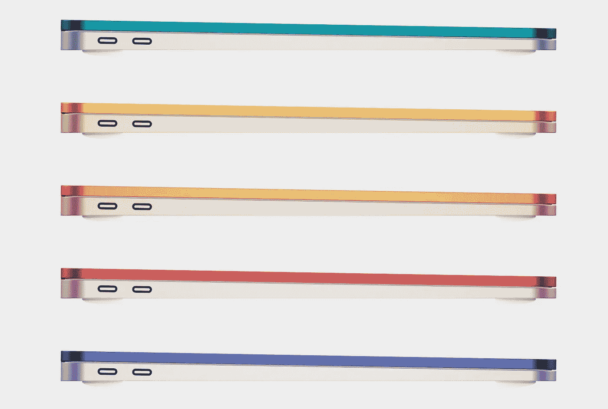

# 这会是迄今为止最好的 MacBook Air 吗？

> 原文：<https://medium.com/codex/will-this-be-the-best-macbook-air-yet-eaf621d8dfaf?source=collection_archive---------14----------------------->

## 为什么 M2 MacBook Air 可以改变一切

M2 MacBook Air

上周，我孤注一掷地说，我相信新款 M2 MacBook Air 将在 WWDC 展出，并很快上市。作为该公司销量最大的 Mac 电脑，让这台机器变得正确非常重要。让我们进一步看看我们认为今年可能会推出的全新 M2 MacBook Pro。

负十六播客

## 等待是漫长的

M2 MacBook Air 上的粉色选项

这是任何 Mac 保持的最长时间，基本上没有变化。距离上次翻新已经过去了 500 多天，MacBook Air 也该更新换代了。尽管持续的芯片短缺，以及客户交付时间的增加，我认为苹果正在为最令人兴奋的发布做准备，这将是非常繁忙的一年。随着我们越来越接近发布日期，我们每周都在了解更多关于它将运行的芯片、设计和屏幕的信息。

## 设计

图片来自 [@AndreaCopellino](http://twitter.com/AndreaCopellino)

自从去年[乔恩·普罗瑟](https://twitter.com/jon_prosser)泄露图片以来，有一个不变的事实一直存在，那就是今年 MacBook Air 的外观。它将脱离自 2008 年 1 月问世以来一直是 Air 标志性外观的臭名昭著的泪滴形设计。但是对于这次迭代，他们将会有一个更符合当前 MacBook 系列的外观；即方方正正、更加方正的外观。虽然风格理念将类似于 MacBook Pros，但预计它会更时尚、更轻便。方形设计的部分原因是为了帮助促进 MagSafe 充电的回归。新款 MacBook Air 上还将至少有两个 Thunderbolt USB-C 端口和一个耳机插孔，以完成其 IO。虽然更方更厚，但它实际上会比以前更光滑更轻，在你的桌子上占据更少的空间。我想象它会在现在的 Air 和 2019 年停产的超轻 MacBook 之间有所感觉和权衡。

 [## iPhone 14——最新独家新闻

### 颜色，相机，电缆，什么都没有！

medium.com](/codex/iphone-14-the-latest-scoop-f1ffb021d571) 

## 颜色来了

图片由 [@appleinsider](http://twitter.com/appleinsider) 提供

另一个似乎属实的传言是，彩色将首次出现在 M2 MacBook Air 上。我认为我们可以期待多种颜色的选择，类似于 M1 iMac。上一次我们在苹果的笔记本电脑上看到任何颜色，是在 1999 年的 iBook 上。然而，这一次，将有更广泛的颜色，将这款笔记本电脑直接瞄准其更年轻的消费者群体。回到那些旧的 MacBooks，我不会惊讶地发现一个白色键盘和边框。Air 的屏幕尺寸有望从 13.3 英寸增加到 13.6 英寸，同时仍保持其较小的外形。这将通过减小边框尺寸来实现，但苹果从未推出过带有白色边框*和*凹口的 Mac，所以他们现在会打破传统吗？由于这款机器没有 Face ID，只有一个 1080P 摄像头，所以*有可能*缩小的缺口看起来不会太明显。如果是这样的话，我们知道一流的警察将会出动！

## 该显示器

图片来自 [@AndreaCopellino](http://twitter.com/AndreaCopellino)

我刚刚提到新款 MacBook Air 的显示屏会更大。然而，为了降低成本，我们可能还不会看到迷你 LED 面板，尤其是供应链问题仍在继续。至少在发布时，它将是相同的 LCD/LED 面板，这是好消息*和坏消息*。显然，这意味着不会提升到华丽的 120Hz 刷新率面板，但它会将成本保持在 999 美元的起点，这在该型号上是有意义的。

 [## HomePod 成为一个收藏家的项目&一些好的闪电电缆新闻！

### 苹果视图综述

medium.com](/codex/homepod-becomes-a-collectors-item-some-good-lightning-cable-news-76b0399bbb14) 

## M2 芯片

苹果的 M2 芯片

我们开始了解新 M2 芯片的一些细节，这将是最新 MacBook Air 的核心。与 M1 一样，它将拥有四个高性能 CPU 内核和四个高能效 CPU 性能内核，保持八个内核的总数量不变。然而，预计会有更大的*性价比*，因为这款芯片将基于 A15 芯片。A15 拥有更高的整体时钟频率，这意味着每个内核将更高效、更强大、更快。我们甚至可以看到一些多核任务的速度达到或超过更昂贵的 Mac Studio 及其 M1 超芯片。GPU 将提升到 9 或 10 个内核，再次像 CPU 一样更强更快。有一段时间，有一些关于 15 英寸 MacBook Air 上市的传言。鉴于供应链问题，我刚才提到过，*如果*这是一个选项，我会说我们最早可以预计到 2023 年中期。

## 有效性

图片来自 [@jon_prosser](http://twitter.com/jon_prosser)

很快！鉴于这种机器的大部分市场将是学生，尽快发布这种笔记本电脑是有意义的。虽然我们可以预计这些新 MAC 电脑在到达客户手中时会有很长的延迟，但它们越早发布，订单就能越早下，并且有希望在秋季返校之前开始交付。因此，期待看到 MacBook Air 宣布于 6 月 6 日在 WWDC 发布*和*。我敢肯定，苹果现在将处于新的 M2 MacBook Air 准备就绪的位置，所以如果他们在供应链上运气好，夏季而不是秋季发布似乎是可行的。

 [## wi-fi 去哪了？

### 苹果有许多依赖 wi-fi 的产品，但他们不再有路由器。为什么？

medium.com](/codex/where-did-the-wi-fi-go-15ecea31a89e) 

## 结束的

图片来自 [@AndreaCopellino](http://twitter.com/AndreaCopellino)

MacBook Air 是我拥有的第一台 Mac 电脑，因此它将永远在我心中占有一席之地。当我女儿还是学生的时候，我也给她买了一对，帮助她通过考试和上大学。可以肯定地说，这款入门级 MacBook Air 对我来说很特别。在所有将于今年升级或发布的 Mac 电脑中，这可能是我最兴奋的一款。虽然我现在不在市场上，但凭借它们明亮的颜色、新的设计、改进的网络摄像头和 M2 芯片，MacBook Air 的遗产将在这个新机身中长盛不衰。

*你是 MacBook Air 用户吗？您打算换出、更换或升级吗？也许你正考虑从个人电脑上来看看苹果芯片有什么大惊小怪的。我很想知道你是否和我一样期待 M2 MacBook Air 的发布。*

## 在你走之前

我只是高端博客网站 Medium 的众多作者之一。这是如此好的价值，你可以加入这里[https://medium.com/membership](https://medium.com/membership)

加入我的幕后邮件[列表](https://www.talkingtechandaudio.com/)

最初发表于 2022 年 4 月 26 日 https://www.talkingtechandaudio.com/blog。