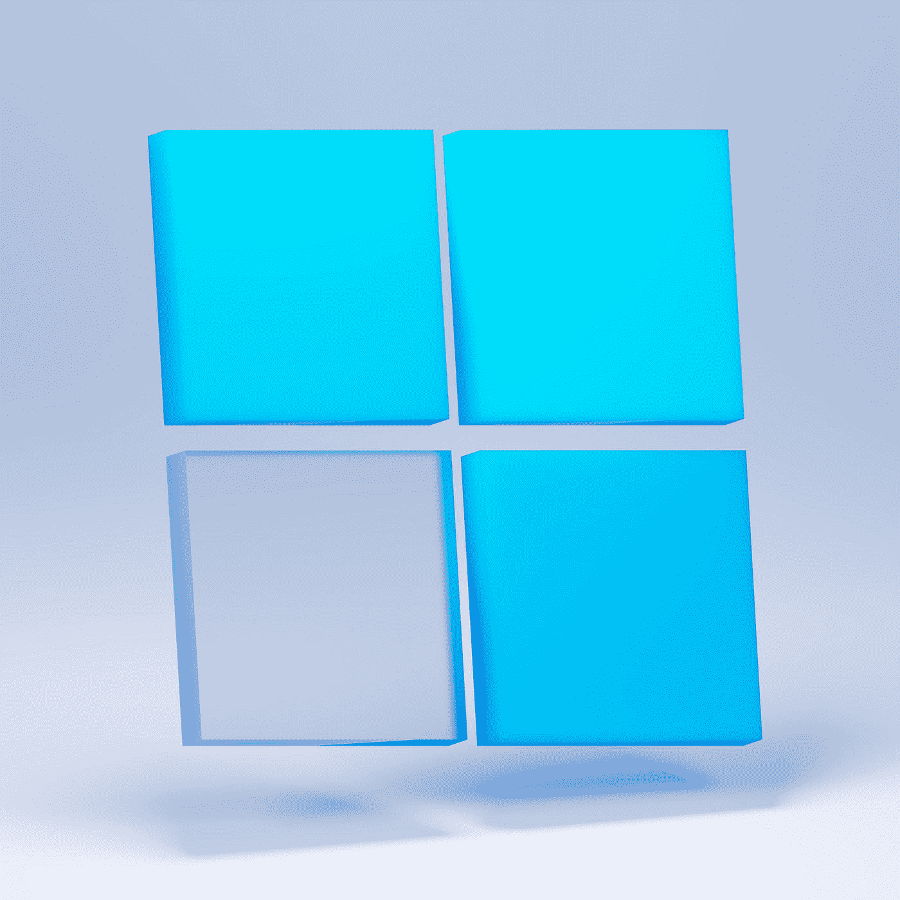

# 窗户会完工吗？

> 原文：<https://medium.com/codex/will-windows-ever-be-finished-426e109c5034?source=collection_archive---------10----------------------->

## 新鞋里的旧宝石

## 还是说它太大了，无法彻底改造？

照片由 [Unsplash](https://unsplash.com/photos/qAR2ndjOAsE) 上的 [Sunder Muthukumaran](https://unsplash.com/@sunder_2k25) 拍摄

Windows 操作系统已经存在很长时间了。自从 1985 年[发布第一个正式版本](https://en.wikipedia.org/wiki/Windows_1.0x)以来，世界和 Windows 都发生了很大的变化。但是你不会相信在里面还能找到多少旧的东西。有些在引擎盖下，我们看不到…