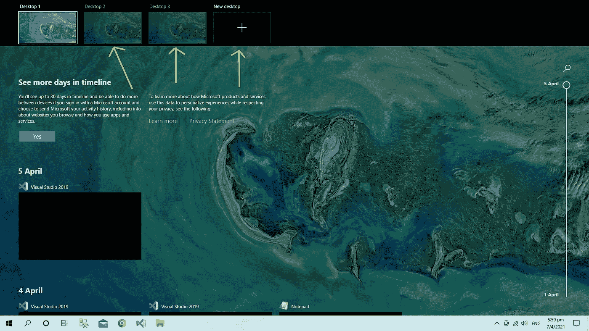
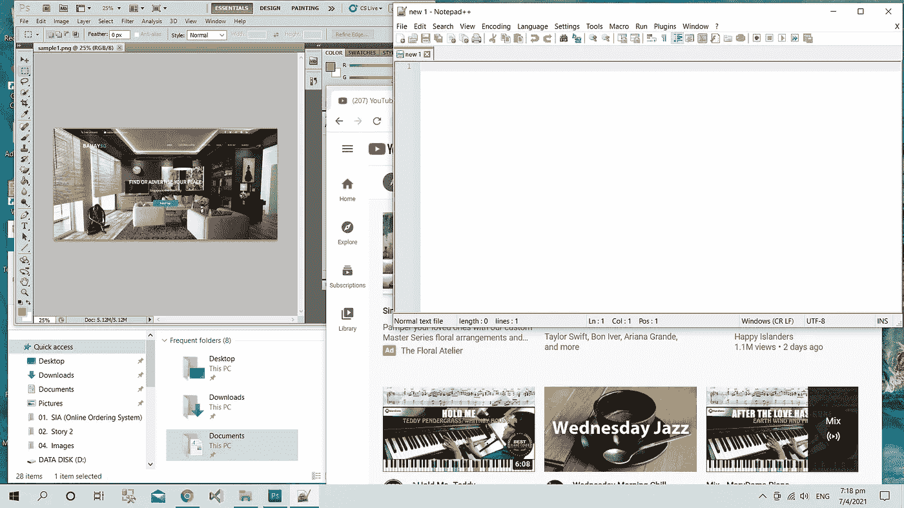
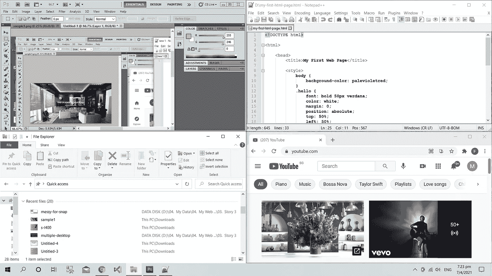
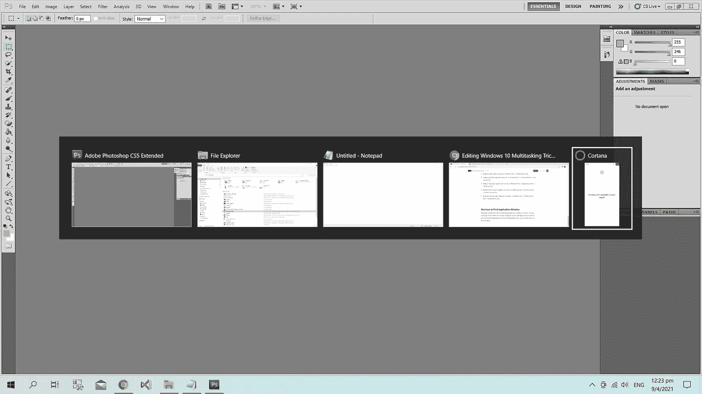
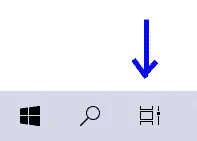
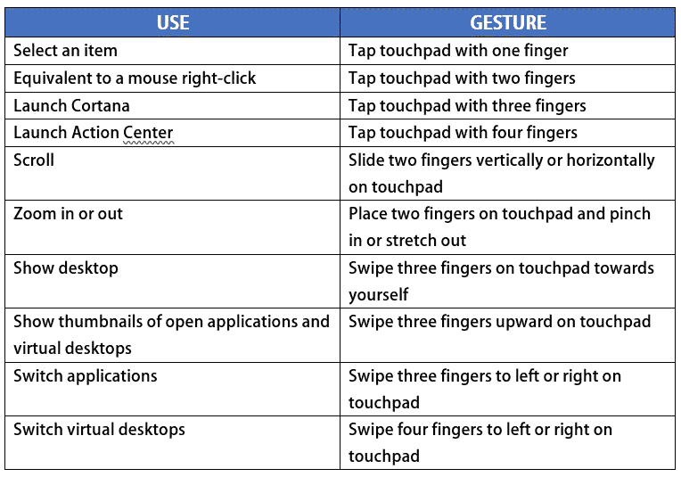

# 你应该知道的 Windows 10 多任务处理技巧

> 原文：<https://medium.com/codex/windows-10-multitasking-tricks-you-should-know-feedfff95518?source=collection_archive---------11----------------------->

## 不那么秘密的秘密。

如果你电脑的操作系统是 Windows 10，这个故事绝对适合你！否则，请继续阅读，因为我相信总有一天你会需要坐在 Windows 10 前:)。

由 [Ashkan Forouzani](https://unsplash.com/@ashkfor121?utm_source=medium&utm_medium=referral) 在 [Unsplash](https://unsplash.com?utm_source=medium&utm_medium=referral) 上拍摄

你是使用多台电脑完成不同任务的人吗？或者，您是否希望拥有另一台计算机来执行另一种任务？如果你对我提出的任何问题的答案是“是”，让我与你分享一些 Windows 10 的提示和技巧，让你在一台电脑上进行多任务处理，同时像拥有多台电脑一样工作。学会它们之后，你一定会很高兴只用一台机器工作。

# 使用多个虚拟桌面管理您的任务

借助 Windows 10，您可以在计算机上虚拟创建多个桌面。实际上，可以把它想象成一台笔记本电脑中有多台笔记本电脑。这在多任务处理不同类型的任务时很有用。例如，假设你同时在做三个不同的项目。借助虚拟桌面，您可以在单独的桌面上处理每个项目。这种方法有助于组织您的任务，并可以帮助您有效地工作。

**如何拥有多个虚拟桌面？**

要添加虚拟桌面，请按下 Windows 上的*键+ ***Tab*** 键。然后，您会在屏幕顶部看到额外的桌面选项，如下所示。根据需要选择或添加新桌面。*

**

*添加虚拟桌面*

*要切换桌面，请用四个手指在触摸板上左右滑动。*

# *使用 Snap 组织您的 Windows 应用程序*

*如果您正在处理几个应用程序，并且您的桌面变成了类似于下图的窗口堆栈，您可以使用“吸附”来快速组织它们。*

**

*这个桌面需要快照！*

*啪的一声，瞧！以下是您的新桌面视图。在应用程序被组织并彼此并排的地方，所有这些都被很好地、平等地捕捉到了。*

**

*快照后的 Windows 桌面*

*以下是捕捉应用程序的快捷方式。*

***靠左对齐(屏幕的一半)***

*   *Windows 键+左箭头键*
*   *或者，将应用程序拖到屏幕的最左侧*

***向右对齐(屏幕的一半)***

*   *Windows 键+右箭头键*
*   *或者，将应用程序拖到屏幕的最右侧*

***贴紧左上角(屏幕的四分之一)***

*   *Windows 键+左箭头键+上箭头键*
*   *或者，将应用程序拖到屏幕的左上角*

***靠右上方(屏幕的四分之一)***

*   *Windows 键+右箭头键+上箭头键*
*   *或者，将应用程序拖到屏幕的右上角*

***贴紧左下角(屏幕的四分之一)***

*   *Windows 键+左箭头键+下箭头键*
*   *或者，将应用程序拖到屏幕的左下角*

***靠右下方(屏幕的四分之一)***

*   *Windows 键+右箭头键+下箭头键*
*   *或者，将应用程序拖到屏幕的右下角*

# *查找应用程序窗口的快捷方式*

*工作和启动了大量的应用程序，但再也找不到你目前需要的一个？不要紧张！在触摸板上水平滑动三个手指，你将看到桌面上所有打开的应用程序的缩略图。*

**

*缩略图视图*

*查看应用程序缩略图的另外两种方法是:*

1.  ****Windows*** 键+ ***Tab*** 键*
2.  *点击 ***任务视图*** 按钮(在屏幕左下方*搜索*按钮旁边)*

**

*任务视图按钮*

# ***触摸板手势***

*Windows 10 上的触摸板手势是现代功能，当你没有鼠标设备时会很方便。而且，它们使用起来也很有趣！*

*以下是 Windows 10 上可用的触摸板手势。*

**

*Windows 10 触摸板手势*

*那里！希望你会发现这些 Windows 10 的小技巧很有用。*

*多任务快乐！*