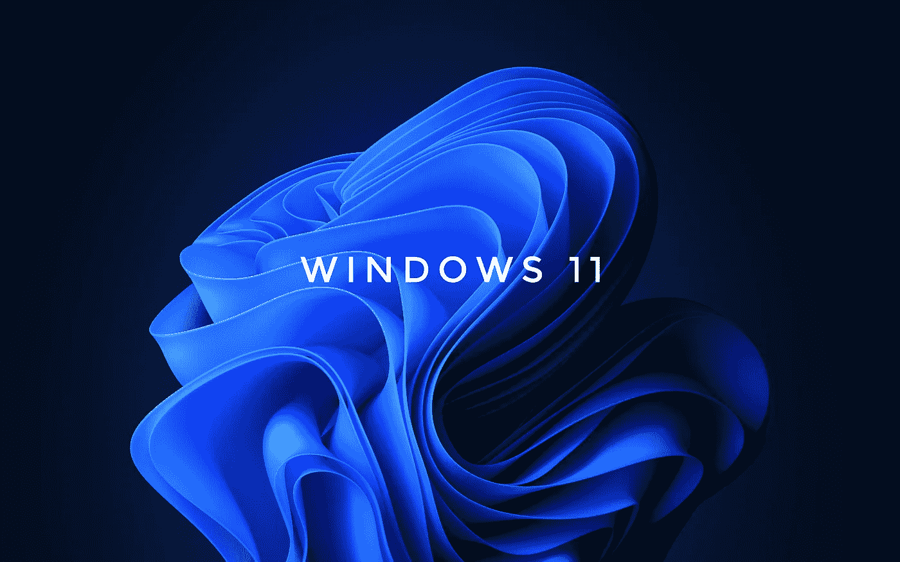

# Windows 11 是新微软的反映

> 原文：<https://medium.com/codex/windows-11-is-a-reflection-of-the-new-microsoft-6ee97f2d5dde?source=collection_archive---------7----------------------->

有时候，一个产品很明显是制造它的公司的反映。当一加去年发布诺德(Nord)时，这款设备似乎证明了该公司最初的理念，即以极具竞争力的价格提供高质量的产品，这让你不禁会问为什么类似的产品如此昂贵。这是一款让人感觉像是[卡尔·裴](https://twitter.com/getpeid?ref_src=twsrc%5Egoogle%7Ctwcamp%5Eserp%7Ctwgr%5Eauthor)的产品，他是……