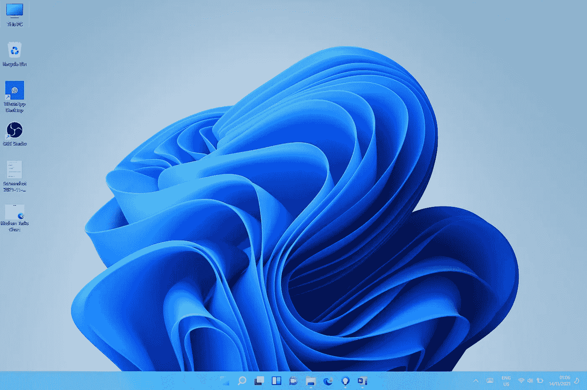

# Windows 11:好、坏、丑

> 原文：<https://medium.com/codex/windows-11-the-good-the-bad-and-the-ugly-fc9c003d6079?source=collection_archive---------4----------------------->

全新的 Windows 11

微软在新的 Windows 11 中并没有完全兑现“让我更接近我所爱的东西”的承诺。新的操作系统有它的粉丝，但它并没有得到大多数用户的好评，微软正在摸索。

不过，值得表扬的是，在过去的几个月里，微软一直在努力修复主要的错误，在我写这篇文章的时候，第一次重大更新…