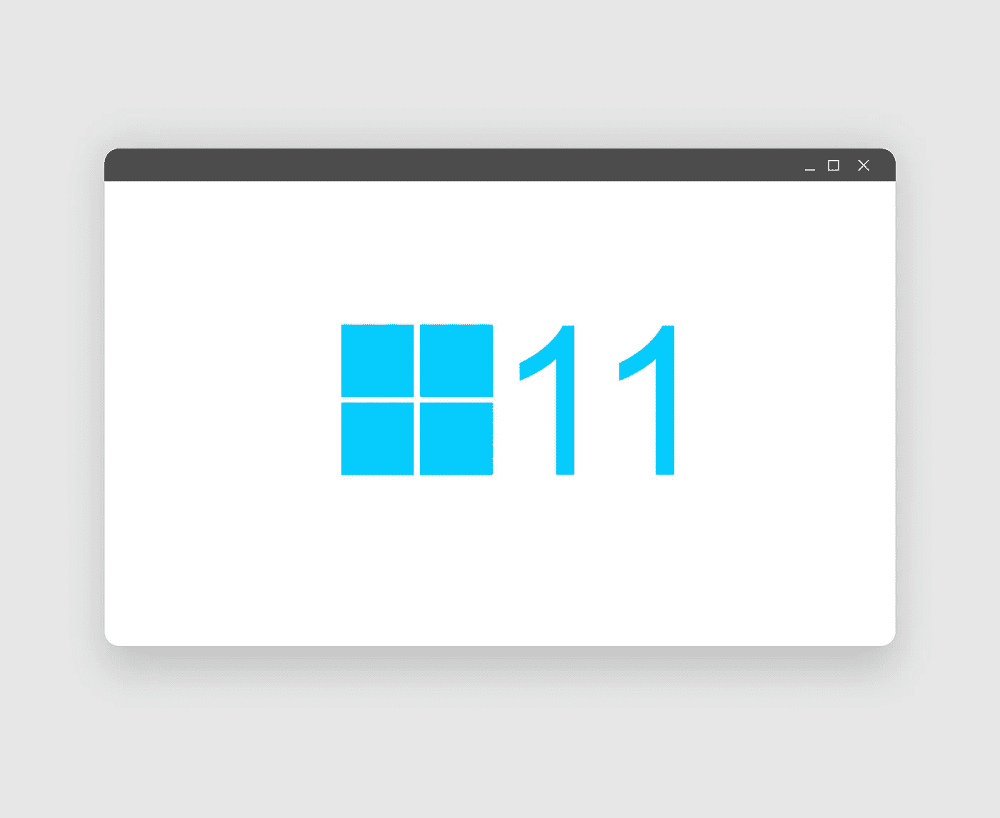

# Windows 11 会为不支持的硬件添加水印，如何去除

> 原文：<https://medium.com/codex/windows-11-will-add-watermark-for-unsupported-hardware-how-to-remove-it-c908676e2e2c?source=collection_archive---------13----------------------->

## 微软不希望你使用变通方法让 Windows 11 在旧电脑上运行。

图片:[https://pix abay . com/illustrations/windows-11-windows-Microsoft-6377156/](https://pixabay.com/illustrations/windows-11-windows-microsoft-6377156/)

水印不仅仅是为微软的未激活或 [**盗版**](https://www.engadget.com/2015-05-15-pirated-windows-10.html) Windows 版本保留的。 [**Verge**](https://www.theverge.com/22988775/microsoft-windows-11-desktop-watermark-unsupported-hardware) 发现，如果你利用变通办法在 [**不兼容的**](https://www.engadget.com/microsoft-windows-11-supported-processors-update-175544403.html) 上运行 Windows 11