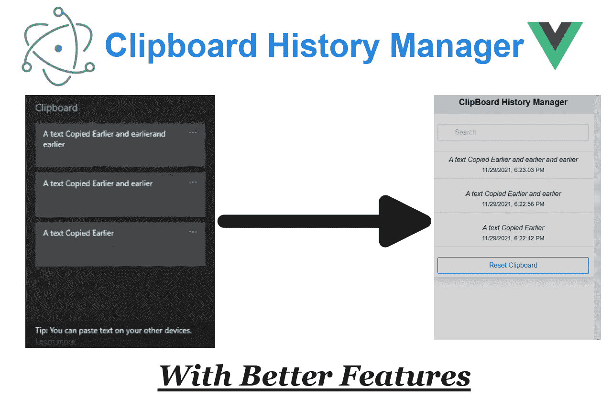
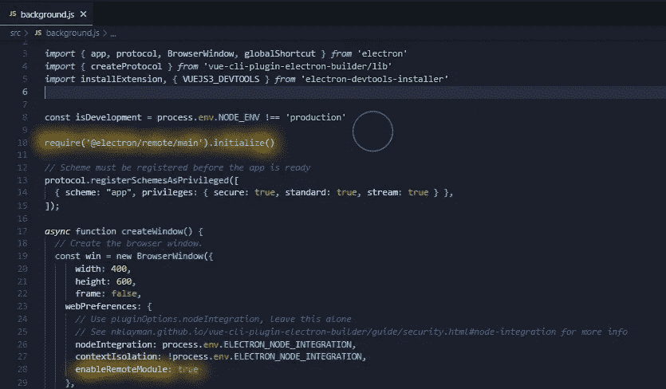
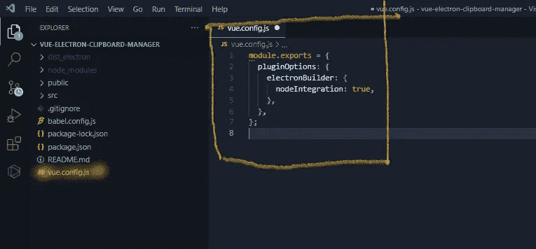

# 使用 Electron 和 Vue.js 克隆 Windows 剪贴板历史记录

> 原文：<https://medium.com/codex/windows-clipboard-history-clone-using-electron-and-vue-js-587b658dff33?source=collection_archive---------9----------------------->

## 为什么不用功能更好的 Electron js 和 Vue.js +创建自己的 Windows 剪贴板历史克隆呢？



# 注意

第 2 部分将很快上传。另外，如果你想查看 Github 代码，在这里查看。此外，如果你想尝试这个克隆版本，请检查 [Github 版本](https://github.com/harsh317/Windows-Clipboard-History-Clone/releases/tag/v1.0.0)，[安装可执行文件](https://github.com/harsh317/Windows-Clipboard-History-Clone/releases/download/v1.0.0/ClipBoard.Manager.Setup.0.1.0.exe)并尝试应用程序。*只在 GitHub 或这里发布这个克隆的问题和改进，然后我们可以改进这个克隆*

大家好，欢迎来到另一个克隆人。正如标题所言，我们今天将使用 Electron.js 和 Vue.js 构建 *Windows 剪贴板历史克隆*。我们还将把应用程序打包成可执行文件，以便我们可以在任何地方使用它。但一如既往，让我们看看我们的应用程序功能和视频。

# 应用程序功能

所以看完这个视频后，你可能已经对这个项目的所有功能有了一个概念，但这是这个应用程序的一些功能以及如何使用这个应用程序:

1.  安装应用程序→启动应用程序
2.  *应用程序启动时，您会听到声音*
3.  *Ctrl + M 隐藏/显示应用*
4.  复制所有需要的文本
5.  复制后，转到您想要使用复制历史的文档
6.  按下 **Ctrl+M 查看您的历史记录**
7.  单击历史记录进行复制，然后按 Ctrl+v 进行粘贴
8.  您可以**搜索您的历史记录**
9.  你会看到物品被复制的日期
10.  ***你所有的历史记录都保存在 nedb 数据库*** 中，所以即使你在 2 天后打开你的应用，你的历史记录也会在那里。

# 几个音符

有趣吧？在这篇文章中，我们将安装我们将要使用的所有模块，并初始化我们的项目。**有** **将是一个 2 部分的项目，这将是所有的代码及其解释**。我个人更喜欢使用 [Visual Studio 代码](https://code.visualstudio.com/download)，但是你可以使用任何你选择的 IDE。这样，让我们快速安装我们需要的包，然后初始化我们的应用程序。

# 初始化我们的项目

首先，让我们快速安装并创建一个 vue-cli 项目，为此，我们需要安装它。

```
npm install -g @vue/cli
```

现在，让我们通过以下方式初始化我们的 vue 项目:

```
vue create vue-electron-clipboard-manager
cd vue-electron-clipboard-manager
```

一旦建立了 vue 项目，我们就可以使用`Vue-electron-cli-plugin`来配置 electron。它基本上用电子做了所有繁重的工作。所以，添加这个神奇的命令

```
vue add electron-build
```

在撰写这篇文章的时候，我的 Electron.js 版本是`13.0.0`，vue 版本是`4.5.15\.` ，我们已经准备好安装我们需要的包了

# 软件包安装

1.  [**自举**](https://getbootstrap.com/) ***或*** [**布尔玛**](https://bulma.io/)

我将使用布尔玛来设计我的应用程序，但你可以使用任何 Ui 框架，如`bootstrap`来制作你的应用程序。如果你想就任何样式给出建议/错误，请在 Github 中写下。所以，让我们安装布尔玛:

```
npm install --save bulma
```

*或*如果您想使用引导程序:

```
npm install --save bootstrap
```

2. [**Nedb**](https://github.com/louischatriot/nedb)

> Node.js、nw.js、电子和浏览器的嵌入式持久或内存数据库，100% JavaScript，无二进制依赖。

基本上，我们将使用它来存储我们的剪贴板历史。因此，即使我们在 5-10 天后打开应用程序，我们的历史仍然存在。我们要去 nedb 的持久数据库。让我们现在安装它:

```
npm install nedb --save
```

3.[**@电子/遥控**](https://github.com/electron/remote)

为了处理 vue (Main.js)和 electronic(background . js)进程之间的通信，我们使用 IPC(进程间通信)。“`@electron/remote`是对 electronic 内置`remote`模块的替代，该模块已被弃用，最终将被移除。”那么，让我们安装它:

```
npm install --save @electron/remote
```

此外，正如[文档所说的](https://github.com/electron/remote)，我们需要在主进程(background.js)中初始化它，然后才能在渲染器进程中使用它。因此，在 background.js 文件中初始化它，并启用`webPreferences`中的`enableRemoteModule:true`,如下所示:



看到黄线并做出改变

我想我们正在安装。虽然包不多:)。在结束本文之前，让我们也启用默认禁用的`nodeIntegration`

# 启用`nodeIntegration`

在浏览器中，我们不能真正使用节点模块。但现在情况并非如此，因为我们使用的是 electron.js。默认情况下，`nodeIntegration`被禁用，这会阻止所有节点 API，如`require`，因为这降低了我们应用程序的[安全风险](https://electronjs.org/docs/tutorial/security#2-do-not-enable-nodejs-integration-for-remote-content)，并防止像 XSS(跨站点脚本)这样的攻击。但是我们需要访问用户的剪贴板，还需要使用`nedb`数据库，我们必须启用它:(

要启用它，请转到您的应用程序根文件夹，创建一个名为`vue.config.js`的文件，并向其中添加以下代码:

```
module.exports = {
  pluginOptions: {
    electronBuilder: {
      nodeIntegration: true
    }
  }
}
```

供您参考:



我们已经完成了所有的配置工作。哦！在接下来的第 2 部分中，我们可以开始研究代码及其解释。

此外，如果您想运行演示应用程序，可以使用:

```
npm run electron:serve
```

所以，我们将在下一部分再见，如果有任何疑问，请务必查看 [GitHub 代码](https://github.com/harsh317/Windows-Clipboard-History-Clone)，并且不要忘记[测试 app](https://github.com/harsh317/Windows-Clipboard-History-Clone/releases/tag/v1.0.0) 。

*直到那时保持安全；保持健康*

## 谢谢你