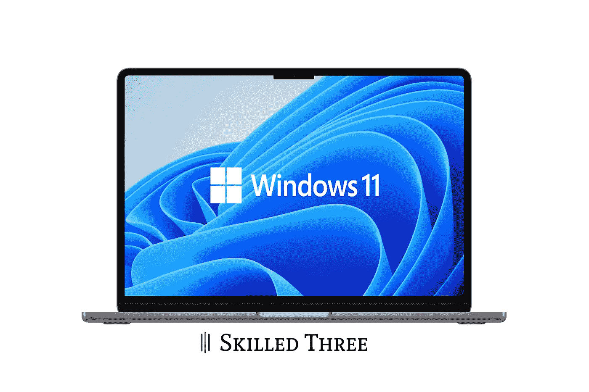

# 装有苹果芯片的苹果电脑上的 Windows 运行完美

> 原文：<https://medium.com/codex/windows-on-macs-with-apple-silicon-runs-flawlessly-d33a37484e28?source=collection_archive---------1----------------------->

## 然而，它的正式到来在望

运行 Windows 11 的苹果 MacBook Pro 图片由 [Jakub Jirák](https://jakubjirak.com) 提供

采用苹果硅芯片的新款 MAC 最大的缺点之一就是架构不同。正因为如此，我们失去了安装 Windows 的能力，直到最近，Windows 还可以轻松地与 macOS 一起运行。每次打开设备时，你必须选择启动哪个系统。