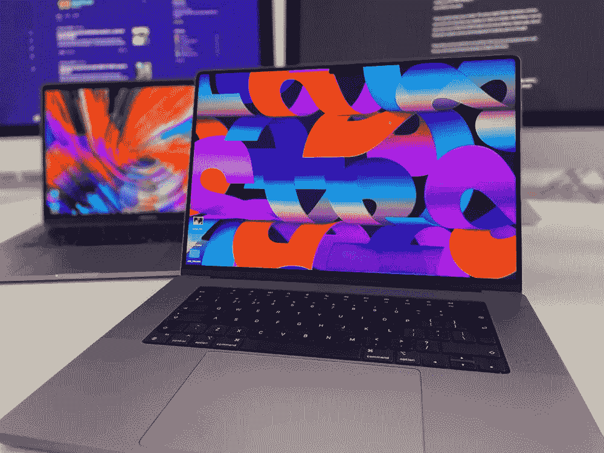

# 随着苹果芯片的出现，二手苹果电脑还有意义吗？他们是你的第一选择吗？

> 原文：<https://medium.com/codex/with-apple-silicon-now-a-thing-do-used-macs-still-make-great-sense-are-they-your-1st-choice-cc325092b57?source=collection_archive---------11----------------------->

## 苹果芯片改变了 Mac 电脑保持价值的方式。旧机器还适用吗？

图片由作者提供

## M1 的出现

2020 年 11 月，计算世界彻底改变了。苹果…