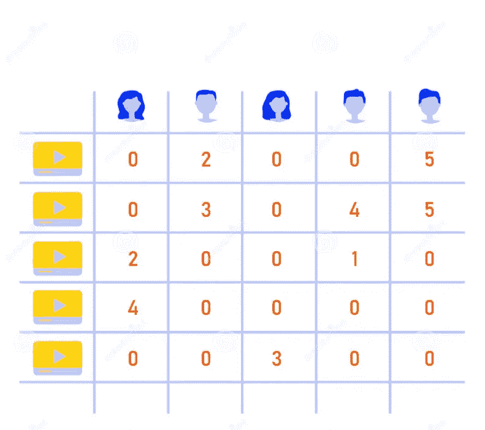

# 想知道推荐系统是如何工作的吗？

> 原文：<https://medium.com/codex/wonder-how-a-recommendation-system-works-5731a88ebf10?source=collection_archive---------14----------------------->

我们在日常生活中都广泛使用网飞、YouTube 和亚马逊。想知道推荐系统是如何工作的吗？随着时间的推移，这些建议似乎变得越来越个性化。当然，为什么不呢？

我们给电影评分，喜欢/不喜欢视频/购买产品。现在有很多数据，但是这些数据足以构建一个健壮的推荐系统吗？

本文将概述如何为我们的应用程序构建推荐系统。我不会深究数学，会尽量保持简单。

我想谈谈两种主要的推荐系统技术。

*1。基于内容的推荐*

*2。协同过滤*

让我们谈一点关于基于内容的推荐系统，然后我将谈到协作过滤技术，*数学魔术。*

基于内容的推荐到底是什么意思？我们如何将此建模为机器学习问题？

推荐系统通常有两个主要部分。一个是用户，一个是产品。亚马逊、网飞、YouTube 拥有数百万用户和数百万产品、电影/纪录片/连续剧、视频。

我们可以将我们的数据可视化为一个数据矩阵(在整篇文章中，我将使用 D 来指代这个矩阵)，其中每行表示一个用户，每列表示一个产品，反之亦然。在这两种情况下，这个矩阵的规模都将是巨大的，当我说巨大，我的意思是非常巨大。这个 N×M 矩阵中的每个单元格代表什么？(N:用户数量，M:产品数量)。这些单元格值可以是评级，也可以是布尔值(真/假)，比如一个人是否看过视频，或者他/她是否看过视频。

这个矩阵将会非常稀疏。为什么？你在网飞网站上给多少部电影评级，或者你喜欢或不喜欢多少部视频？很少，并且这种行为在大多数用户中是相似的，使得这个数据矩阵非常非常稀疏。

在基于内容的推荐系统中，你必须为用户和产品提出特征向量。

然后，您将利用这些特征向量来预测数据矩阵值(即，一个人是否会对一部电影给出 1、2、3、4 或 5 星评级，或者他/她是否会观看某个特定的视频)。这简单地归结为一个标准的分类/回归问题。

这种建立推荐系统的方式有一个小问题。通常，数据矩阵 D 将非常稀疏，并且进入训练集的数据点的比例将大大少于进入测试集的数据点。我们如何确保我们的基于内容的推荐系统是健壮的？

好了，让我们跳到另一个优雅的技术:协同过滤。

我更愿意称之为数学的魔力。机器学习是一个确实从许多其他领域借用了一些想法的领域，比如统计、数学、概率、热力学等等。

有一种叫做矩阵分解的技术可以用来构建一个基于协同过滤的推荐系统。

## 矩阵分解简介；

假设我们有数据矩阵/评级矩阵(D):我们可以把它写成两个独立矩阵 U 和 P-转置的乘积。这和我们写 10 = 2 * 5 非常相似。矩阵 U & P 转置被认为是数据矩阵 d 的因子。

N * M (N:用户数量，M:产品数量，D:包含我们评级的稀疏矩阵)

`Dimensions of Matrix U:` N * f

`Dimensions of Matrix P:` M * f，暗示 P-转置将具有 f * M 的维数

我将使用 P.T 作为 P-转置的简称。

(先不要担心 f，它是一个超参数，我们可以以后再调)

我会讲到为什么我们有时需要这些矩阵，但是让我们想想如何找到这些矩阵 U & P。

我们在机器学习中解决优化问题，不是吗？是的，我们可以使用随机梯度下降来找到这些矩阵。我们的损失将在所有非空数据点上求和(以 D 表示的等级)，

`(over all non-empty cells of D):` ∑ [(Dij — Ui * Pj。T) ^ 2】。

`Dij:`用户 I 对商品 j 给出的非空评分

`Ui:`矩阵 U 的第 I 行表示用户 I 的 f 维向量

`Pj:`矩阵 P 的第 j 行或 P.T 的第 j 列(P 的转置)。这也是一个 f 维向量。

好，现在我们有了矩阵 U & P。

U & P.T 是我们的数据矩阵 D 的因子，意味着 U x P.T = D，当然有一些微小的误差。(损失不总是零)。

我们填充 d 中的空单元格。

如果我们希望填充 D (2，3)，我们将取向量 U (2)和 P (3)的点积。D (2，3)是什么意思？这是用户 U (2)对产品 P (3)的预测评分。

我们现在有一个矩阵 D，所有的评级都在里面。现在，我想继续向用户推荐电影/视频是非常容易和直接的。

因为 D 是填充的(没有空单元格)，所以我们可以对每个用户的列值(即每行)进行排序。这就是协同过滤的工作原理。*这个魔术不是用数学完成的吗？*😀

在结束本文之前，我选择了 U 和 P 这两个名字，以便让事情看起来更直观。

N * f 矩阵表示所有 N 个用户的 f 维特征向量。

`P:` M * f 矩阵表示所有 M 个产品/视频/电影的 f 维特征向量。

希望你喜欢！！😀