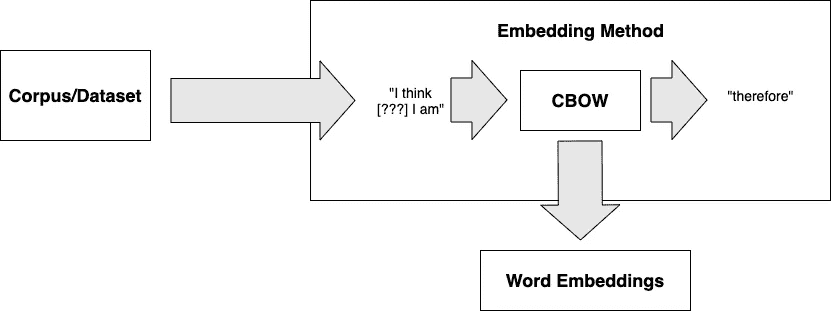

# 单词嵌入

> 原文：<https://medium.com/codex/word-embeddings-173d67c7a295?source=collection_archive---------6----------------------->

# 这是什么？

单词嵌入是将单词表示为向量或数字序列。通常，这些向量编码了该单词如何与数据集中的其他单词结合使用。编码技术和使用的数据集可以有很大的不同，最终取决于适当的用例。

# 为什么有用？

单词嵌入在 NLP/ML 中有着无处不在的用例，并允许计算机或数学方程对单词进行推理。计算机只将单词视为单个字符的序列，这在推理一种语言中一个单词的语义或句法用法时并不经常有用。单词嵌入可以给计算机提供关于一个单词的附加信息，以及它在句子中与其他单词的用法。

许多大型科技公司，如谷歌和脸书，已经投入巨资开发最先进的技术来创建这些嵌入。

# 是怎么做到的？

将单词编码为向量的过程通常是通过建立单词到向量映射的存储库，然后引用该存储库来获得特定单词的嵌入。这个知识库是通过在训练语料库上训练某个模型而创建的。

## 一袋单词/一个热门编码模型

将单词表示为向量的一个简单方法是给字典或词汇表中的每个可能的单词分配一个唯一的标识符。例如，如果我们的词汇表包含 5 个单词:[狗，比，猫更好]，那么我们可以给每个单词分配一个唯一的整数:

*   狗— 1
*   are — 2
*   更好— 3
*   than — 4
*   猫— 5

然后将一个单词编码为一个向量，构造一个向量，其大小为每个条目中包含 0 的词汇表的大小。然后将对应于单词的唯一标识符的索引设置为 1。所以“更好”这个词的向量应该是[ 0，0，1，0，0 ]。然后，我们可以通过将文档的所有单词向量相加，将句子甚至整个文档表示为嵌入。例如，如果我们的文档只是“猫更好”，那么文档的向量将是[ 0，1，1，0，1 ]

*优点*

*   易于/简单实施
*   快速处理/培训时间
*   适用于其他嵌入技术没有足够数据进行训练的小型数据集
*   适用于特定领域的小型数据集，在这种情况下，在大型通用数据集上训练的其他嵌入模型无法捕获更适合的数据集的上下文

*缺点*

*   不考虑单词的顺序
*   单词向量非常大，通常需要对文档向量进行大量处理以减少维数

## Word2Vec 型号

Word2Vec 是 2013 年发布的一个流行的单词嵌入算法家族。支持 word2vec 的算法主要有两种:连续单词包和 Skip-gram。

*生产用例*

*   Spotify 和 Anghami 上的音乐推荐
*   Airbnb 的房源推荐
*   雅虎邮箱中的产品推荐
*   将广告与雅虎搜索上的搜索查询相匹配

*连续包字(CBOW)*

连续单词袋模型使用具有单个隐藏层的前馈神经网络，根据周围的单词对句子中的单词进行分类。如果示例输入是“我认为[？？？]我是”，那么模型的输出应该是“因此”，因为这将是给定上下文单词“我想”和“我是”的最可能的选择。

当我们训练这个神经网络根据上下文单词来建议单词时，神经网络学习许多权重。事实上，这些权重直接对应于词汇表中每个单词的向量。然后从神经网络模型中提取这些向量，并用于将任何单词作为向量嵌入。

*优点*

*   将其他单词的邻近用法编码到单词的嵌入中
*   比 skip-gram 模型训练更快
*   很好地捕捉单词的句法用法:单词“pickle”接近于“pickle”

*缺点*

*   限于上下文单词的窗口大小
*   也没有捕捉单词的语义用法:单词“car”与“boat”不太相似。
*   倾向于过多使用常用词
*   无法嵌入模型尚未看到的单词

## 跳格模型

skip-gram 算法可以被认为是 CBOW 模型的逆模型。skip-gram 不是基于上下文单词对单词进行分类，而是尝试基于单个输入单词对上下文单词进行分类。例如，如果输入是单词‘因此’，窗口大小是 5，那么输出应该是[我，想]，[我是]。类似于 CBOW，训练一个前馈神经网络来完成这项任务，然后我们提取神经网络的权重作为单词嵌入。

*优点*

*   将其他单词的邻近用法编码到单词的嵌入中
*   很好地捕捉单词的语义用法:单词“car”与“boat”接近
*   不像 CBOW 那样倾向于过多使用频繁的单词

*缺点*

*   限于上下文单词的窗口大小
*   训练速度比 CBOW 慢
*   也没有捕捉单词的句法用法:单词“pickle”与“pickle”不太相似。
*   无法嵌入模型尚未看到的单词

# 资源

*   [介绍 skip-gram 和 CBOW 模型的原始论文](https://arxiv.org/pdf/1301.3781.pdf)
*   [堆栈交换比较 skip-gram 和 CBOW 模型](https://ai.stackexchange.com/questions/18634/what-are-the-main-differences-between-skip-gram-and-continuous-bag-of-words)
*   [word 2 vec 的使用案例](/@chris.mccormick/4-production-examples-of-word2vec-in-recommender-systems-and-advertising-f76102074870)
*   [word 2 vec 的张量流介绍](https://www.tensorflow.org/tutorials/text/word2vec)