# 单词嵌入——神经网络的文本表示

> 原文：<https://medium.com/codex/word-embeddings-text-representation-for-neural-networks-65fd934d1fa2?source=collection_archive---------5----------------------->

艾莉娜·格鲁布尼亚克在 [Unsplash](https://unsplash.com?utm_source=medium&utm_medium=referral) 上的照片

对于任何 ML 项目，特征提取都是构建模块，模型从这些特征中导出模式，而无需显式训练。无论数据是文本、图像、视频还是语音，都需要用数字格式表示，以便用任何 ML 算法处理。与复杂得多的文本相比，图像、视频和语音的数学表示更为简单。

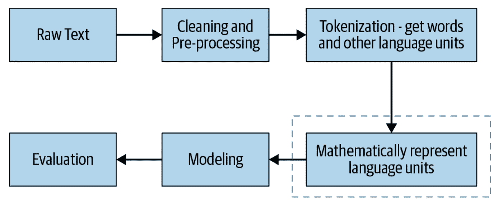

**典型的** [**NLP 流水线**](https://www.amazon.com/Practical-Natural-Language-Processing-Pragmatic/dp/1492054054/ref=sr_1_1?keywords=practical+natural+language+processing&qid=1653872590&sprefix=practical+natural%2Caps%2C2051&sr=8-1)

在 NLP 世界中，这种原始文本到合适的数字形式的转换被称为文本表示。各种技术被用来收集文本，把它们分解成原子，并把它们转换成数字向量。

> “与将顶级算法应用于普通文本表示相比，将好的文本表示应用于普通算法会让你走得更远。”

—第 84 页，[实用自然语言处理](https://www.oreilly.com/library/view/practical-natural-language/9781492054047/)

让我们从将原始文本转换成数字向量的方法开始。

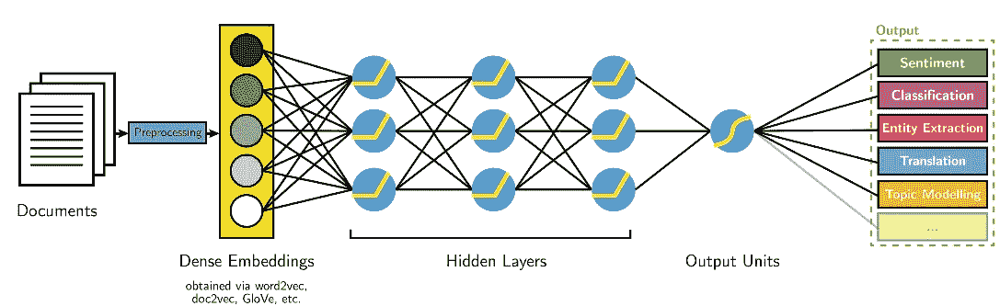

图片来源:[此处](https://s3.amazonaws.com/aylien-main/misc/blog/images/nlp-language-dependence-small.png)

为了从一段语料库中正确地提取主要单词/标记，第一步通常是将句子分成词汇单元，然后对句子进行标记，并根据用例移除停用单词和不相关的单词/句子，这通常由 [*正则表达式*](https://docs.python.org/3/howto/regex.html) 、 [*NLTK* 、](https://www.nltk.org/) [*spaCy*](https://spacy.io/api) 或 [*文本向量矢量化*](https://www.tensorflow.org/api_docs/python/tf/keras/layers/TextVectorization) 来完成

在此之后，我们现在将有一个记号列表，这些记号只不过是数字表示的独特单词(也称为词汇)——可以转换成数字向量。

在直接进入单词嵌入之前，让我们看看一些传统的数字编码方法，以及为什么它们不是输入神经网络的好方法。

## 标签编码

这种方法非常简单，它为语料库中的每个标记分配一个唯一的编号。它与词汇的大小成正比，并且由于其排序的性质，在获得较高数字的特征之间建立了关系，并且有偏差的模型是不可避免的。这可能导致模型性能不佳和意想不到的结果，因此在特征表示方面使用这种技术是一个很大的问题，而总是用于目标变量/标签，因此得名。

更多阅读:[此处](https://scikit-learn.org/stable/modules/generated/sklearn.preprocessing.LabelEncoder.html)

## 一个热编码器

在独热编码中，语料库词汇表中的每个记号被给予 1 到 n 之间的唯一整数表示，其中 n 是语料库词汇表中唯一记号的长度/数量(*记号集*)。在 n 维空间中，每个标记将占据其中一个维度，这意味着无论上下文如何，这些标记之间都没有任何相似性。这是通过一个 n 维向量来完成的，除了标记为 1 的索引之外，该向量都填充了 0。

更多阅读:[此处](https://scikit-learn.org/stable/modules/generated/sklearn.preprocessing.OneHotEncoder.html)

## 仿制品

将分类值转换为虚拟/指标值的更灵活的方法。

默认情况下，get_dummies()提供了一个热版本，为了获得虚拟版本，我们需要传递 drop_first=True。

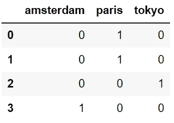

更多阅读:[此处](https://pandas.pydata.org/docs/reference/api/pandas.get_dummies.html)

我们看到在一键编码中有一些冗余，n 维向量可以用 n-1 维长来表示。在上面的例子中，如果任何两个城市是 0，那么很明显第三个是 1，因此上面的表示可以进一步转换成这样。

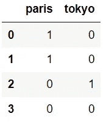

## 为什么这些不适合神经网络？

还有几个比如 BoW，TF-IDF 等。我们不会详细讨论所有问题，但所有问题的共同点是:

1.  它们是离散的表示——捕捉单词之间关系的能力丧失了。
2.  特征向量是稀疏的(*对于任何向量*大多数值为零)和高维的(*与词汇*的大小成比例)表示。
3.  他们不能处理 OOV 词汇。

所有这些都妨碍了学习能力和高维表示，使它们的计算效率低下。 ***密集再现*** 前来救援。

> “使用密集和低维向量的好处之一是计算上的:大多数神经网络工具包不能很好地处理非常高维、稀疏的向量。……密集表示的主要好处是泛化能力:如果我们认为某些特征可能提供相似的线索，那么提供一种能够捕捉这些相似性的表示是值得的。”

—92 页，[自然语言处理中的神经网络方法](https://amzn.to/2wycQKA)。

## **单词嵌入**

嵌入是自然语言的一种表示，可以在具有相同含义的单词具有相似表示的情况下学习。

对于语料库中的词集，嵌入是来自分布式表示的向量空间到来自分布式表示的向量空间之间的映射。如果我们给定单词“USA”，分布相似的单词可能是其他国家(例如，加拿大、德国、印度等。)或美国的城市。

分布式表示是基于单词的使用来学习的。这允许以相似方式使用的单词产生相似的表示，自然地捕捉它们的意思。

每个单词用一个实值向量来表示，往往是几十维或者几百维。这与稀疏单词表示所需的数千或数百万维形成对比，例如一键编码。

## ***创建自己的嵌入层***

为了创建自己的 word 嵌入层，您需要执行以下操作:

1.  文本清理
2.  标记化
3.  把...嵌入

***第一步:文本清理***

这是构建的基础，也是非常关键的一步，嵌入的质量与文本清洗成正比。噪音越小，模型越好。我们可以根据所需的清理类型来利用 NLP 库。在本教程中，由于显而易见的原因，我不打算介绍这一步。

***第二步:标记化***

记号化意味着记号到数字的直接映射。我们将使用 TensorFlow 的[文本矢量化](https://www.tensorflow.org/api_docs/python/tf/keras/layers/TextVectorization)，这是一个预处理层，直接将文本特征映射到整数序列。它执行以下操作:

1.  标准化每个例子(通常是小写+标点符号剥离)
2.  将每个例子分成子串(通常是单词)
3.  将子字符串重新组合成标记(通常是 ngrams)
4.  索引标记(将唯一的 int 值与每个标记相关联)
5.  使用该索引将每个示例转换为整型向量或密集浮点型向量。

让我们创建一个伪序列列表。

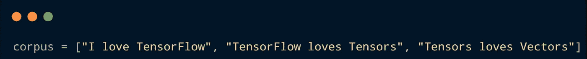

现在，导入库并初始化参数。以下是一些需要注意的关键参数:

*   max_tokens =词汇表中有多少单词。
*   标准化=你想应用哪种标准化，比如“lower”、“strip _ 标点”或“lower _ and _ strip _ 标点”。
*   split =是按空白还是某些指定字符进行拆分。
*   ngrams =创建 n 个单词的组，默认为 None(无组)。
*   output_sequence_length =每个序列应该有多长？

定义 output_sequence_length 的一个好方法是在每个句子中放置一个大于或等于平均标记数的值，如下所示:

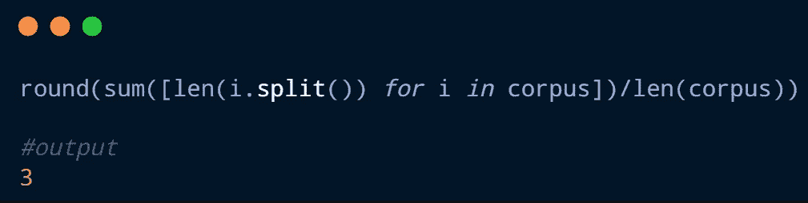

所以在这里，我可以选择值 3，但我会选择 4，我们最终会知道为什么。

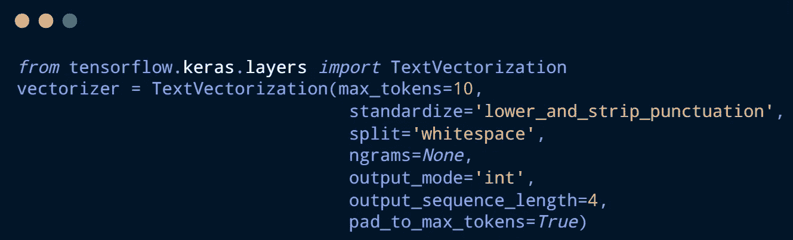

现在是我们的 text_vectorization 实例调整语料库中的序列的时候了。

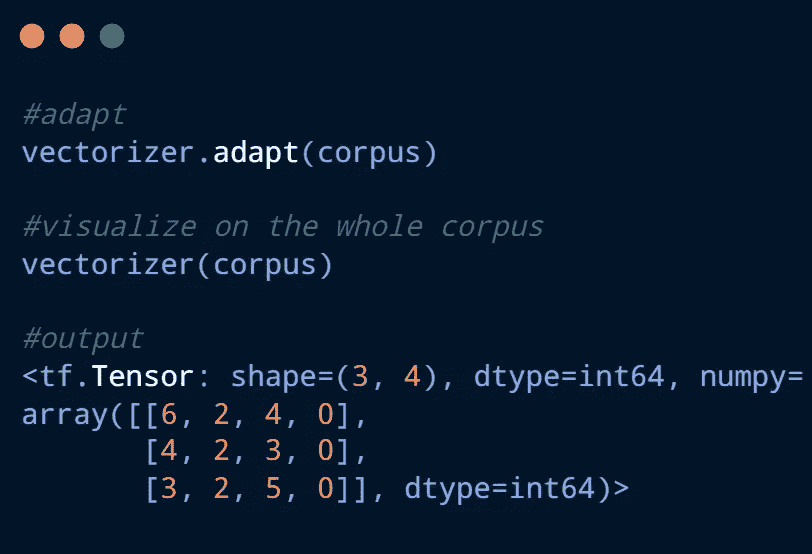

形状在这里非常重要— (3，4)，它代表行数，然后每个序列有多长。由于我们定义了“output_sequence_length = 4 ”,因此尽管序列长度等于 3，但它会用零填充到 4，这同样适用于对映体，即，即使序列长于所述大小，它也会被截断到定义的限制，因此选择该参数是棘手的。即使将单个令牌传递给此方法，它也会继续使用相同的填充。

***步骤三:嵌入***

最后，我们到了创建单词嵌入层的最后一步！为此，我们将使用 *TensorFlow 的* [*嵌入*](https://www.tensorflow.org/api_docs/python/tf/keras/layers/Embedding) *。同样，这里有一些需要注意的关键参数:*

*   input_dim =词汇表的大小。

在将矢量器拟合到语料库之后，我们可以通过使用以下公式来获得词汇的长度:

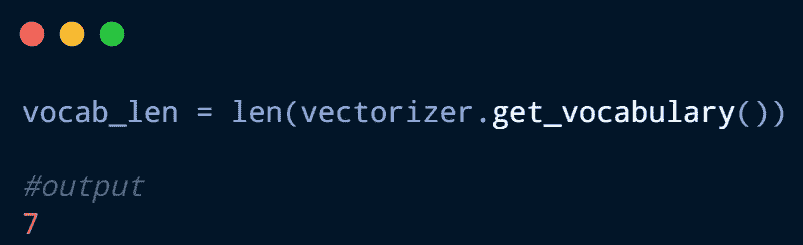

*   output_dim =输出嵌入向量的大小，值 10 将意味着每个令牌由 10 个向量表示

***注意*** *:始终尝试定义容易被 8 整除的向量——加速计算*

*   input_length =传递到嵌入层的序列长度，因此它应该等于 *output_sequence_length*

现在，让我们创建嵌入的实例，并将其安装到上一步的输出中。

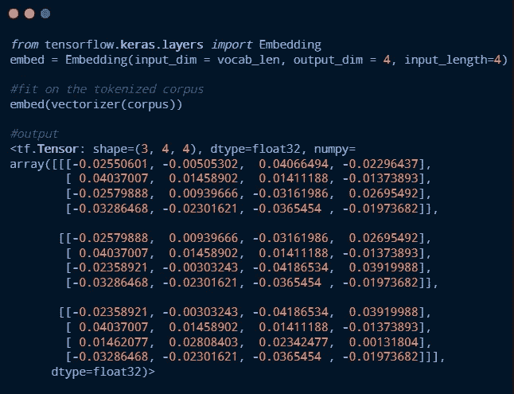

输出形状非常重要，因为该形状将负责将该嵌入馈送到任何神经网络。

*那么(3，4，4)是什么意思？*

3-传递三个序列，

4-每个句子被填充为 4 个标记，因此所有的零将具有相同的表示。

4-每个标记由 4 个特征向量表示。

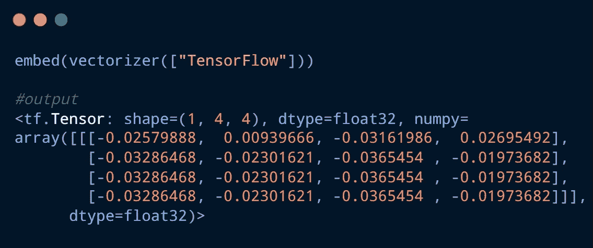

可以看到，这次的形状是(1，4，4)。虽然只传递了一个令牌，但它被视为一个序列并被填充。因此，第一行是唯一的，其余行都具有相同的 0 表示。

让我们来看看完整的工作流程。

恭喜你！！！现在我们知道如何在 TensorFlow 中高效地创建一个基本的单词嵌入层！这两个著名的算法只是这一层的扩展版本，它们是 [*word2vec*](https://www.tensorflow.org/tutorials/text/word2vec) *和* [*GloVe*](https://nlp.stanford.edu/projects/glove/) *，我们将分别介绍它们。*

## 总结:

*   神经网络和数字一起工作，所以你不能只是把单词扔进去。
*   你可以一次性编码所有的单词，但这将导致一个稀疏的矩阵，你将失去它们之间相似性的概念——这是一个大禁忌。
*   神经网络最适合密集层。
*   因此，我们将嵌入层提供给神经网络。

***参考文献:***

1.  实用自然语言处理:构建真实世界自然语言处理系统的综合指南。

*2。* [*什么是文本的单词嵌入？*](https://machinelearningmastery.com/what-are-word-embeddings/)

3. [*张量流文档。*](https://www.tensorflow.org/api_docs/python/tf/keras/layers/Embedding)