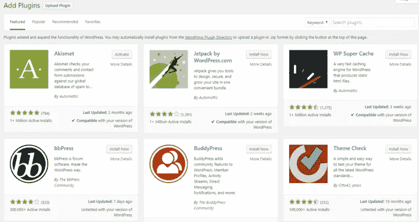

# WordPress 插件可能是邪恶的:你应该(也不应该)使用它们

> 原文：<https://medium.com/codex/wordpress-plugins-can-be-evil-you-should-and-shouldnt-use-them-356882925660?source=collection_archive---------15----------------------->

Kenzo Bruijnaers 的插图

听到有人说“某网站的 WordPress 插件”，你会想到什么？一个新的功能，一个更新，一些会拓宽你的数字机会，带你到一个新的水平。对吗？

每天都有数百个网站使用 WordPress 建立起来。我们很久以前就认识到了它的受欢迎程度，[雇佣了](https://shakuro.com/wordpress) WordPress 开发者到我们的团队中。作为外包代理，我们提供 WordPress 开发服务，并利用它们的优势来帮助提升品牌和发展业务。显然，我们热爱并珍惜 WordPress 和我们在它的帮助下创作的[作品](https://shakuro.com/works)。

那么,“WordPress 插件”这个短语自然意味着好的东西？不。有时候，WordPress 的插件会变得邪恶。在这篇文章中，我们思考善与恶的问题，告诉你什么时候你不应该，什么时候应该为[网站](https://shakuro.com/web-dev)使用 WordPress 插件。

# 为什么我们要使用插件？

WordPress 插件库

根据一份 [CMS 的市场份额](https://trends.builtwith.com/cms/traffic/Entire-Internet)，领先的网站建设者有四家(网站建设者 GoDaddy 是基于 WordPress 的，所以不算):

*   WordPress 43.41%
*   Wix 7.03%
*   平方空间 4.24%
*   Joomla 2.44%

WordPress 插件是一个扩展 WordPress 主题功能的程序。允许你在不编程的情况下向站点添加多个功能。在 WordPress 官方网站上可以找到所有扩展的列表。WordPress 的官方知识库上目前几乎有[70000 个](https://wordpress.org/plugins/)插件，而且都是免费的，或者说几乎免费。许多免费插件功能对于大多数标准[网站](https://shakuro.com/blog/why-use-wordpress-9-best-reasons-to-choose-it-for-your-site)来说已经足够了。

WordPress 插件的多样性允许增加安全性、备份空间、与社交网络更灵活的集成等等。毫不夸张地说，这些扩展可以被称为**网站的基础**，因为它们为管理员和用户执行所有重要的功能。看来，你怎么强调插件的重要性都不为过。不久前，我们甚至将它与西格蒙德·弗洛伊德的原则相比较。

# 何时应该使用 WordPress 插件

首先，WordPress 是“**可定制**”的同义词。它也是“频繁崩溃”的同义词，但我们稍后会谈到这一点。有几十个插件可以解决搜索引擎优化、统计、字体和其他样式选择、安全等常见问题。此外，很难想出一个功能或特性，而发烧友们没有为此编写过至少一个模块。

其次，大部分 WordPress 插件都是**免费**或者**免费增值。**几乎所有的 CMS 都可以与社交网络和分析服务快速整合。例如，WordPress 没有内置的基本 CRM 功能来跟踪交易和客户偏好，但你可以安装 [WooCommerce](https://woocommerce.com/) 扩展。WordPress 维护服务不是这个平台提供的，所以你必须去别处寻找。

第三，您可以使用可视化编辑器向站点添加内容，任何使用过 Word 的人都可以使用该编辑器。管理面板是直观的，所以它可以在短期内掌握。

重要的是要记住，WordPress 不是一个网站建设者，它是一个开源代码的 CMS。的确，有了构造函数，构建一个网站就更容易了。但是 WP 更像是 DIY 的方法，有利有弊。例如，做好准备，管理插件、托管、调整代码和处理集成将变得更加困难。如果你雇佣网络开发人员，在 WordPress 上建立一个网站会变得更容易。感觉就像你在使用 GoDaddy 这样的网站构建器，但是带有定制开发的味道。

如果你想在 WordPress solo 中创建一个网站，又不想雇佣一个 WordPress [设计师](https://shakuro.com/ui-ux)，要注意隐藏的邪恶插件。

# 警告标志表明 WordPress 插件是秘密邪恶的

有些受雇的 WordPress 专家是邪恶的，所以常规插件也可能是暗箭伤人。

**仓库看起来很奇怪**

想象一下，你正在通过 WordPress 插件搜索某个特性，谷歌的前 3 个结果指向独立的 WordPress 开发者网站。

如果你登陆一个网站，它看起来像是在 2000 年代早期创建的，除了通过电子邮件地址之外，没有其他方法可以联系到[开发者](https://shakuro.com/blog/interview-with-a-back-end-developer-what-makes-a-good-code)…好吧，也许可以忽略这个库。

**再多一个插件，一切都会崩溃**

插件应该根据需要来使用，而不是希望从中获益或捏造需求。

例如，你不应该仅仅因为你认为插件可以给你带来更多的流量或者让你的 WordPress 站点更受欢迎就使用它。同样，当你寻找新的插件来安装时，你也不必为插件找借口。

第二，当一个插件提供的功能对于你的网站(以及那些阅读它的人)的整体利益来说是不需要的时候，你可能根本就不需要这个插件。

当决定你是否需要一个[插件](https://blog.hubspot.com/website/must-have-wordpress-plugins)时，一个好的晴雨表是问你自己它所解决的问题是否真的需要它，以及该插件是否是该问题的最佳解决方案。提前思考比疯狂地查找 WordPress 开发服务来纠正你的错误要好。

**下载量不够**

在 WP 的官方网站和许多其他公共存储库，你将能够看到活跃安装的数量。这是有用的。你不仅可以看到有多少人下载并移除了该插件，还可以看到目前安装该插件的网站数量，这是一个很好的可靠性指标。

最好避免下载量少于 1 000 的 WordPress 插件。如果你从一个自由网站雇佣 WordPress 开发者，这是一个你必须亲自检查的错误。

# 当你不应该使用 WordPress 做网站的时候？

不要忘记 WordPress 最初是作为博客平台而创建的。CMS 的大部分功能和工具都是用来发布文章和评论文章的。因此，你应该明白 WordPress 的功能是有限的。要实现某些功能，您需要添加适当的插件。当然，这是可能的，但仍然会造成某些不便。

如果你的网站致力于:

*   博客
*   [电子商务](https://shakuro.com/blog/e-commerce-mobile-app-development-features-trends-cost)
*   [教育](https://shakuro.com/blog/e-learning-trends)
*   投资组合
*   娱乐
*   非营利活动
*   不动产
*   [应用程序的营销](https://shakuro.com/blog/how-to-promote-your-mobile-app-for-free-in-2022)
*   [婚礼](https://shakuro.com/blog/lifestyle-mobile-app-ideas-for-2022)或其他喜庆活动
*   等等。

对于拥有大量媒体内容的网站、金融服务网站或其他高安全性关键活动的网站，可以考虑转向定制 web 开发。

[三郎](https://dribbble.com/shakuro)定制网站开发设计

三郎在 WordPress 上的旧博客设计

想想你未来的用户会在你的[网站](https://shakuro.com/project-calculator)上做什么，管理员会如何管理它？想想系统应该有多先进。会简单极简，还是细致精准？深入到这几点之后，平台的选择就是技术的问题了，还有插件的选择。

几乎每一个网站平台都是为了通用和最大限度地满足你的需求而创建的。因此，总的来说，如果适合你，你可以完全依赖他们中的任何一个，或者雇佣一个 WordPress 开发者。

[丽塔写的*善良-羡慕*](https://shakuro.com/blog)