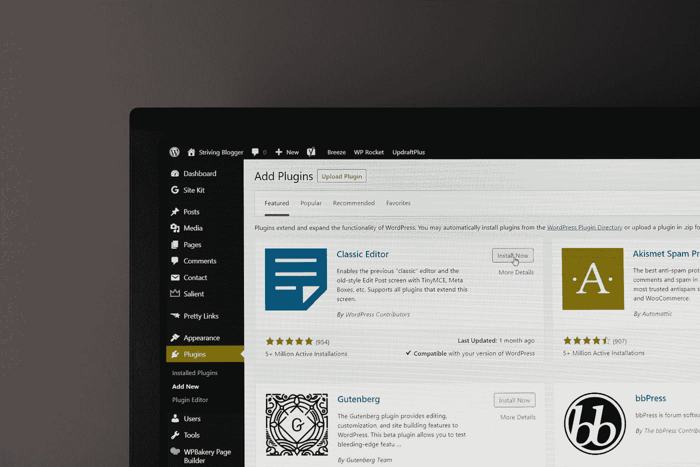

# 赞成和反对

> 原文：<https://medium.com/codex/wordpress-pros-and-cons-a85e00954940?source=collection_archive---------11----------------------->

## WordPress 的利与弊:你需要知道的关于这个流行的网站建设者的一切。

贾斯汀·摩根在 [Unsplash](https://unsplash.com?utm_source=medium&utm_medium=referral) 上的照片

WordPress 是一个流行的内容管理系统，帮助博客和网站所有者轻松创建和管理在线内容。但是像任何软件一样，使用 WordPress 也有利弊。