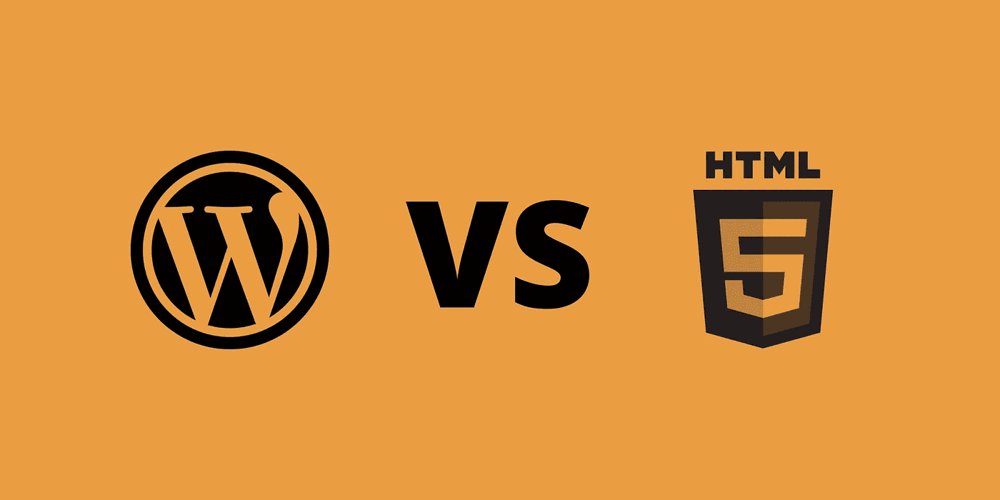

# WordPress Vs HTML

> 原文：<https://medium.com/codex/wordpress-vs-html-7792d058b47?source=collection_archive---------12----------------------->

## 哪个是创建网站的最佳资源！

你正在寻找一个简单的方法来创建一个网站，你可能会考虑切换到 WordPress。与 HTML 不同，WordPress 有一个用户友好的界面，并且是开源的。与 HTML 相比，它更容易维护，也更安全。如果你不确定选择哪个，这里有一些好处和缺点。继续阅读，了解更多信息！下面列出的只是一些…