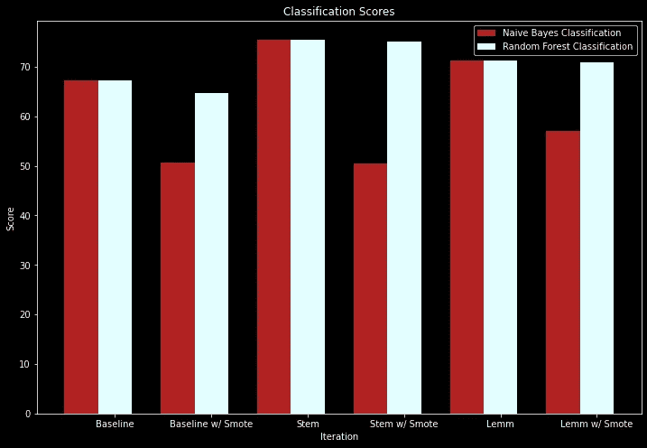

# 让她跳舞

> 原文：<https://medium.com/codex/wordz-a-make-her-dance-ee336fb4b632?source=collection_archive---------6----------------------->

## 看看 Billboard 从 1970 年到 2020 年的热门 100 首歌词，包括 NLP、随机森林和朴素贝叶斯

图片由 Shutterstock.com 拍摄

10 年前，丽贝卡·布莱克发布了一首名为《[星期五](https://www.youtube.com/watch?v=kfVsfOSbJY0)》的歌曲。
这首歌一夜成名，超过[1.66 亿次点击](https://en.wikipedia.org/wiki/Friday_(Rebecca_Black_song))，每个人，每个地方都在唱…

giphy.com 的 GIF

…即使是星期一。

我会用这首歌的另一部分歌词来告诉你我对这首歌的看法:

> 明天是星期六
> ，星期天在病房之后
> 我不想这个周末结束

-___-

不言而喻，这首歌的流行让我*沉没*。随着 YouTube 的崛起和它的迅速成名，我认为平庸的音乐和平庸的歌词会一直存在。幸运的是，出现了像弗兰克·奥申和比莉·埃利什这样的音乐歌词天才，但在这个“现象”十年后，它仍然让我感到好奇: ***什么样的歌词让一首歌成为热门*** ？

这让我想到了我目前的项目。

我想看看歌词是否对它在公告牌百强中的排名有影响。为此，我遵循 CRISP-DM 方法，使用自然语言处理对歌词数据进行清理、词干提取和词汇化，然后使用随机森林和朴素贝叶斯进行分类(如果这些听起来不熟悉，请不要担心，我会在我们进行的过程中解释更多)。

我提出了另一个假设，说歌词确实对它在 Billboard Top 100 中的排名有影响，而我的零假设说歌曲中的单词对它的排名没有影响。

# 数据

我使用来自 [Billboard](https://www.billboard.com/charts/year-end/1970/hot-100-songs) 和 [Genius](https://genius.com/) 的数据来创建我的数据集。Billboard 提供了 1970-2020 年前 100 首歌曲的歌名及其对应的艺术家，Genius 提供了每首歌曲的歌词。一旦我预处理了所有的数据，我就有了 1000 位艺术家写的 2200 多首歌。

需要注意的一点是，这些数据不包括任何合作或其他艺术家的歌曲。一些艺术家在广告牌上有很多歌曲，如麦当娜、埃尔顿·约翰和德雷克，但我们数据集中超过一半的艺术家只有一首。

一旦我在一个数据框中准备好了所有的歌词数据，我就用一个叫做 **regex** 的工具去掉标点符号，并用 python 包 NLTK **去掉所有的*停用词*。** *停用词*是像“the”或“me”这样的普通词，它们本身并没有什么实际意义。然后，一旦所有这些都被删除，我们就可以使用函数 **FreqDist** 来计算语料库中单词的频率，这个函数也在 NLTK 包中。

按作者列出的 25 个最常见单词的标度字数

没有人会对此感到惊讶，但“爱”是公告牌百强中最常唱的词。词的频率保持相对不变，即使我过滤了前 25 名和前 25 名以外的歌曲，以及 2000 年之前和之后发行的歌曲。

(还有人对*不满意*看我们平常话里的“星期五”吗？)

# 模型

接下来，我使用两个不同的分类器对歌曲歌词数据进行预测:**随机森林**和**朴素贝叶斯**。

快速复习一下， [*随机森林*](https://www.youtube.com/watch?v=J4Wdy0Wc_xQ) 选取一部分歌曲，构建多个决策树，每个决策树预测一首歌曲的结果，在这种情况下，它是否是前 25 名的热门歌曲。拥有最多树选票的结果获胜。

[*另一方面，朴素贝叶斯*](https://www.youtube.com/watch?v=O2L2Uv9pdDA&t=570s) 计算在歌曲中发现的特定单词，如“朋友”或“哭泣”出现在排名前 25 的歌曲*和排名非前 25 的歌曲*中的可能性。该模型然后查看“朋友”在一首未知歌曲中被唱的次数，然后通过发现可能性是更匹配前 25 首歌曲还是非前 25 首歌曲来预测其结果。关于这两者的更详细的解释，请看 StatQuest 的视频。

为了使我们的数据符合模型，我使用了一个 **tf-IDF 矢量器**。因为机器和模型不能像人类一样阅读单词，所以矢量器根据单词在歌词语料库中的频率将它们转换为数字数组。

# 结果

作者的基线混淆矩阵

如果你看看上面的混淆矩阵，我们发现朴素贝叶斯分类器预测*在我们的测试数据中，每首歌曲*将**而不是**成为前 25 名，尽管实际上有 182 首歌曲。我们的随机森林模型并没有表现得更好，在 182 个预测中只有 2 个是肯定的。

giphy.com 的 GIF

两种分类模型看起来都太害怕预测一首歌会成为热门歌曲，这可能是由于类别的不平衡(记住，我们 25%的数据实际上都在前 25 名)。为了解决这个问题，我使用 SMOTE 重新分配了数据，使点击次数与未点击次数相等。然而，这并没有提高我们的准确性。如果你看下面的矩阵，我们会发现我们的分类模型*的确*有更多的机会将一首歌曲分类为热门歌曲，但是*的分类错误*却更多。

通过使用 SMOTE，我们的朴素贝叶斯分类器的准确率为 **45%** ，随机森林分类器的准确率为 **69%** 。

作者使用 SMOTE 的混淆矩阵

由于这些分数如此之低，我尝试了额外的清理技术，包括**词干**和**词汇化**。*词干化*基本是砍掉词尾，把一个像“跳舞”的词改成“跳舞”，而*词条化*则是到词根，把像“更好”的词改成“好”。

在词干化、词元化和用 SMOTE 处理类不平衡之后，我们的模型的性能对于两个分类模型都提高到了 **76%** ，比我们的基线提高了*9%*(参考下面的“词干”迭代)。然而，考虑到大约 25%的数据被归类为前 25 名，我们的模型就像猜测这首歌不会每次都是前 25 名一样好，正如我在基线中看到的那样。下图显示了每次迭代的准确度分数。

按作者分类的分类准确度得分图

# 结论和建议

不幸的是，我的模型无法找到前 25 名与前 100 名中其他人的区别，也无法证明歌曲中的词对其排名有影响。因此，我建议歌曲作者做到以下几点:

*   把更多的注意力放在歌曲的创作上——音乐不仅仅是歌词本身。有韵律和节奏，声音，还有唱腔。创造一些让你感觉良好的东西。
*   写一些相关的话题——虽然不是特定的前 25 个，但是我们知道“爱”是前 100 个中最常见的词。听众可能会对自己熟悉的话题产生更多的共鸣。我们真的没有发现俱乐部里的人在唱关于太空的歌。
*   想唱什么就唱什么——我无法证明带有“舞蹈”这个词的歌曲比带有“哭泣”这个词的歌曲表现得更好。所以就写一些你有激情的东西，或者写一些感觉对的东西。音乐是自我表达的一种形式，所以不要把自己局限在某些话题上，除非你是丽贝卡·布莱克。开个玩笑，丽贝卡！

giphy.com 的 GIF

# 未来的工作

我有点沮丧，因为我不能得出任何结论，所以我开始寻找其他方法来分类我的数据。如果给这个项目更多的时间，我可能会尝试以下。

*   包括 Billboard Top 100 之外的歌曲——我认为结果不确定的一个重要原因是数据库中的歌曲都是成功的。我需要看看外面表现不好的歌。
*   添加额外的功能——我很想看看我是否可以添加节奏和成分作为预测一首歌是否流行的功能。
*   按年份分类——我开始对歌曲是在 2000 年之前还是之后制作的进行分类，准确率达到 80%。或许值得深入调查。
*   按流派分类——摇滚和嘻哈听起来完全不同，但看看歌词是否也有很大不同会很有趣。

*在我的* [*github*](https://github.com/christianmoya/BillboardTop25_NLP) *上查看代码和非技术演示。你会如何分类歌词？评论下面，很想听听大家的想法。*