# 使用 Python 处理 Hubspot 第 2 部分。

> 原文：<https://medium.com/codex/working-on-hubspot-using-python-part-2-cedec143921c?source=collection_archive---------3----------------------->


在前一篇文章中，我们看到了如何提取 contact 对象中的所有数据。我们找到了从 Hubspot API 提取数据的更好方法。在本文中，我们将演示如何在联系人对象中插入数据。以及如何更新或修改现有数据。

我们如何上传存储在熊猫数据框架中的多种数据？

首先，我们将了解属性名称。

属性名是字段名称，在 Contacts 对象中是必需的。

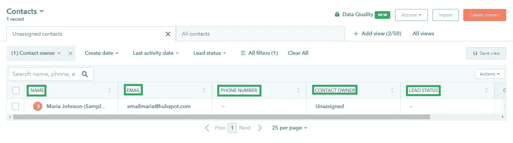

属性图像

如果我们可以看到上面的截图，我们可以观察到绿色框中的字段名称、电子邮件、电话号码和联系人所有者都是属性名称。

现在，您还可以创建一个新的属性名，即 custom。所以我将以一个叫做曼彻斯特联队的足球队为例。在这里我将插入球员的名字和他们的国家名称。

国家名称将是自定义的属性名称，我将演示如何创建一个新的属性名称。

首先，单击设置符号。

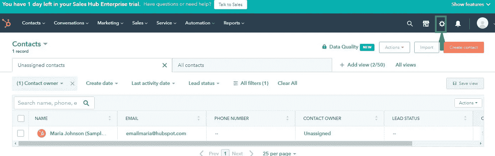

设置图像

点击管理属性。

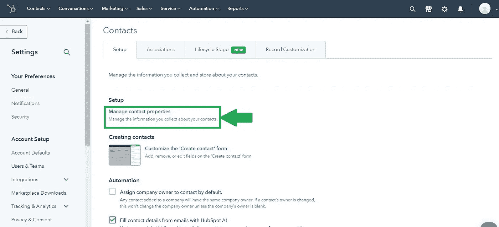

联系人设置页面

点击创建属性

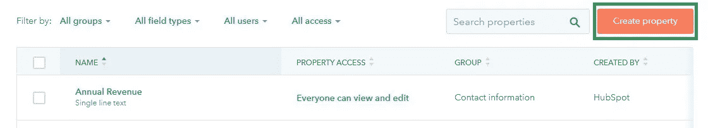

之后，屏幕右侧会出现一个弹出屏幕。如下图所示:

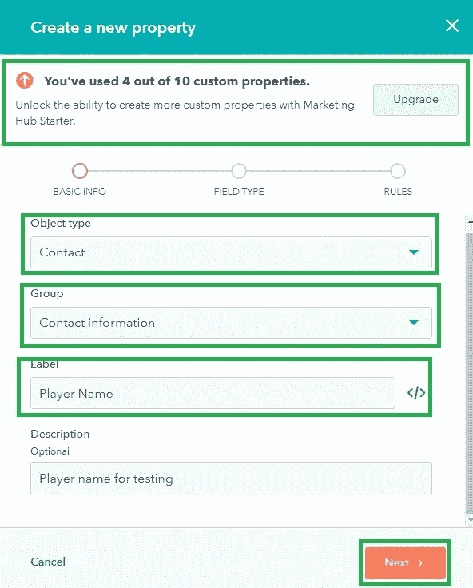

财产的创造

我们创建了一个属性名“玩家名”，这是自定义字段/属性。填写数据后，请点击**下一步**。

我将拥有另一处房产，名字将是'**球衣号码'**

现在我们已经创建了属性名。现在我们必须通过代码提取属性名，该名称应该在插入或更新数据时应用于 Hubspot API。

```
import hubspot
from hubspot.crm.properties import ApiException
client = hubspot.Client.create(access_token="Your_api_token")
```

你可以选择你想要的对象，所以我选择“联系”对象。

```
#api_response = client.crm.properties.core_api.get_all(object_type = 'your_object',archived=False)api_response = client.crm.properties.core_api.get_all(object_type = 'contacts',archived=False)
```

属性名称列表保存在“field_of_contact.txt”文件中。在文本文件中，我们将获得属性列表及其详细信息。

我们必须收集属性列表中的“标签”和“名称”。我们必须为插入和追加工作。

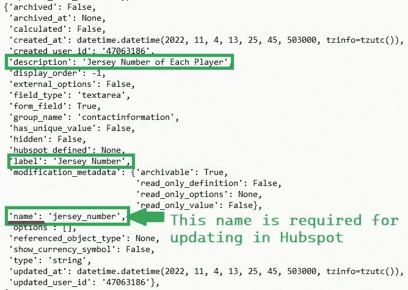

文本文件包含属性名称列表

现在我们跳到在 Hubspot 中插入数据。

现在我要插入一张名为“大卫·德基”的著名门将的唱片。我从维基百科获取数据。

运行上述代码后，我们将观察到如下所示的输出:

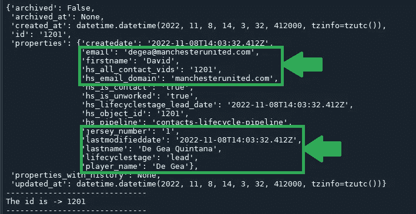

在 Hubspot 中插入数据后 python 代码的输出

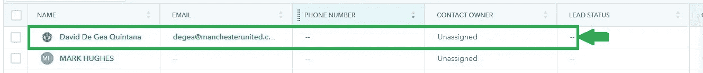

Hubspot 平台的输出

如果我们有很多数据，可以通过 CSV 或 EXCEL 文件上传。

我们将使用 Pandas DataFrame 创建一些数据。

我从维基百科收集了数据。

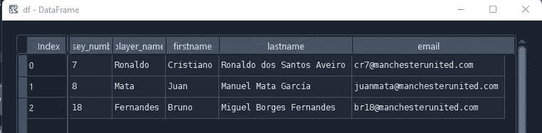

要上传的数据帧

运行上述代码后，我们将在 list_id 中获得新创建数据的联系人 id:

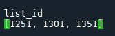

新创建数据的联系人 id 的输出

现在我们可以在 Hubspot Contact 字段中看到输出。

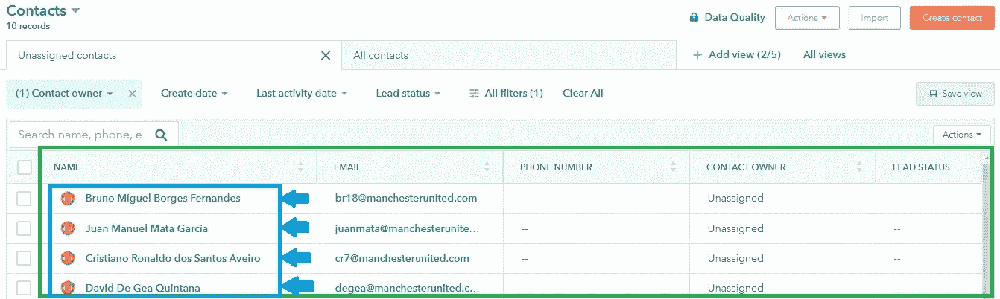

轮毂点触点的输出