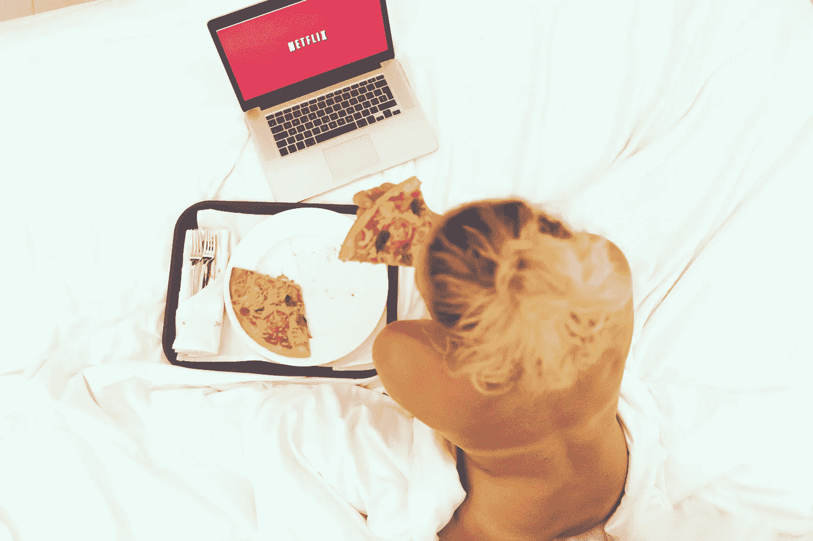

# 由于人工智能，在家办公室工作时不用穿裤子？

> 原文：<https://medium.com/codex/working-pantless-in-home-office-thanks-to-artificial-intelligence-af67e76fd6e7?source=collection_archive---------8----------------------->

## 一个有趣的用例，可能对我们所有人都有帮助

马文·迈耶在 [Unsplash](https://unsplash.com/s/photos/naked?utm_source=unsplash&utm_medium=referral&utm_content=creditCopyText) 上的照片

在全球柯维德-疫情法案颠覆了工作世界，我们大多数人不得不或被允许在家里办公后，我们大多数人可能没用多久就从斜纹棉布裤或裙子转向了运动裤、打底裤甚至什么都不穿。