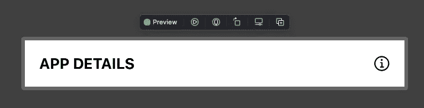
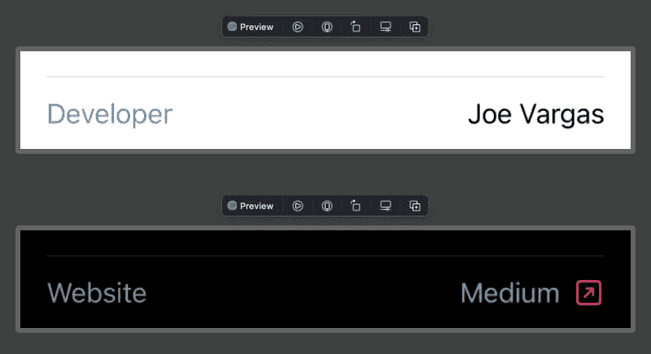
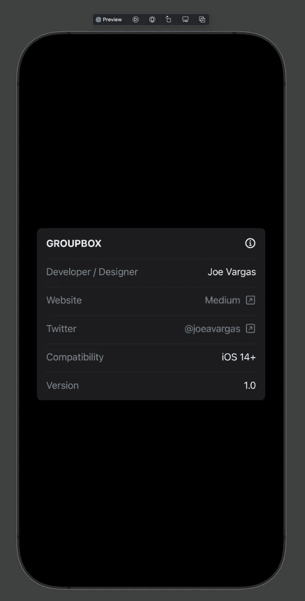

# 在 SwiftUI 中使用 GroupBox

> 原文：<https://medium.com/codex/working-with-groupbox-in-swiftui-9865cc9c0ca?source=collection_archive---------6----------------------->

我 2022 年的一个决心是更多地接触 SwiftUI。像许多其他人一样，我一开始并没有加入 SwiftUI 的行列。然而，SwiftUI 似乎正在成熟，我注意到许多公司不仅寻求 Objective-C 和 Swift(UIKit)经验，一些公司正在考虑拥有 SwiftUI 经验的申请人更占上风。

这些年来我一直非常忠诚于 UIKit，但现在我更有灵感开始修补 SwiftUI。幸运的是，有一些 YouTube 视频和媒体教程展示了 SwiftUI 的声明式简单性，这让我很感动🤯。

SwiftIU 中给我留下深刻印象的一种风格化视图是 GroupBox。GroupBox 允许你*将*相关的信息组合在一起。UIKit 中类似这样的视图需要定制的 xib 来设计和约束。请允许我向您展示我在自定义子视图的帮助下实现的 GroupBox。

我创建的两个子视图的使用帮助我们几乎不费吹灰之力就能在应用程序中的任何地方实现 GroupBox。

## GroupBoxLabelView

这个视图将允许我们添加一个粗体标题和相关的[系统图像](https://developer.apple.com/sf-symbols/)作为分组框的标签。您实现的每个 GroupBox 只需要一个 GroupBoxLabelView。为了避免预览抛出错误，您可以添加任何标题和 SF 符号图像。在我的代码中，我为 labelText 添加了“App Details”，为 labelImage 添加了“info.circle”。

## GroupBoxRowView

很可能是您将添加到 GroupBox 的最常用的子视图。我将这个视图配置为接受最多 4 个属性，其中 3 个是可选的。

该行将需要一个名为的**。该名称将与您在行右侧设置的详细信息相关。你将在完成的截图中看到一个例子，我已经将名称设置为*开发者*。对于**内容**，我加了我的名字。因为 name 是可选的，所以我确保通过 if/else 语句将有文本呈现。**

linkLabel 和 linkDestination 也是可选的。原因是，如果您想要添加一个链接到其中一行，它将添加一个文本标签，带有一个到所提供的 URL(linkDestination)的超链接和一个*arrow . right . square*SF symbol。

## GroupBoxView

现在让我们把这些都放在 GroupBoxView.swift 中。

使用您选择的 labelText 和 SFSymbole 为 GroupBox 标签添加 GroupBoxLabelView。根据需要在括号内添加任意数量的 GroupBoxRowView。加一个**。如果愿意，水平**填充分组框。

上面的代码应该会产生下面的视图。如果您自定义了自己的 GroupBoxRowViews，它看起来会有所不同。

我希望你和我一样发现创建一个 GroupBox 既容易又有趣。

编码快乐！