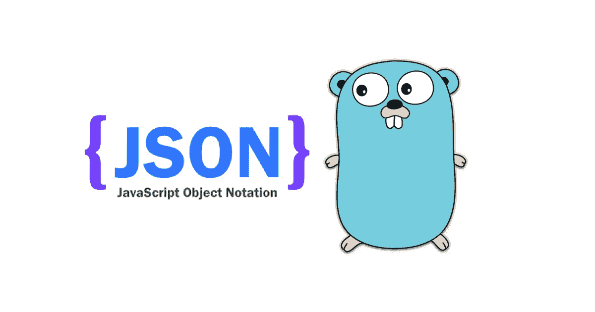

# 在 Golang 与 JSON 合作

> 原文：<https://medium.com/codex/working-with-json-in-golang-9dad4770ccb3?source=collection_archive---------1----------------------->



作者图片

Golang 使用 [**编码/json**](https://pkg.go.dev/encoding/json) 包提供了多个 API 来处理 JSON，包括与内置和自定义数据类型之间的相互作用。

> Golang 用[**Marshal()**](https://pkg.go.dev/encoding/json#Marshal)**和[**Unmarshal()**](https://pkg.go.dev/encoding/json#Unmarshal)**方法将对象转换成 JSON，将 JSON 数据转换成 string。这些方法以字节格式返回数据，我们需要将返回的数据转换成 JSON 或 String。****

****在本文中，我们将了解 **Golang** 中的数据**编组**和**解组**。****

# ****戈朗元帅****

****将 Go 对象转换成 JSON 在 Golang 中被称为封送，使用内置的`encoding/json`包来执行 JSON 相关的操作。****

```
**json.Marshal(v any) ([]byte, error)**
```

****在上述函数的帮助下，Marshal 返回 v 的 JSON 编码，进一步，我们可以将字节数据转换为字符串并返回它。****

# ****在戈朗取消婚姻****

****正好和 Marshal 相反。将 JSON(字节数据)转换为 Struct，并将结果存储在变量指向的值中。****

```
**json.Unmarshal(data []byte, v any)**
```

****在上述函数的帮助下，Unmarshal 返回 JSON 数据的实际值。****

****现在让我们看一下使用上面的函数写一些代码并对 JSON 数据集做一些修改。****

****让我们考虑给定的数据集:👇🏻****

```
**{
  "_id": "62b435e407bc586da8d297cb",
  "index": 4,
  "guid": "57a22da3-d791-4420-9245-465a34730537",
  "gender": "male",
  "company": "EZENT",
  "email": "[barrerajarvis@ezent.com](mailto:barrerajarvis@ezent.com)",
  "phone": "+1 (801) 499-2594",
  "friends": [
    {
      "id": 0,
      "name": "Dale Sexton",
      "email": "[Dale.sexton@example.com](mailto:Dale.sexton@example.com)"
    },
    {
      "id": 1,
      "name": "Watkins Puckett",
      "email": "[Watkins.puckett@example.com](mailto:Watkins.puckett@example.com)"
    },
    {
      "id": 2,
      "name": "Luann Bond",
      "email": "[Luann.bond@example.com](mailto:Luann.bond@example.com)"
    }
  ],
  "greeting": "Hello, Barrera Jarvis! You have 8 unread messages.",
  "favoriteFruit": "banana"
}**
```

****并且，问题陈述就是写下从好友的**数组中删除 **email** **字段**的代码。******

****现在，让我们写下修改 JSON 数据的代码:****

**我希望你喜欢这篇文章。**

*****感谢阅读*****

**[Linkedin](https://www.linkedin.com/in/itskushagra/)|[Twitter](https://twitter.com/im_Kushagra)**