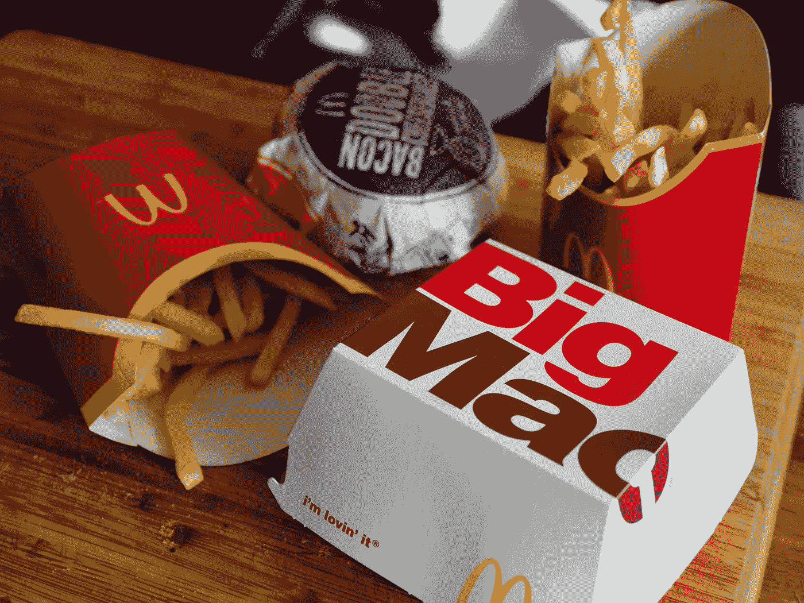

# 在 BigQuery 中使用宽模型和深模型

> 原文：<https://medium.com/codex/working-with-wide-and-deep-models-in-bigquery-c373707285a5?source=collection_archive---------13----------------------->

## 到底什么是宽深模型？

布雷特·乔丹在 [Unsplash](https://unsplash.com/s/photos/mcdonalds?utm_source=unsplash&utm_medium=referral&utm_content=creditCopyText) 上的照片

你可能会问自己什么是广泛和深度学习模型，以及在哪里使用它们。广度和深度学习模型有两个主要组成部分:

*   组件 1:用线性模型记忆组件
*   组件 2:用神经网络概括组件