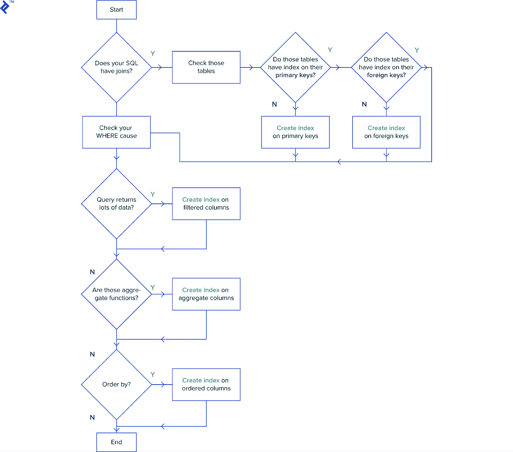

# 编写更快更高效的 SQL 查询

> 原文：<https://medium.com/codex/write-faster-and-more-efficient-sql-queries-42d295ba60fc?source=collection_archive---------0----------------------->

作为开发人员，我们知道 SQL 查询优化的各种最佳实践。虽然其中一些是特定于单个关系数据库管理系统(RDBMSs)的，但大多数几乎可以应用于任何数据库。


本文将解释为什么优化如此重要，因为我们探索了一些快速优化 SQL 查询的最佳方法，以便通过以下方式将对数据库性能的影响降至最低:

*   高效的索引，
*   选择并选择不同的语句细化，
*   通配符和条件句的战略性使用，以及
*   使用解释查询成本分析

# SQL 查询和数据管理简介

标准查询语言，简称 SQL，允许用户使用特定的命令或查询访问数据库，允许他们更改和维护数据库。诸如 SELECT(帮助用户从数据库中提取数据)、UPDATE、DELETE、INSERT INTO 等命令使数据库管理员更容易管理数据。

这些命令中的每一个都有自己的一套功能，在处理数据库时非常有用。一些 SQL IDEs，如 Arctype，为开发人员提供了可视化、设计、建模和管理数据库的理想框架。Arctype 是一个免费的、协作式的、直观的 SQL 编辑器，可简化您所有的数据管理和可视化需求。

在接下来的小节中，我们将简要讨论并确定影响查询性能的因素，以及我们如何改进每一个因素，以便用更快的查询获得相同的期望输出。

# SQL 查询的三个阶段

从为逻辑数据库开发全局模式到通过计算机网络分配数据，再到建立特定于本地 DBMS 的模式，数据库的生命周期包含了创建数据库所需的所有阶段。这个过程不会停止，因为数据库监控、改进和维护只是在设计定义之后才开始。对这些阶段的深刻理解不仅有助于我们做出更好的优化决策，还有助于发现性能问题:

*   **注解**:在执行一个查询之后，SQL server 使用解析器解析命令，解析器分析数据并将其分成各种数据结构。这个查询被修改，结果是一个解析树，带有所有输入数据的解释文本。
*   **查询优化**:SQL 查询被解析后，查询优化器使 SQL server 能够更有效地返回输出。目标是尽可能高效地利用系统资源，同时降低成本(CPU 和时间)。优化后的查询将被发送到下一阶段:
*   **查询执行**:该阶段将制定好的查询计划发展成最终形式。接下来，我们会看到一个输出。

# 大小=资源:SQL 查询运行时理论

我们经常忽略这样一个事实，数据库像所有基于计算机的软件一样，有硬件限制。除了硬件配置之外，其他因素也会影响 SQL server 查询的处理速度。这些因素包括表的大小、表的连接方式、同时运行的查询数量、行的组合以及数据库软件和优化本身。

虽然这些因素中有一些，如数据库软件，是无法控制的，但大多数是可以控制的。我们将在下面探讨哪些是在我们控制范围内的。

# SQL 表大小如何影响性能

查询中的行数会影响处理查询的速度。换句话说，**行数越大，性能变慢的概率**越高。通过删除冗余数据来缩小表的大小可以很容易地解决这个问题。

我们可以开始对一部分数据进行一系列分析，以加速这个消除冗余的中间步骤，但不是在消除任何约束之前。在执行这个过程之前，您需要通过整个数据集来实现它。此外，确保我们想要的数据仍然在最终查询中也很重要。

但是，加速中间阶段会导致定性评估变慢，因此管理查询结果表大小的另一种方法是使用 Mode 强制执行 LIMIT 子句。在构建和细化查询时，我们不一定需要遍历整个数据集—我们通常只需要 100 行样本数据，我们可以在这些数据上测试查询的逻辑、输出和格式。

虽然这看起来像一个小数据集，但它会在更短的时间内返回输出。权衡？虽然使用 LIMIT 子句可以显著加快该过程，但它可能不会产生一组准确的结果。因此，我们应该只使用它来测试新查询的逻辑。

# SQL 表连接和查询运行时之间的相关性

每次实现表连接时，SQL 查询的运行时间都会增加。这是因为连接增加了输出中的行数，在许多情况下还增加了列数。为了纠正这种情况，应该在加入之前减小表的大小(如前所述)。

# LIMIT 对 SQL 聚合函数有效吗？

聚合是两行或更多行的组合。与简单地从数据集中检索行不同，合并两行或更多行然后给出准确的输出需要更多的计算能力和时间。

虽然 LIMIT 子句在减小表的大小不会从根本上改变查询结果的情况下工作得很好，但它对于聚合是无效的。当 SQL 查询对数据集执行聚合函数时，输出被限制为预定数量的行。如果您打算将这些行合并成一行，例如，使用 LIMIT 100 来最小化运行时间将不起作用。

# 什么是 SQL 查询优化？

SQL 查询优化就是使用有意识的方法编写查询。SQL 是一种声明式查询语言，这意味着它易于使用，并且特别关注需要检索的数据。查询优化在开发阶段经常被忽略，因为测试的数据很小。然而，一旦项目上线，并且实时数据不断涌入数据库，这个决定的后果就会变得非常明显。最终，所有的路都会回到这个问题:是否有更好的方法来创建运行更快的 SQL 查询？

# 优化 SQL 查询的策略

为了实现优化，我们必须正确处理索引，避免循环，并利用 SELECT 和 EXITS()函数、子查询、行选择和通配符。我们将在下面看看其中的一些做法:

# 使用索引来缩短数据检索时间

[索引](https://en.wikipedia.org/wiki/Database_index)是一种数据结构，它提高了数据库表上的数据检索速度，并代表了一种简单而有效的方式来完善我们的查询。正确的索引可以确保更快地访问数据库，索引良好的数据库将具有更快的查找时间，从而确保您的应用程序可以更快地从数据库中找到所需的特定数据。



上面是一个简单的清单，有助于有效地组织查询。因为所有的表都需要一个主键，所以确保我们的主键有一个索引有助于数据检索。反过来，它保证所有表中都有聚集索引。因此，使用主键从表中进行的任何检索操作都会很快。然而，经常使用“插入”和“更新”来维护我们的索引逻辑上会导致较低的性能。

# 选择列和选择*哪个好？

在运行探索性查询时，我们通常倾向于使用 SELECT *。只需指定所需的列，而不是使用*来返回所有数据并通过网络传输千兆字节的数据，就可以显著提高性能。这里有一个例子:

```
SELECT * FROM Games
```

瞥一眼执行计划显示:
*查询费用为 1655.02，执行时间为:0:00:0.00377150*

然而，上面的问题是，您正在处理比实际需要更多的数据。这听起来很简单，但是即使是最有经验的开发人员也会习惯性地犯这个错误。更有效的方法是简单地选择我们真正关心的列:

```
SELECT Name, Year, Genre FROM Games
```

执行计划一览显示:
*查询成本为 1655.02，执行时间为:0:00:0.00011700*

# 为什么应该避免选择 DISTINCT

每当我们需要查询中的唯一记录时，我们通常会使用 SQL DISTINCT 子句。假设我们合并了两个表，结果得到了重复的行。筛选重复行的 DISTINCT 运算符提供了一个简单的解决方法。

现在，让我们比较一些简单 SELECT 语句的执行计划。请注意，DISTINCT 运算符是两个查询之间的唯一区别:

```
SELECT Year FROM Games
```

执行计划一览显示:
*查询成本为 1655.02，执行时间为:0:00:0.00131060*

然而，这种截然不同的情况将会出现:

```
SELECT DISTINCT Year FROM Games
```

瞥一眼执行计划显示:
*查询成本 as 1655.02，执行时间:0:00:0.01145430*

# 有效使用 SQL 通配符

考虑一个场景，您需要找到一个名称或一个州。通配符可以帮助您做到这一点，然而，尽管这看起来很吸引人，但却是一种浪费，因为它会大大降低查询性能。

当我们在查询的开头使用通配符时，查询优化器可能不会使用合适的索引。因此，最好尽可能避免在搜索字符串中使用通配符，因为这会迫使您的 SQL 查询进行全表扫描。当数据集非常大时，需要额外的系统资源，如 I/O、CPU 和内存。

为了更好地优化查询，后缀通配符可能更有效:

```
SELECT 
	Name 
FROM
	Games
WHERE 
	Name LIKE '%Wii%'
```

执行计划一览显示:
*查询成本为 1655.02，执行时间为 0:00:0.02328750*

然而，当我们正确使用通配符时(像这样):

```
SELECT 
	Name 
FROM
	Games
WHERE 
	Name LIKE 'Wii%'
```

执行计划一览显示:
*查询成本为 1655.02，执行时间为 0:00:0.01539200*

这样的改进是显著的——尤其是在只有 15975 行的数据集中。现在，考虑一下在查询大数据时它能带来多大的不同。

# 优化 SQL 条件语句

简单地说，当基于条件过滤查询时，WHERE 语句更有效。

另一方面，在筛选聚合字段时应该使用 HAVING。

# 为什么应该使用 EXISTS()而不是 COUNT()

在尝试扫描表时，使用 EXISTS()比 COUNT()更有效。后者扫描表并计算所有符合条件的条目，一旦满足条件，EXISTS()就退出。

除了上面提到的这些做法，还有一些其他的技巧，比如避免使用运营商 RHS 的功能，这些都有助于提高性能，满足您的业务需求。

# 使用 EXPLAIN 分析 SQL 查询

执行计划是数据库为运行 SQL 语句而执行的一系列操作。正如我们已经解释过的，我们需要的数据类型、索引和其他因素都会影响 SQL 查询的性能。跟踪查询进行情况的最好方法是查看执行计划(不运行它)。

您可以使用 EXPLAIN 开始查询，以查看执行策略，这将允许您试验并确定语句的最佳解决方案。
明确地说，您可以修改您的查询，然后运行 EXPLAIN 来查看成本是上升了还是下降了:

```
EXPLAIN
SELECT
	* 
FROM
	Games
```

查询计划:
*查询成本为 1655.02，行数为 15975，执行时间为 0:00:*

0.00039610，EXPLAIN 不提供我们输出的详细信息，因为我们的语句没有执行。我们将需要利用运行查询的 ANALYZE 关键字来获得更详细的结果:

```
EXPLAIN ANALYZE
SELECT
	* 
FROM
	Games
```

查询计划:
*游戏上的表格扫描(成本=1655.03 行=15975)(实际时间=0.059..12.778 行=15972 个循环=1)\n'*

# 为什么 SQL 查询优化很重要？

查询优化的目标是通过在资源限制下选择最佳执行策略来最小化查询的响应时间。您可以通过在数据库开发周期中做出深思熟虑、仔细和深思熟虑的设计决策来实现这一点。那么，这为什么如此重要呢？首先，更快更有效的查询处理。系统将能够在相同的时间内处理更多的查询，因为与未优化的请求相比，每个优化的请求将使用更少的时间。它有助于在保持应用程序良好用户体验的同时防止延迟。良好的优化实践还可以减缓硬件的磨损，让服务器更有效地运行(更少的内存使用)。最终，所有这些确保了高性能水平和优化的系统。

# 结论

查询优化是一项我们不应忽视的任务，它有助于微调数据库系统的整体性能。即使有一个健壮的基础结构，低效的查询也会耗尽生产数据库资源，导致延迟和性能下降。因此，第一步也是最重要的一步是确定并遵循最佳实践和策略，以改善任何数据密集型项目(数据库查询)的生命力。