# 使用 Stylify 在 Symfony 中编写优化的 CSS

> 原文：<https://medium.com/codex/write-optimized-css-in-symfony-with-stylify-7d6392593a31?source=collection_archive---------8----------------------->

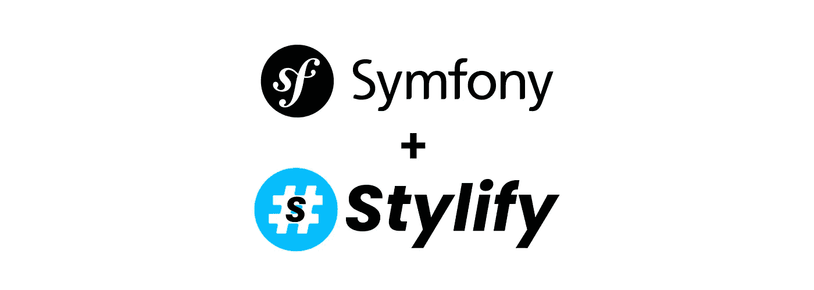

# **简介**

[Stylify](https://stylifycss.com) 根据你写的东西动态生成 CSS。语法类似于 css `property:value`。定义的实用程序与组件选择器相结合，并在生产中缩小到最低限度，如`.color\:red,.button {color:red}`到`_zx, _ga{color:red}`。

有了 Stylify，你可以继续使用 Twig 模板或 PHP 文件，编写选择器，并为每个页面分别获取尽可能小的 CSS 块🤟

# Symfony 快速设置

最简单的开始方式是使用 Symfony Skeleton 和 Webapp 包。

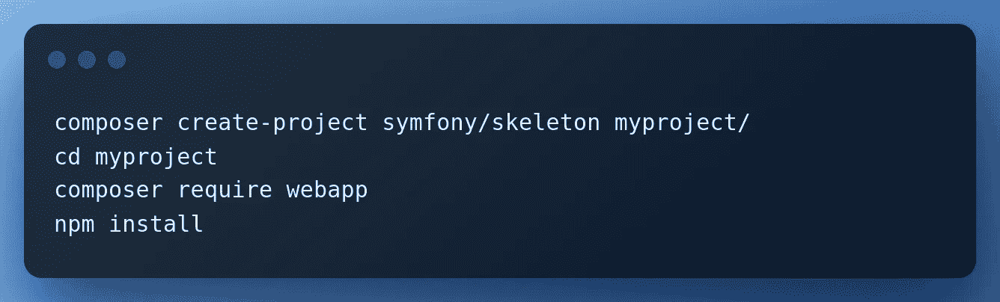

添加 HP 控制器`src/Controller/HpController.php`

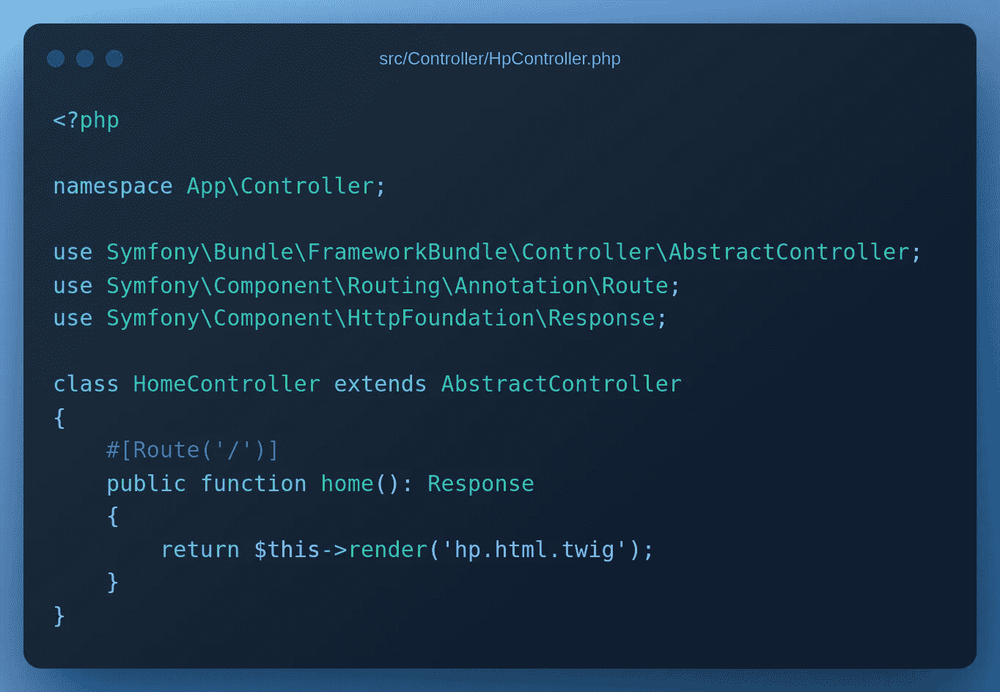

还有主页模板`templates/hp.html.twig`。

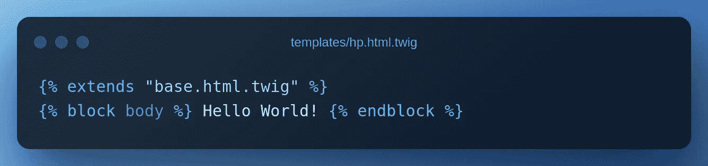

# 风格化集成

安装 Stylify 通用插件。

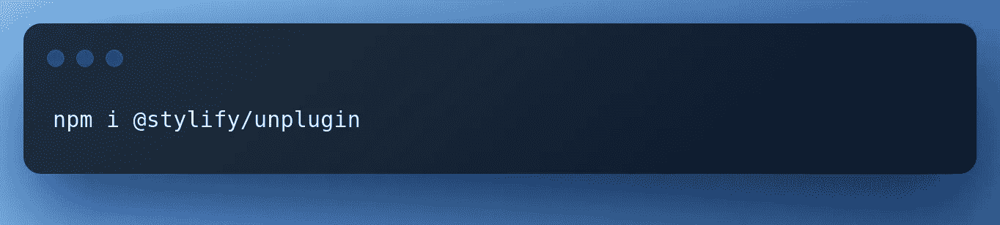

更新 web pack . config . js . Import Stylify，添加插件和 hp style 条目。

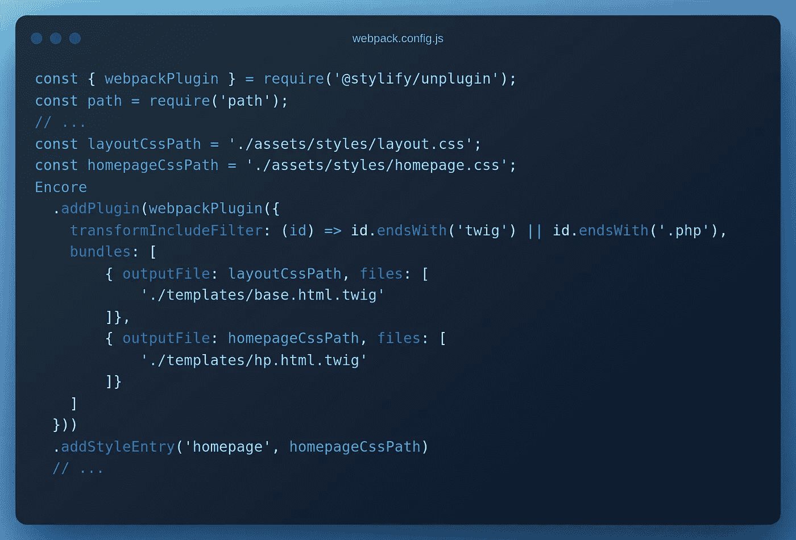

将`assets/app.js`中的`app.css`改为‘layout . css ’,并将 CSS 链接添加到`hp.html.twig`中。

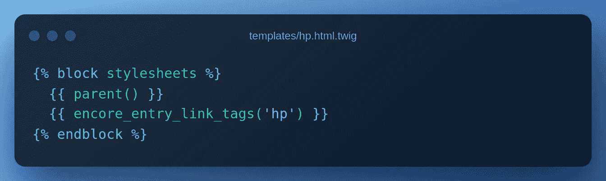

# 设计网站

设置完成后，编辑`hp.html.twig`

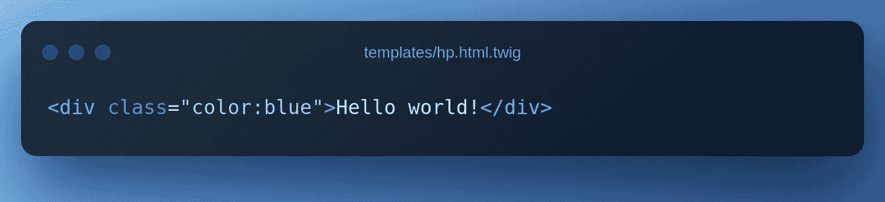

并运行`npm run dev`。

Stylify 将找到`color:blue`选择器，并为其生成 css。`.color\:blue{color:blue}`进入`homepage.css`。

一些代码经常需要跨多个页面重用。通过实用程序和选择器中的硬编码单元来扩充模板并不是一个好主意。让我们定义一个`container`组件和一些变量。

打开`webpack.config.js`并编辑 Stylify 插件配置:

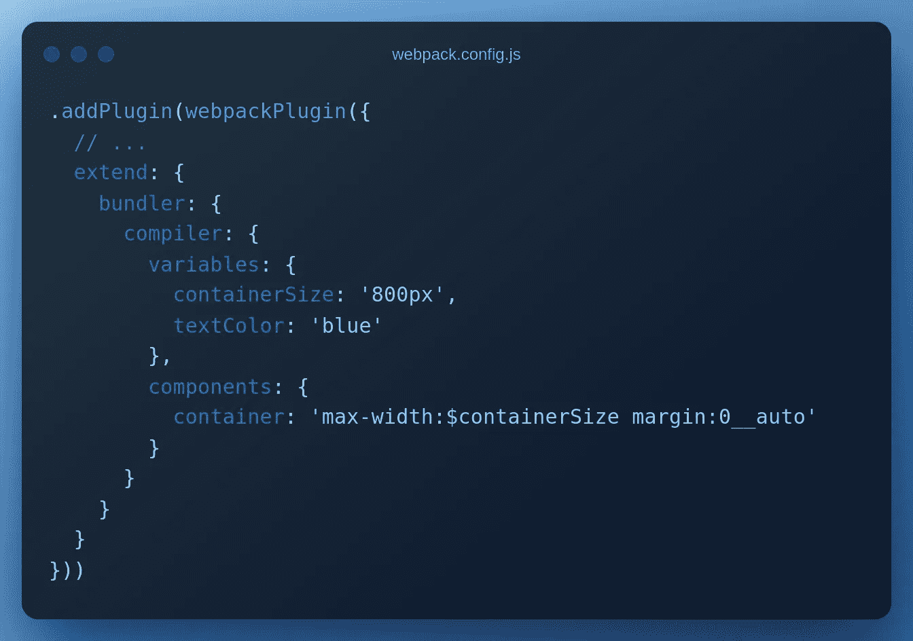

现在我们可以更新`base.html.twig`

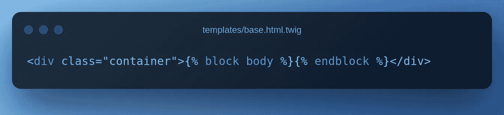

而`hp.html.twig`

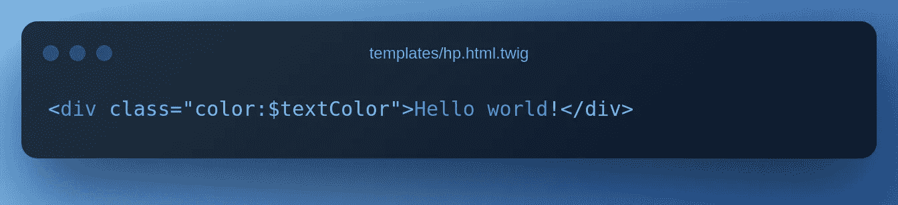

有时，一些组件只在一个地方使用。在`webpack.config.js`中定义它们是没有意义的。我们也可以直接在使用它们的文件中定义组件、变量等。为此，Stylify 有一个[内容选项](https://stylifycss.com/docs/stylify/compiler#contentoptionsprocessors)。

让我们在`hp.html.twig`中添加一个段落组件:

# 生产大楼

当我们运行生产版本`npm run build`时，Stylify 会自动处理所有识别的选择器并生成优化的 CSS。

优化的`hp.html.twig:`

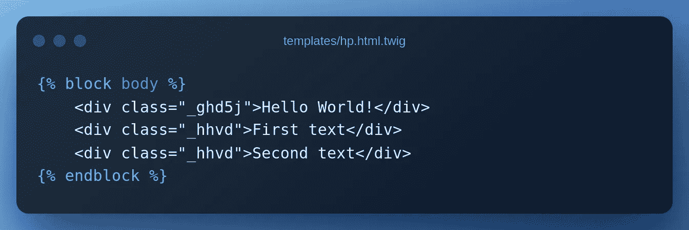

优化的惠普 css:

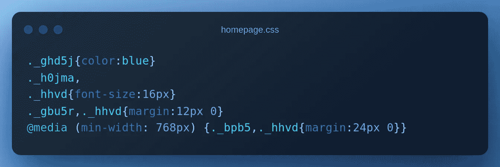

这个例子也可以在[Stylifycss.com 网站](https://stylifycss.com/docs/integrations/symfony)上找到。

# 配置您需要的任何东西

上面的例子没有包括 Stylify 能做的所有事情:

*   您可以在模板中映射[嵌套文件](https://stylifycss.com/docs/bundler#files-content-option)
*   样式[全局选择器](https://stylifycss.com/docs/stylify/compiler#plainselectors)
*   定义[自定义屏幕](https://stylifycss.com/docs/stylify/compiler#screens)
*   添加[自己的宏](https://stylifycss.com/docs/stylify/compiler#macros)像`ml:20px`一样用于左边距
*   还有更多

请随意[查看文档](https://stylifycss.com/docs/get-started)以了解更多信息💎。

# 让我知道你的想法！

我会很高兴得到任何反馈！风格化仍然是一个新的库，有很大的改进空间🙂。

保持联系:
👉 [@8machy](https://twitter.com/8machy)
👉 [@stylifycss](https://twitter.com/stylifycss)
👉[Stylifycss.com](https://stylifycss.com)👉[dev.to/machy8](https://dev.to/machy8)👉[medium.com/@8machy](/@8machy)