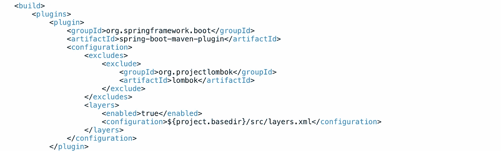

# 为 Spring Boot 应用程序编写生产就绪的优化 docker 文件

> 原文：<https://medium.com/codex/write-production-ready-optimized-dockerfile-for-spring-boot-application-8fec0906a894?source=collection_archive---------5----------------------->

[伊恩·泰勒](https://unsplash.com/@carrier_lost?utm_source=medium&utm_medium=referral)在 [Unsplash](https://unsplash.com?utm_source=medium&utm_medium=referral) 上拍照

# Dockerfile 文件

优化的多级 Dockerfile 文件

# 第一阶段—建造者

我使用多阶段 Docker 构建来创建图像。在第一阶段，我使用`maven-3.8.3-openjdk-17`作为我的基本映像，并将 pom.xml 和代码库复制到映像中。使用`mvn package`命令，我构建了一个超级 jar，在一个 JAR 文件中包含了包*和*及其所有依赖项。

这个超级 jar 可以轻松达到 400MB 或更多。这意味着对于每一次新的构建，甚至是应用程序中最简单的代码更改:

*   将创建一个新的 400MB 层
*   该图层将上传到您的 OCI 注册表中
*   当 Kubernetes 将最新的图像拉至运行容器的节点时，将需要拉取整个 400 MB 的层。

这将发生在每次代码更改和映像重建时。事实上，只有很小一部分编译后的代码发生了变化。Dockerfile 将每个新行视为一个新层，因此将第三方依赖项放在它们自己的层中，并将我们的自定义代码放在自己的层中会更有意义。从 2.3 开始，Spring boot 提供了一种将 jar 分解成层的方法。

# 分层

代替*运行*Spring Boot 应用程序，将参数`-Djarmode=layertools list`传递给 java 命令将简单地列出对 Spring Boot 应用程序有意义的层。在我们的案例中，这些是:

*   **依赖关系**——Spring Boot 和其他框架基于发布的依赖关系。这些只有在我们升级到 Spring Boot 版本或第三方框架版本时才会改变。
*   **Spring Boot 加载器**——这是将我们的 Spring Boot 应用程序加载到 JVM 中的代码，以管理 bean 的生命周期，等等。这也很少改变。
*   **快照依赖关系** —这些依赖关系的变化更加频繁。有可能在每个新版本中，我们都需要获取最新的快照。因此，这一层最接近我们的应用程序代码。
*   **应用** —这是我们来自`src/main/java`的应用代码(对于 maven 来说)。

使用`Djarmode=layertools extract`命令将图层提取到目标目录。

# 第二阶段— Spring Boot 应用

在下一个阶段，我们使用 openjdk-17 作为基础图像，并将前一阶段的图层逐个复制到当前阶段的图像。由于 Dockerfile 中的每一行都创建了一个可以缓存的单独层，这在下一次只有代码更改而没有依赖关系更改时会有所帮助，这意味着 Docker 可以重用旧的依赖关系缓存层。这有助于优化构建时间。

此后，我公开了 Spring Boot 将运行的端口，并切换到一个非 root 用户。最后一行加载并运行 Spring Boot 应用程序。

# 自定义图层

我有自己的一组依赖项，不属于 Spring 提供的依赖项。例如，我有一个连接到文件存储服务的自定义库。将这样的依赖项提取到它们自己的层中是有意义的，因为它比 Spring 依赖项更频繁地变化。为此，我创建了一个自定义层配置:

在 Spring Boot 创建自定义图层

始终以这样的方式对层进行排序，即变化最小的层在开始，变化较频繁的层在最后。

要在应用中应用该配置，将`spring-boot-maven-plugin`指向自定义层配置:

在 Spring Boot maven 插件中包含自定义层文件

*如果你喜欢这篇文章，请花点时间为我鼓掌👏(可以多次鼓掌)，跟着我，甚至给我买杯咖啡*[https://www.buymeacoffee.com/abhiandy](https://www.buymeacoffee.com/abhiandy)