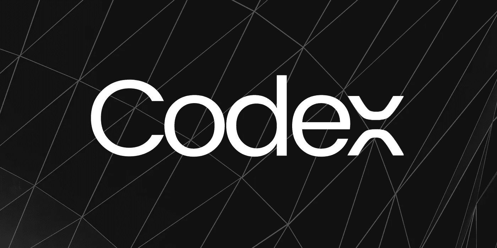

# 为法典写作

> 原文：<https://medium.com/codex/write-to-codex-428b6d509452?source=collection_archive---------1----------------------->

## [法典](http://medium.com/codex)

## 按照以下步骤向食品法典委员会提交您的文章

作者图片

# 什么是法典？

CodeX 是一个媒体出版物，旨在提供基于技术和编码的顶级内容。

我们期待的文章类别包括计算机科学、创新技术、编程、编码和工程概念、个人在技术或编码方面的经验、主要领域的技术(如医疗保健、教育等)。

# 要记住的要点

*   确保你的文章是一篇没有语法错误的文章(强烈推荐使用**语法**或者它的 chrome 扩展)。
*   确保您有权使用张贴在您文章上的图片(图片来源必须在图片下方注明)。这是避免版权问题的重要一步。
*   你的文章中不应该有抄袭的内容发表。如果我们发现任何抄袭的内容，那么你将被永远开除。

# 如何提交？

作者应该通过电子邮件将他们的文章提交给 codexsubmission@gmail.com 的**。**邮件的格式必须是这样的:

*   文章提交——这必须是你的主题
*   你的名字*
*   您的中等个人资料链接*
*   您的文章标题*
*   您的文章链接*
*   您的电子邮件地址(用于联系)*
*   您的 LinkedIn 个人资料(如果有)

如果你的文章符合我们的标准，你将很快被添加为作家法典。然后你就可以直接向食品法典委员会提交你的文章了。如果没有，请在以后的文章中再试一次。希望一切顺利！