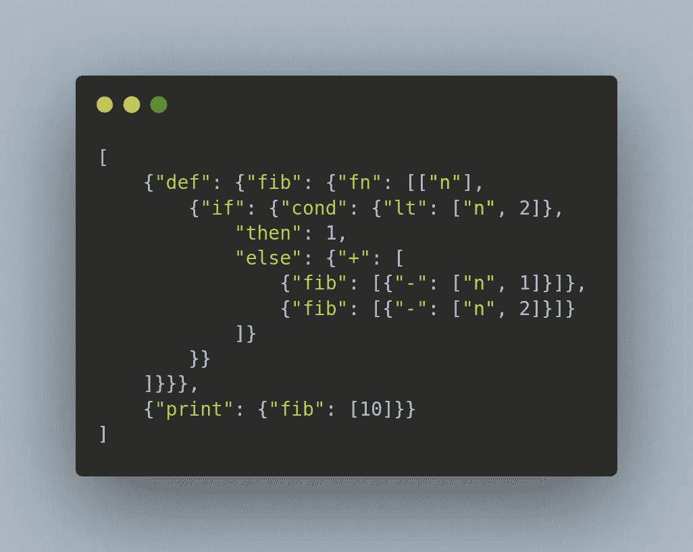

# 用 115 行代码编写一个 LISP-y JSON 解释器

> 原文：<https://medium.com/codex/writing-a-lisp-y-json-interpreter-in-115-lines-of-code-862a4dd37cee?source=collection_archive---------25----------------------->

几天前，我写了[JavaScript](https://github.com/mkhan45/javascripth)，这是一种使用 JSON 作为具体语法的 lispy 脚本语言。它是一个单相的 treewalk 解释器，所以它的抽象语法树也是 JSON，但是从技术上讲，任何用 JavaScript 编写的解释器都是如此。下面是计算第 10 个斐波那契数的 Javascripth 代码示例:



用 JavaScripth 写的斐波那契

挺难看的。超级慢。写它是痛苦的。但这是一种图灵完全编程语言，它的解释器只有大约一百行代码。

我不记得我为什么决定写这个了。花了大约两个小时来编写解释器，然后又花了两个小时来编写 Project Euler 的第一个问题的解决方案。这没用，我可以用手更快地解决这个问题。不管怎样，考虑到它的紧凑性，我认为它是一个学习 basic 解释器的好例子。

我将从解释语言的规则开始:

1.  程序是由 JSON 语句数组定义的，这些语句是按顺序计算的。
2.  一个语句是一个 JSON 对象(字典/映射)或原子(数字、布尔值)，它可能有也可能没有副作用。
3.  “表单”是一个 JSON 对象键值对。例如，在表达式{"+": [5，2]}中，"+"是形式(和函数)，[5，2]是参数列表
4.  还有一些特殊的形式，包括“def”、“fn”等。如果表单不是其中之一，它将被视为函数调用

补充说明:通过 JavaScript 创建用户定义的表单可能非常简单，这将为该语言增加很多功能。

所以我们来看看解释器。几乎没有存储任何数据；只是一个包含全局变量的`state`字典。构造函数只是初始化一些内置函数。解释器的所有工作实际上都发生在`eval()`函数中。我将一个块一个块地研究这个函数。

```
if (typeof expr === 'number' || typeof expr === 'boolean') {
            return expr;
}

if (typeof expr === 'string') {
    return this.state[expr];
}

if (Array.isArray(expr)) {
    return expr.map(s => this.eval(s));
}
```

这些条件计算原子表达式。如果表达式是一个数字或布尔值，它已经被计算过了。如果它是一个字符串，它被当作一个全局变量从字典中取出，如果它是一个数组，数组中的每个表达式都被求值。

```
const res = Object.keys(expr).map(key => {
    let args = expr[key];
    ...
})
```

如果表达式是一个字典，则检查每个键，并让参数是与所述键对应的值。

```
if (key === 'def') {
    for (const name in args) {
        this.state[name] = this.eval(args[name]);
    }
    return;
}
```

第一个内置形式是' def '，用于定义全局变量。与其他形式不同，“def”使用一个字典作为其参数，其中每个键值对直接对应于全局变量字典。

```
if (key === 'fn') {
    if (Array.isArray(args)) {
        // contains argnames list
        const [argnames, expr] = args;
        const fn = new Fn(expr, argnames);
        return fn.compile(this);
    } else {
        // only contains expr
        const expr = args;
        const fn = new Fn(expr);
        return fn.compile(this);
    }
}
```

第二个内置形式是' fn '，用于定义匿名函数。有两种方法可以定义匿名函数；有参数名列表，其中参数必须作为列表传入，或者没有参数名列表，在这种情况下，传入参数字典。这用于命名变量和可选参数。由于有了`Fn`类，这段代码看似简单:

```
class Fn {
    constructor(expr, argnames) {
        this.expr = expr;
        this.argnames = argnames;
    }

    compile(interpreter) {
        return args => {
            if (this.argnames) {
                let args_dict = {};
                for (let i = 0; i < this.argnames.length; i += 1) {
                    const arg_name = this.argnames[i];
                    const arg_val = args[i];
                    args_dict[arg_name] = arg_val;
                }

                args = args_dict;
            }

            const new_interpreter = new Interpreter();
            new_interpreter.state = {...interpreter.state, ...new_interpreter.state, ...args};
            return new_interpreter.eval(this.expr);
        }
    }
}
```

这看起来很简单，但是弄清楚函数是如何工作的花费了编写这个解释器的大部分时间。在此之前，肯定有几个不同的函数实现不起作用。代码本身相当简单。`compile()`实际上返回一个匿名函数，只有一个参数`args`。如果函数有`argnames`，那么必须使用一个参数列表按顺序调用它。在这种情况下，它通过将参数名和值压缩到一个字典中来为函数构造一个局部变量列表。如果函数没有`argnames`，这已经完成了。使用局部变量的字典，我们只需构造一个新的`Interpreter`实例，它的状态只是默认的，调用范围内的全局变量，然后是顶层的函数参数。最后，我们用这个新的范围计算表达式并返回它。这是解释器的核心，我怎么强调都不为过。没有突变，所以任何允许状态在某种意义上改变的事情都是通过函数来完成的。

```
if (key === 'if') {
    const cond = this.eval(args['cond']);
    if (cond) {
        return this.eval(args['then']);
    } else {
        return this.eval(args['else']);
    }
}

if (key === 'print') {
    console.log(this.eval(args));
    return;
}
```

这两种形式非常简单。

```
if (args.map)
    args = args.map(e => this.eval(e));
else
    args = this.eval(args);
```

这几行只是确保所有的参数在被传递到不应该被传递的地方之前都被正确地评估了。我很确定这在某些情况下是多余的，如果做得好的话，可能会让解释器快很多。

```
if (key in this.state && typeof this.state[key] === 'function') {
    return this.state[key](args);
}
```

如果表单不是内置的，那么它一定是一个函数。这种语言中的函数只是匿名函数，所以我们可以正常地在参数字典上调用它。

*原载于 2021 年 8 月 9 日*[*https://mkhan 45 . github . io*](https://mkhan45.github.io/2021/08/09/json-interpreter.md.html)*。*