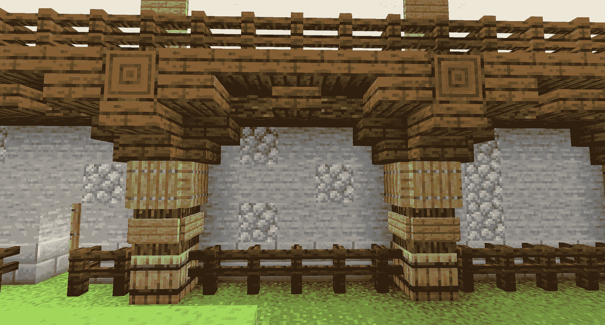

# 用 Python 编写《我的世界》屏幕截图查看器

> 原文：<https://medium.com/codex/writing-a-minecraft-screenshot-viewer-in-python-b8e5ba769e9e?source=collection_archive---------19----------------------->

我是一名软件开发人员，也是一名游戏玩家。我们大多数从小玩乐高长大的人都喜欢玩《我的世界》，因为在《我的世界》你永远不会用光积木。这是一场精彩的比赛。但有时也会令人沮丧。本文解释了我是如何使用 Python 解决其中一个难题的。

我目前在《我的世界》创作的一段重复的墙。

# 问题是