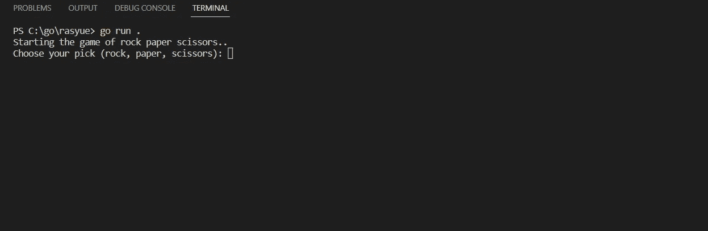
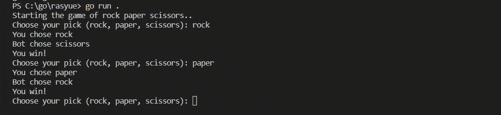
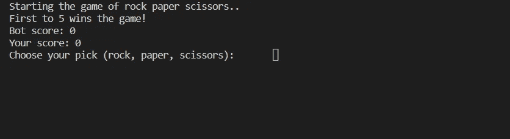

# 用 Golang 写一个石头剪刀布游戏

> 原文：<https://medium.com/codex/writing-a-rock-paper-scissors-game-with-golang-b300ba263c7b?source=collection_archive---------7----------------------->


戈朗

# 介绍

对某些人来说，用 Golang 编写一个石头、剪子、布的游戏听起来可能不那么好。

然而，对于初学者来说，通过编写这个简单的脚本将有助于你学习、理解和熟悉 Golang。

让我们开始吧。

首先，为我们的新项目创建一个新目录。

```
mkdir rasyue
cd mkdir rasyue

go mod init example.com/rasyue

type nul > main.go //(if you are using Windows)
touch main.go //(other than windows)

//or rather just create the main.go any way you want.
```

至此，我们已经创建了编写 Golang 代码所需的目录和文件。

# 编写程序的第一部分

让我们开始吧。

```
package main

import (
 "fmt"
 "bufio"
 "os"
 "strings"
)

func  main(){
 fmt.Println("Starting the game of rock paper scissors..")

 reader := bufio.NewReader(os.Stdin)
 fmt.Print("Choose your pick (rock, paper, scissors): ")
 answer, _ := reader.ReadString('\n')
 text := strings.TrimSpace(answer)

 fmt.Println("You chose: " + text)

}
```

运行时，上面的 Golang 代码将允许您键入您的输入。

继续使用`go run .`运行它，或者您可以使用`go run main.go`运行它。



提示

你可能已经注意到，每当你键入你的输入时，程序就会停止。让我们试着让程序继续运行。

```
package main

import (
 "fmt"
 "bufio"
 "os"
 "strings"
)

func  main(){
 fmt.Println("Starting the game of rock paper scissors..")

 for true {
  reader := bufio.NewReader(os.Stdin)
  fmt.Print("Choose your pick (rock, paper, scissors): ")
  answer, _ := reader.ReadString('\n')
  text := strings.TrimSpace(answer)

  fmt.Println("You chose: " + text)

 }

} 
```

现在试试吧。你可以输入任何东西，程序会继续问同样的问题。

# 输入检查编码

你可能注意到，你甚至可以按下`Enter`，输入将会是空的，或者你甚至可以输入任何类型的文本、数字等。

我们需要确保输入不能为空，文本只能是`rock`、`paper`或`scissors`。

```
package main

import (
 "fmt"
 "bufio"
 "os"
 "strings"
)

func  main(){
 fmt.Println("Starting the game of rock paper scissors..")

 for true {
  reader := bufio.NewReader(os.Stdin)
  fmt.Print("Choose your pick (rock, paper, scissors): ")
  answer, _ := reader.ReadString('\n')
  text := strings.TrimSpace(answer)

  if text == "exit" {

   fmt.Println("Exiting the game...")
   break

  }else if text == "" {

   fmt.Println("Empty input detected")

  }else if text != "rock" && text != "paper" && text != "scissors" {

   fmt.Println("Please choose either rock, paper or scissors!")

  }
 }

} 
```

上述代码不允许输入为空，输入必须是`rock`、`paper`或`scissors`。同样，如果您输入`exit`，那么程序将中断循环并停止。

# 添加机器人

现在，是时候为我们添加机器人来玩石头、布、剪刀的游戏了。

```
package main

import (
 "fmt"
 "bufio"
 "os"
 "strings"
 "math/rand"

)

func  main(){
 fmt.Println("Starting the game of rock paper scissors..")
 var botAnswers = [3]string{"rock", "paper", "scissors"}

 for true {

  reader := bufio.NewReader(os.Stdin)
  fmt.Print("Choose your pick (rock, paper, scissors): ")
  answer, _ := reader.ReadString('\n')
  text := strings.TrimSpace(answer)

  if text == "exit" {

   fmt.Println("Exiting the game...")
   break

  }else if text == "" {

   fmt.Println("Empty input detected")

  }else if text != "rock" && text != "paper" && text != "scissors" {

   fmt.Println("Please choose either rock, paper or scissors!")

  }else{

   randomIndex := rand.Intn(len(botAnswers))
   botPick := botAnswers[randomIndex]
   fmt.Println("You chose " + text)
   fmt.Println("Bot chose " + botPick)

   if botPick == "paper" && text == "rock"{
    fmt.Println("You lose!")
   }else if botPick == "paper" && text == "scissors"{
    fmt.Println("You win!")
   }else if botPick == "rock" && text == "scissors"{
    fmt.Println("You lose!")
   }else if botPick == "rock" && text == "paper"{
    fmt.Println("You win!")
   }else if botPick == "scissors" && text == "rock"{
    fmt.Println("You win!")
   }else if botPick == "scissors" && text == "paper"{
    fmt.Println("You lose!")
   }else{
    fmt.Println("Draw!")

   }

  }
 }

} 
```

给你。现在尝试再次运行程序并输入您的选择。



提示

# 使程序有趣的最后一步(至少)

让我们对剧本做最后的润色，至少让它更有趣。

```
package main

import (
 "fmt"
 "bufio"
 "os"
 "strings"
 "math/rand"
 "time"
)

func  main(){
 fmt.Println("Starting the game of rock paper scissors..")
 fmt.Println("First to 5 wins the game!")
 var botAnswers = [3]string{"rock", "paper", "scissors"}
 var yourScore = 0 
 var botScore = 0

 fmt.Printf("Bot score: %d \n", botScore)
 fmt.Printf("Your score: %d \n", yourScore)

 for true {

  reader := bufio.NewReader(os.Stdin)
  fmt.Print("Choose your pick (rock, paper, scissors): ")
  answer, _ := reader.ReadString('\n')
  text := strings.TrimSpace(answer)

  if text == "exit" {

   fmt.Println("Exiting the game...")
   break

  }else if text == "" {

   fmt.Println("Empty input detected")

  }else if text != "rock" && text != "paper" && text != "scissors" {

   fmt.Println("Please choose either rock, paper or scissors!")

  }else{

   randomIndex := rand.Intn(len(botAnswers))
   botPick := botAnswers[randomIndex]
   fmt.Println("You chose " + text)
   fmt.Println("Bot chose " + botPick)

   if botPick == "paper" && text == "rock"{
    fmt.Println("You lose!")
    botScore++
   }else if botPick == "paper" && text == "scissors"{
    fmt.Println("You win!")
    yourScore++
   }else if botPick == "rock" && text == "scissors"{
    fmt.Println("You lose!")
    botScore++

   }else if botPick == "rock" && text == "paper"{
    fmt.Println("You win!")
    yourScore++
   }else if botPick == "scissors" && text == "rock"{
    fmt.Println("You win!")
    yourScore++
   }else if botPick == "scissors" && text == "paper"{
    fmt.Println("You lose!")
    botScore++

   }else{
    fmt.Println("Draw!")

   }

   fmt.Printf("Bot score: %d \n", botScore)
   fmt.Printf("Your score: %d \n", yourScore)
   if yourScore > 4{
    fmt.Println("You won the game")
    time.AfterFunc(1*time.Second, func() {
     os.Exit(0)

    })
   }else if botScore > 4{
    fmt.Println("You lose the game")
    time.AfterFunc(1*time.Second, func() {
     os.Exit(0)

    })

   }

  }
 }

} 
```

就这样，我们结束了。运行脚本，争取胜利！



提示

# 结束了

总而言之，这仍然只是一个 CLI 脚本，绝对没有视觉吸引力。这就是为什么在下一篇教程中，我们将看到如何通过将 Golang GUI 集成到脚本中来做得更好。

敬请期待！