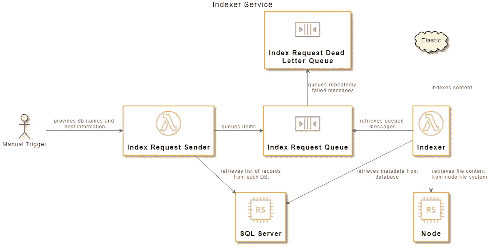

# 编写无服务器文件索引器

> 原文：<https://medium.com/codex/writing-a-serverless-file-indexer-4ed524fe2a5e?source=collection_archive---------12----------------------->

无服务器解决方案适用于各种情况。不管你选择无服务器的理由是你不想管理服务器，想通过扩展到零来节省成本，还是你的流量具有高波动性，无服务器在很多情况下都是有用的。在这篇文章中，我将回顾我在设计一个最近的无服务器系统时经历的一些设计和思考过程。