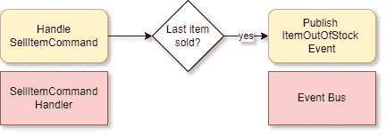

# 中编写更好的方法调用断言。网

> 原文：<https://medium.com/codex/writing-better-method-call-assertions-in-net-8de121e9eb33?source=collection_archive---------6----------------------->

## 停止使用 Moq。核实


# 介绍

在这篇博文中，我将向你展示测试方法调用的常用方法，解释为什么使用 Moq。验证不理想，并提出不同的方法。

# 单元测试

我们都同意测试的好处。

对于大多数开发人员来说，最大量的测试将通过**单元测试**来完成。

**单元测试**是一个非常强大的工具。它们提供了**短反馈循环**，并迫使我们以一种更干净和隔离的方式编写代码，从而使我们的代码库更少**错误**倾向**，**更容易**改变，**总体而言，更易于**维护**。

# 单元测试应该有助于节省时间

作为开发人员，我们的职责是使我们的单元测试尽可能的可读和有帮助，这样维护和构建我们代码的人就可以花尽可能多的时间解决业务问题，而不是修复错误，或者更糟，修复测试。

# 例子

考虑下面的例子。



我们正在测试的行为

我们有一个通用的 CQRS 流，带有一个 **SellItemCommand** 和该命令的**处理程序**。我们希望确保处理程序在库存中的最后一件商品售出的情况下，向事件总线发布一个 **ItemOutOfStock** 事件和**正确信息**。

# 通常的方式

乍一看，测试似乎没什么问题。它短小精悍，可读性强，意图明确。

不过，我们来看看**测试失败**会发生什么。出于演示的目的，我将让处理程序发布一条带有不同**原因**的消息。

我们运行测试，并看到以下消息:

```
Moq.MockException : 
    Expected invocation on the mock at least once, but was never performed: x => x.Publish(It.Is<ItemOutOfStockEvent>(e => ((e.StoreId == 12 && e.ItemId == 12345) && e.Cashier == "Anna") && (int)e.Reason == 1))

    Performed invocations:

       Mock<IEventBus:1> (x):

          IEventBus.Publish(ItemOutOfStockEvent)
```

这个消息不是很有帮助。它告诉你测试失败了，但是只告诉你这个方法没有收到它所期望的对象的调用。这意味着您现在必须调试测试，设置断点，并手动检查 ItemOutOfStockEvent 的每个属性，以找出哪一个是错误的。此外，这整个异常消息是一个命令行程序。想象一下，当测试一个具有几十种属性的复杂对象时，会有多恐怖。

# 不同的方法

我建议使用**最小起订量。回调**来存储方法参数，然后分别断言每个属性。

让我们修改代码来使用这种方法。我还将使用**fluent assessments**来提高可读性。

让我们现在试着运行测试。

```
Expected publishedEvent.Reason to be StockoutReason.SoldOut {value: 1}, but found StockoutReason.LateDelivery {value: 2}.
```

那就好多了，不是吗？该消息清楚地传达了测试失败的原因:资产的名称、T2 的期望值和 T4 的实际值。

# 最后的想法

你使用 Verify 编写过测试吗？你会尝试回调方法吗？你看到我遗漏的潜在问题了吗？让我知道你的想法。