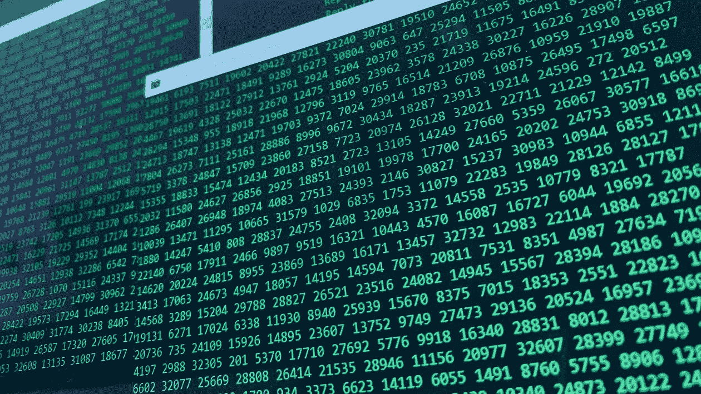

# 编写优秀的软件工程任务

> 原文：<https://medium.com/codex/writing-good-software-engineering-tasks-2ffcf38ed352?source=collection_archive---------9----------------------->

*免责声明:所有观点都是我自己的*

[照片](https://www.pexels.com/photo/codes-on-screen-9951077/)来自 Pexels 的 Tibe De Kort

通常，当你开始职业生涯时，你花在执行任务上的时间比写任务的时间多。你从你的 sprint 或看板(或者瀑布项目计划，我猜)上抓一个任务，通读一遍，如果任务写得好，就开始敲代码。

如果任务写得不好，你可能需要找到写的团队成员…