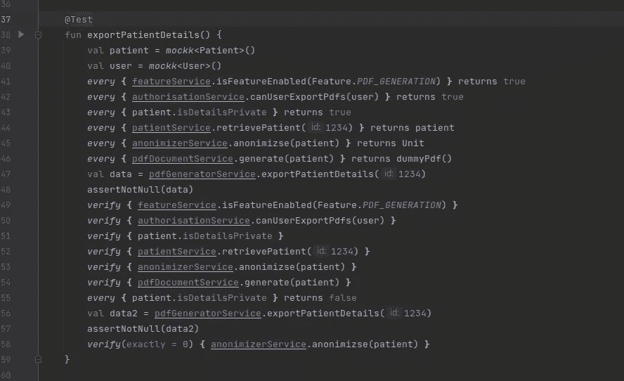
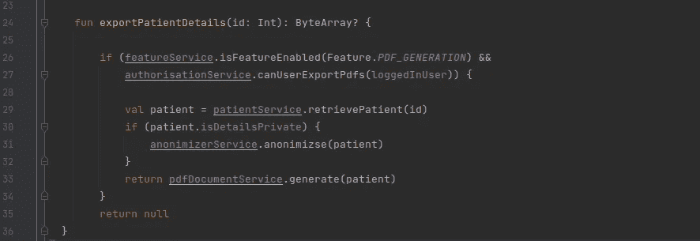
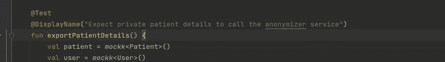
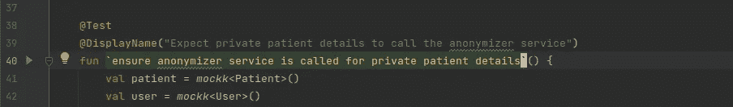
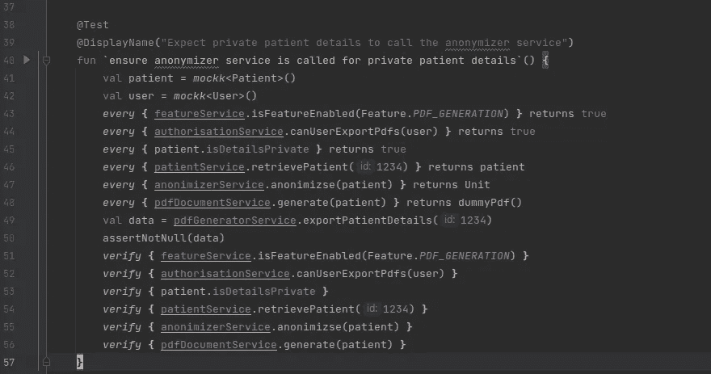
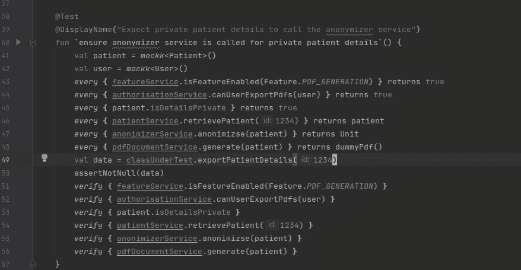
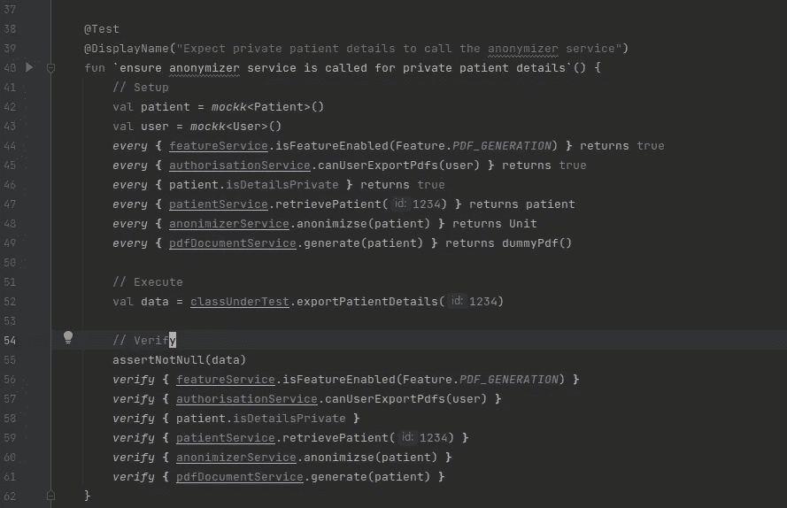

# 编写可读的 JUnit 测试

> 原文：<https://medium.com/codex/writing-readable-junit-tests-9fbb31e28746?source=collection_archive---------20----------------------->

詹姆斯·哈里逊在 [Unsplash](https://unsplash.com?utm_source=medium&utm_medium=referral) 上拍摄的照片

我们以前都经历过。您编写您的特性，编写您的测试，运行完整的测试套件，然后在一个看似不相关的测试中发现一个失败。你去看它，看到的是这样的东西。

看着代码，你会意识到你根本不知道测试首先要测试什么，这使得理解它为什么会失败变得更加困难。然而，为了提高可读性，可以对测试进行一些简单的修改。

下面的例子是用 Kotlin 编写的，但是这些思想也适用于 Java。

# 编写更清晰的测试

让我们假设这是在上面的例子中被测试的方法

这是一个非常简单的流程:

*   如果启用了 PDF_GENERATION 功能，并且授权用户导出 PDF 文档，则检索患者数据，检查患者详细信息是否保密，如果保密，则匿名，最后返回 PDF。

然而，目前还不清楚该测试试图验证这一流程的哪一部分。让我们检查一些方法，测试可以更加自我记录。

## 1.描述测试

JUnit 提供了一个@DisplayName 注释，可以用来提供关于测试的额外信息:

此外(或可选地),测试本身可以被重命名:

应该使用上述任何一种方法来更清楚地说明测试的目的。

## 2.只测试一件事

如果我们再看一下测试:

我们可以在第 55 行看到，在该测试中正在测试另一个条件，即患者详细信息不是私有的。任何给定的测试都应该只关注测试流程的一部分。这里测试的第二个条件应该被分解成一个单独的测试。这给我们留下了:

## 3.重命名被测试类的实例变量

在此示例中，测试正在测试 PDFGeneratorService。然而，这个服务只是在这个例子中被模拟出来的 4 或 5 个其他服务中的一个，浏览一下代码，应该可以更清楚地看出这些服务中的哪一个才是真正被测试的服务。一个建议是将被测试的类的实例变量重命名为更独特的名称，如 *testClass* 或 *classUnderTest* ，如下所示:

这使得测试的哪一部分调用被测试的类，而不是定义任何嘲笑/存根行为变得更加清楚。

## 4.分成几个阶段

单元测试有三个不同的阶段:

*   **设置**:设置测试所需的任何模仿/敲击行为。
*   **执行**:执行测试。理想情况下，这应该是单行代码。
*   **验证**:验证测试做了它应该做的事情。

这些阶段可以有不同的名称，*给定/何时/然后*，或者*安排/行动/断言*，但是原理是相同的。

用简单的注释声明每个阶段，确保正确的代码在正确的阶段，并且代码现在看起来像这样:

现在，测试代码的每个部分都有了去处，每个阶段本质上都告诉你它在做什么。

偶尔，这些阶段中的一些可能被组合，例如，如果执行阶段预期会抛出异常，则执行和验证可能同时被执行和验证。

像这样划分测试还可以让你专注于编写测试的各个部分。所以不要问“我该怎么写测试？”你在问“我需要设置什么来执行测试”和“测试应该执行什么验证”。

# 摘要

在本文中，我们研究了几种使 JUnit 测试更具可读性的方法。因此，希望下次你需要更新任何测试时，你能理解测试试图验证什么行为，以及任何失败发生在什么阶段，因为它应该更清楚什么可能导致任何失败，或者它可能只是使测试更容易维护代码的变化。