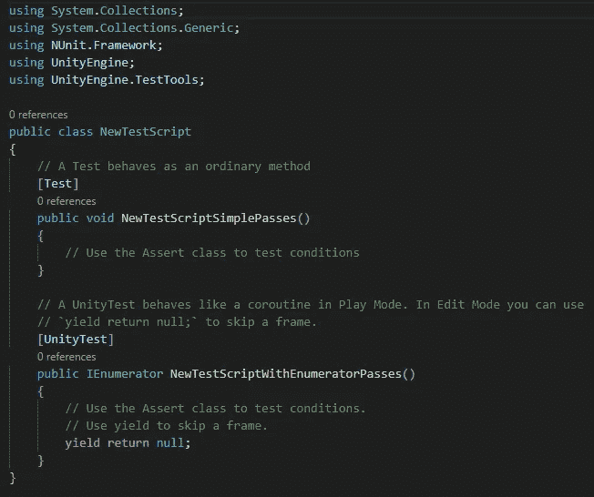
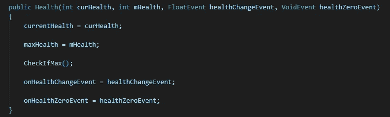
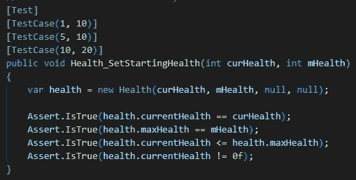
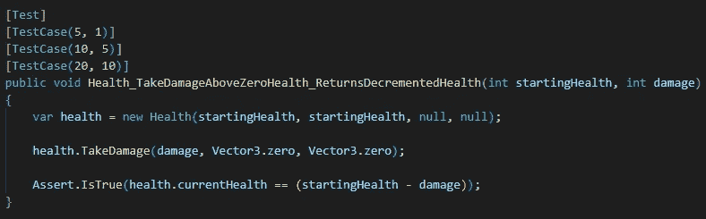
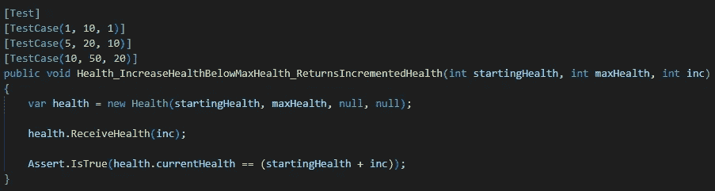
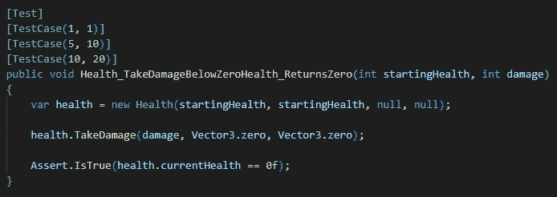
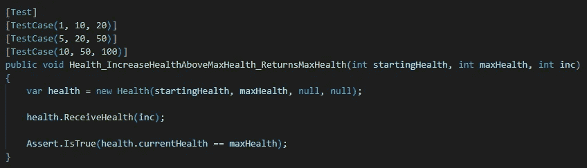
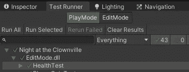

# 在 Unity 中为我的游戏编写单元测试

> 原文：<https://medium.com/codex/writing-unit-tests-for-my-game-in-unity-b0163e2c9b47?source=collection_archive---------14----------------------->

## 假设你已经知道基本的 C#和 Unity

你们中的大多数人一定已经知道我目前正在 Unity 开发一款游戏，名为《小丑之夜》。这是一个 3D 低聚第一人称射击游戏，生存恐怖游戏，你被困在一个主题公园，你将努力摆脱出来。别担心，我不会在这里推广它(抱歉，我刚刚做了)，只需在我们的 [Instagram 页面](https://www.instagram.com/stationrgames/)上查看一下！在这篇文章中，我想说的是 Unity 中的单元测试。坐着别动，继续读下去！

> 当代码运行得非常好的时候，为什么还要测试它呢？

在我作为一名从事硬盘工作的固件开发人员的第一次实习经历中，我遇到了单元测试这个话题。然而，我害怕单元测试的概念，因为我对它一无所知。像大多数开发人员一样，我过去常常嘲笑“测试”代码的想法。"当代码运行良好时，为什么要测试它？"这正是我心中的疑问。开门见山，当我开始开发《小丑之夜》时，我才知道单元测试的重要性。

> 亲吻(保持简短)

简单地说，单元测试是一段测试你的代码的一个“单元”的代码。听起来简单又愚蠢，对吧？应该就是这么简单。但不傻。事实上，单元测试是用来验证一小段逻辑代码的，所以它在特定的场景中完全按照我们想要的方式执行。嗯，理想的做法是将这段代码一般化，使其适用于任何情况。但是保持你的代码简短是很重要的，这样它才能很好地执行每一个也是唯一一个任务——接吻(保持简短)。

现在，让我们动手编写 Unity 中一个简单函数的单元测试。这个单元测试也是我用来评估我的代码片段的。首先，让我们在 Unity 中设置单元测试特性。Unity 的好处在于它提供了 Test Runner，这是一个在 C#中使用 NUnit 框架的单元测试特性。它基本上是一个开源测试框架，支持隔离模块中的单元测试。在这里阅读更多。

在 Unity 中，直接进入窗口>常规>测试运行程序。对于本文，让我们只在编辑模式下编写一个单元测试，在这里我们可以测试任何不必在播放模式下运行的脚本。在 Test Runner 中，点击“在当前文件夹中创建测试脚本”按钮，这将允许 Unity 做两件事:

1.  创建一个汇编定义文件(这对于将文件依赖与我们的生产代码分开是很重要的)。
2.  创建一个测试脚本(我们可以将它重命名为我们想要的任何名称，只需给它一个相关的名称)。

这是当测试脚本被创建时你将得到的。如果第二个函数引起了您的注意，那是因为它是一个协程函数。别担心，我们今天不会用到它，你可以随意查找，因为它在为你的游戏编写脚本时被广泛使用。

正如您已经从第一个函数内部的行注释中看到的，使用 Assert 类来测试条件，这就是我们今天要使用的。在本文中，我将为我的健康组件编写一个单元测试。和任何角色一样，无论是玩家、NPC 还是敌人，都需要健康元素。我们会在运行之前或运行期间单独设置它们的健康状况，但更重要的是，我们需要确保设置健康状况的函数正确运行并返回正确的健康数字。然后，就像任何角色一样，它可以承受导致生命值下降的伤害，或者服用生命药剂来增加生命值。那么，让我们在这里定义我们的规则:

1.  在运行之前或运行期间实例化健康时，它应该返回正确的健康值，并且小于最大健康值。
2.  当且仅当生命值大于零时，它会受到伤害，并返回递减的生命值。
3.  当且仅当健康低于最大健康且高于零时，它可以被递增，并且它应该返回递增的健康。

当然，接下来，我们还需要处理一些极端情况，比如:

4.如果生命值低于零，检查它是否能承受伤害，它应该返回零而不是负数。

5.如果生命值等于或高于最大生命值，并且玩家服用了一剂生命药剂，它应该返回最大生命值。

显然，我们需要一个健康的组成部分。

为了本文的简单起见，我们将只使用这个构造函数，它通过给定以下内容来创建一个健康对象:

*   游戏对象应该具有的当前健康状况
*   游戏对象应该拥有的最大健康值
*   健康变化事件(这是 Unity 事件系统，我们将在以后的文章中讨论)
*   当健康值为零时的事件

让我们设定我们的起始健康并测试它。

## 1.Health_SetStartingHealth

从这里，你可以清楚地看到测试函数上面的 **TestCase** 属性。大括号中的整数对应于函数的参数。因此，我们可以传入多组数字来测试函数，但是我们肯定会在尽可能短的测试用例中涵盖所有的极限情况。使用**断言*。IsTrue()*** ，我们只想比较创建的健康变量是否确实等于我们在**测试用例**属性中传递的内容。

## 2.health _ takedamagebovezerohealth _ ReturnsDecrementedHealth

忽略 TakeDamage()函数，但只知道造成了损害，我们希望确保返回的生命值等于初始生命值减去损害值。简单！

## 3.health _ increasehealthblowmaxhealth _ ReturnsIncrementedHealth

类似地，对于增量健康，我们希望确保返回的健康等于开始健康和增量的总和，假设它低于最大健康。

## 4.health _ TakeDamageBelowZeroHealth _ ReturnsZero

当玩家或任何角色的生命值低于零，但仍然受到伤害时，无论如何生命值都应该等于零。

## 5.health _ increasehealthboathmaxhealth _ ReturnsMaxHealth

类似地，如果健康状况已经高于最大预定值，则应该将其设置为最大值，甚至进一步增加。

当您完成了由多个测试组成的整个测试套件的编写后，是时候在 Unity 中运行它了！

在选择了您刚刚创建的健康测试后，只需按“运行所选项目”，然后*瞧*！我们最不想要的就是失败的测试，所以只要确保你知道你正在运行什么测试。

在本文中，我展示了如何使用内置的测试运行器对 Unity 中的组件执行单元测试。单元测试经常被忽视，但它是保证代码简短的可靠方法，因为它们测试的都是功能单元。我希望你能在编写单元测试中获得乐趣，因为这仍然是我偶尔喜欢做的最好的事情之一。快乐发展！