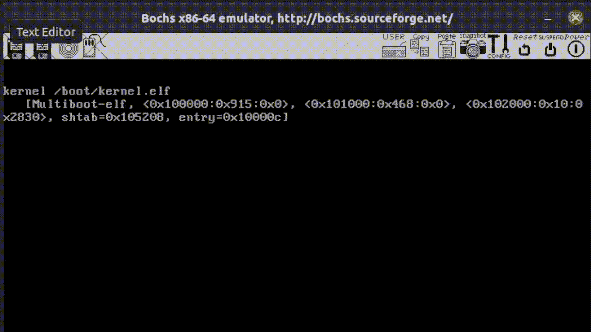

# 编写自己的操作系统:中断和输入

> 原文：<https://medium.com/codex/writing-your-own-operating-system-interrupts-and-input-b6dfae970767?source=collection_archive---------2----------------------->


[横幅](https://www.freepik.com/vectors/banner)由 katemangostar 创建的矢量—【freepik.com 

在我以前的一篇文章中，我解释了如何在控制台上显示文本以及如何将数据写入串口。如果你看起来很困惑，你可以回到第[篇](https://hasinisama.medium.com/building-your-own-operating-system-drivers-8adfc889398b)来补上。

所以既然我们已经教会了我们的操作系统产生输出，如果它也知道如何读取输入，那就太好了。所以让我们从最常见的输入源开始；键盘。那么键盘是怎么工作的呢？你只要按一个按钮，瞧，它就印在屏幕上了！有这么简单吗？这就是我们将在本文中讨论的内容！



## 什么是中断？

当硬件设备(如键盘、串口或定时器)向 CPU 发送输入时，就会发生中断。这是他们说“对不起，状态发生了变化，您可能需要检查一下这个”的方式。

中断也可能是由于程序错误而由 CPU 发出的，比如当一个程序将一个数除以零时。还有由 ***int*** 汇编代码指令引起的中断。我们称它们为*软件中断*，它们主要用于系统调用。


[人](https://www.freepik.com/vectors/people)由 pch 创建的向量。向量—[freepik.com](http://www.freepik.com)

# 中断处理程序

但是我们如何解释这些中断呢？这些中断是通过*中断描述符表* (IDT)来处理的。总共有 256 个不同的中断，每个都从 0-255 编号。IDT 描述了每个中断的处理程序。现在有三种处理程序:

*   **任务处理程序** —特定于 x86 的英特尔版本
*   **中断处理程序** —由硬件设备触发
*   **陷阱处理器** —由用户程序触发

在本文中，我们将使用陷阱处理程序。

# 在 IDT 中创建条目

正如我们在以前的文章中无数次做的那样，我们将使用另一个打包结构来定义 IDT 中的每个条目。

不要忘记为 IDT 本身创建另一个打包结构，就像我们为 GDT 创建的一样。

# 处理中断

但是当中断发生时，真正发生了什么呢？首先，CPU 将把一些关于中断的信息推到堆栈上。然后它会在 IDT 中查找合适的中断处理程序并跳转到它。

那时的堆栈看起来会像这样，

```
 [esp + 12] eflags
    [esp + 8]  cs
    [esp + 4]  eip
    [esp]      error code?
```

*错误码末尾问号的原因？*不是所有的中断都会产生*错误代码*。就像问有没有错误一样。中断处理程序可以使用错误代码来获取更多关于发生了什么的信息。

这里的中断*号*是*而不是*被推到堆栈上，因为我们可以通过检查哪个处理程序正在执行来知道哪个中断正在发生。


接下来，一旦中断处理程序完成，堆栈就使用`iret`指令返回。

与机场海关一样，iret 将检查返回的堆栈是否与中断发生前的堆栈相同。所以任何由中断处理程序压入堆栈的值都必须弹出。堆栈应该和以前一样。

在这里，C 处理程序应该看起来像下面的代码。

接下来，棘手的部分是创建一个通用的中断处理程序。

# 通用中断处理程序

为什么制作一个能处理所有中断的通用中断处理程序很困难？这仅仅是因为 CPU 没有将中断号推入堆栈。为了解决这个问题，我们使用了 NASM 的宏功能。由于一些中断不会产生错误代码，所以值 0 将被用作它们的“错误代码”。

所以我们需要一个`**common_interrupt_handler**`来完成以下工作:

*   将寄存器压入堆栈。
*   调用 C 函数`interrupt_handler`。
*   从堆栈中弹出寄存器。
*   `esp`加 8(因为之前推送的错误码和中断号)。
*   执行`iret`返回中断代码。

所以你的代码应该是这样的，

# 装载 IDT

接下来，使用`lidt`汇编代码指令加载 IDT，该指令获取表中第一个元素的地址。

# 可编程中断控制器(PIC)

我们不能就这样开始使用硬件中断。为此，我们需要配置可编程中断控制器(PIC)。PIC 使得将信号从硬件映射到中断成为可能。

但是我们为什么需要配置它呢？PIC 就不能完成任务吗？

配置 PIC 有几个原因，

*   重新映射中断。默认情况下，PIC 使用中断 0-15 作为硬件中断，这与 CPU 中断相冲突。因此，PIC 中断必须重新映射到不同的时间间隔。
*   选择要接收的中断。你可能不想接收所有设备的中断，因为你没有处理这些中断的代码。
*   为 PIC 设置正确的模式。

这里两张图片链接在一起，以适应 16 个硬件中断。

每个 PIC 中断都必须得到确认，这意味着必须向 PIC 发送一条消息，确认中断已被处理。如果不这样做，PIC 将停止产生中断。通过向产生中断的 PIC 发送字节 0x20 来确认 PIC 中断。

因此，由于键盘中断是由 PIC 引发的，所以您必须在键盘中断处理程序的末尾调用`**pic_acknowledge**`。

# 从键盘读取输入

接下来我们需要解决的是键盘输入本身。键盘不生成 ASCII 字符，它生成扫描代码。一个扫描码定义了一个按钮，当它被按下和释放时。可以从键盘上的数据 I/O 端口(地址为 0x60)获得刚刚按下的按钮的扫描代码。

最后一部分是编写一个函数，将扫描代码翻译成相应的 ASCII 字符。此代码可能因键盘而异。

# 输出输入

现在只需调用`**serial_write()**` 函数，将从键盘读取的字符传递到串口写入即可。当你打字时，你在屏幕上看不到任何东西(因为我们不是在 Bochs 控制台上写，而是在串行端口上写)。

如果你做了所有正确的事情，你会在你的`com1.out`上看到这个。


但是，如果我们在键盘上输入的任何内容都能在 Bochs 控制台上显示出来，那不是更好吗？

为此，我们不能简单地使用`**fb_write()**` 功能，因为我们一次只写一个字符，需要相应地移动光标。

所以，我添加了`**unsigned int BUFFER_COUNT**`来记录写在控制台上的字符数。并且增加了一个`**fb_clear()**` 功能，可以在退格键被按下时擦除一个字符。你可以简单地通过在一个字符上写字来“擦除”它。

```
fb_write_cell( i * 2, ' ', BLACK, BLACK);
```

如果你阅读了这篇文章，你可以很容易地使用键盘在 Bochs 控制台上写东西，就像你看到的第一个 gif 一样。你现在可以尽情地写了。


但是如果你有任何麻烦，不要担心。你可以从下面我的 GitHub 获得完整的代码。

[](https://github.com/HasiniSama/pocketOS/tree/interupt_and_inputs) [## GitHub -中断和输入端的 HasiniSama/pocketOS

### 中断驱动的单任务实模式 x86 操作系统。- GitHub - HasiniSama/pocketOS at…

github.com](https://github.com/HasiniSama/pocketOS/tree/interupt_and_inputs) 

希望在下一篇文章中也能看到你！

谢谢大家！

*参考文献:赫林，e .&伦伯格，A. (2015)。* [*关于 OS 开发的小书*](https://littleosbook.github.io/#getting-to-c)

## 阅读以前的文章

[](/codex/writing-your-own-operating-system-segmentation-61351ecaa1bd) [## 编写自己的操作系统:分段

### 这是 OS 系列的第四篇文章。它解释了分段和全局描述符表。

medium.com](/codex/writing-your-own-operating-system-segmentation-61351ecaa1bd) [](https://hasinisama.medium.com/building-your-own-operating-system-drivers-8adfc889398b) [## 构建您自己的操作系统:驱动程序

### 这是 OS 系列的第三篇文章。它解释了如何在控制台上显示文本，以及如何将数据写入…

hasinisama.medium.com](https://hasinisama.medium.com/building-your-own-operating-system-drivers-8adfc889398b) [](https://hasinisama.medium.com/building-your-own-operating-system-2-e66425adb084) [## 构建自己的操作系统#2

### 本文解释了如何使用 C 语言代替汇编代码作为 OS 开发的编程语言。

hasinisama.medium.com](https://hasinisama.medium.com/building-your-own-operating-system-2-e66425adb084) [](https://hasinisama.medium.com/building-your-own-operating-system-980a4498104) [## 构建您自己的操作系统

### 本文将描述如何实现可以和 GRUB 一起使用的最小的操作系统。

hasinisama.medium.com](https://hasinisama.medium.com/building-your-own-operating-system-980a4498104)