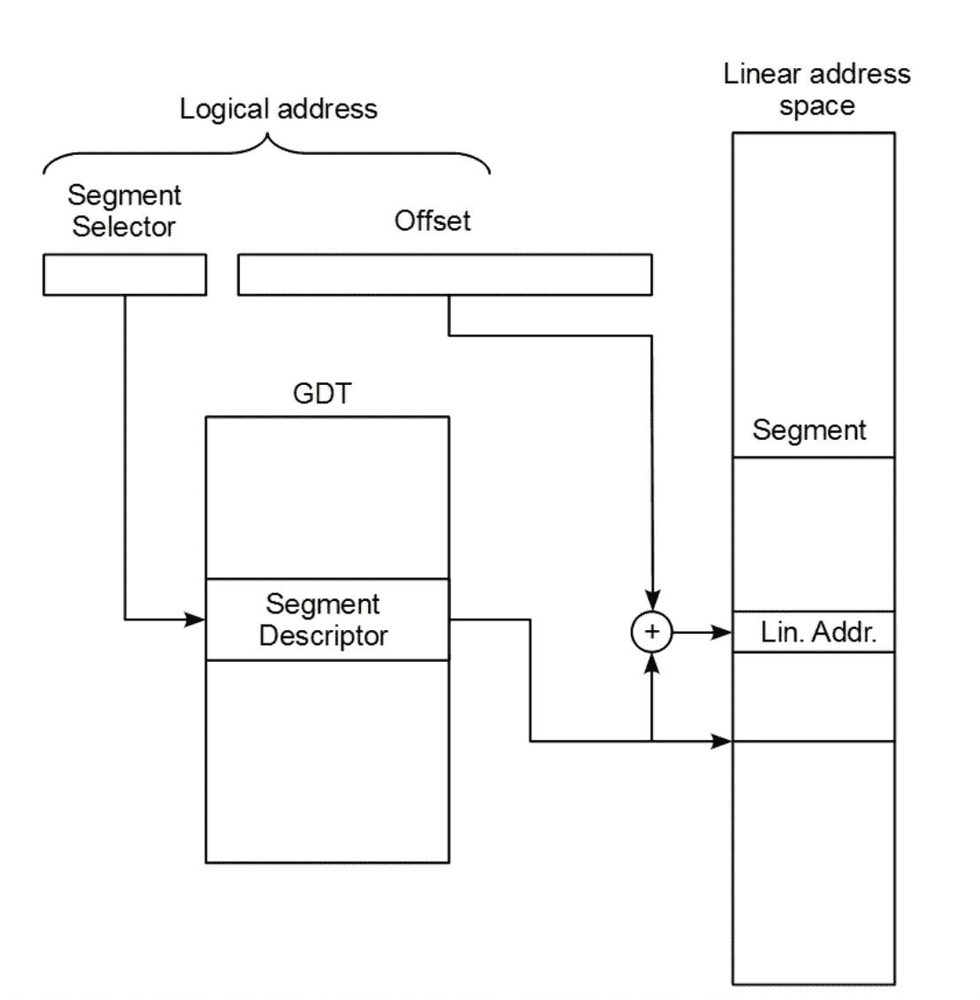

# 编写自己的操作系统:分段

> 原文：<https://medium.com/codex/writing-your-own-operating-system-segmentation-61351ecaa1bd?source=collection_archive---------12----------------------->


由 pch.vector 创建的[人向量](https://www.freepik.com/vectors/people')——【freepik.com 

T 本文是解释 x86 操作系统开发的系列文章的一部分。它可以作为一个独立的指南，但是如果你从[开始](https://hasinisama.medium.com/building-your-own-operating-system-980a4498104)跟随这个系列，它会更有意义。如果你们都跟上了，我们可以继续下一步的操作系统开发。

到目前为止，我们只在实模式下工作，这限制了我们 1MB 的内存。由于这远远不足以做任何有用的事情，我们需要跳转到保护模式，这将允许我们访问其余的内存。然而，在我们这样做之前，处理器至少需要设置两件事情:分段和中断。在本文中，我将讨论**分段**。

# **分割**

把整个记忆想象成一条面包。你把它切成片。


分段是一种组织记忆的方法。顾名思义，我们通过段来访问内存。如果记忆是一条面包，那么每一片都是一段。每个段都有一个基址和一个限制。

48 位逻辑地址用于寻址分段存储器中的一个字节。这 48 位定义了段和该段内的偏移。参见下图，了解 48 位逻辑地址如何转换为线性地址(将根据段的限制进行检查)。



为了允许分段，您需要创建一个描述每个分段的表。在 x86 中，有两种类型的描述符表:全局描述符表(GDT)和本地描述符表(LDT)。ldt 用于更复杂的分割模型。GDT 是全球性的，为每个人所共享。

# 全局描述符表(GDT)

需要澄清的是，严格来说，GDT 并不是编写内核的*要求*，它只是编写有用的*内核的一个要求。*

GDT 为内存的某些部分定义了基本访问权限。这允许内核在进程试图违反这些约束时处理异常，并以某种方式终止该进程。大多数现代操作系统使用一种叫做“**分页**的内存模式来实现这一点。它更加通用，并且允许更高的灵活性。我将在另一篇文章中讨论分页。

既然我们对分段和 GDT 有了一个基本的概念，让我们继续实际的编码。

# 访问内存

首先，我们需要在内存中为 GDT 保留空间。为此，我们将编写名为 **gdt_flush()的汇编代码函数。**

**gdt_flush()** 是一个函数，它使用我们包含一个限制的特殊指针，实际上告诉处理器新的 gdt 在哪里。

GDT 可以加载如下所示的组件代码:

```
**lgdt** [**eax**]
```

然后我们需要重新加载新的段寄存器。

处理器有六个 16 位段寄存器:`cs`、`ss`、`ds`、`es`、`gs`和`fs`。 **CS 寄存器**也被称为**代码段**。代码段告诉处理器它将在 GDT 的哪个偏移量中找到执行当前代码的访问权限。

**DS 寄存器**也是同样的想法，但它不是用于代码，它是**数据段**并定义当前数据的访问权限。ES、FS 和 GS 只是备用 DS 寄存器，对我们来说并不重要。

对于数据寄存器来说，加载段选择器寄存器很容易。您只需将正确的失调复制到寄存器中。0x10 是 GDT 到数据段的偏移量。

```
 **mov** **ds**, 0x10
    **mov** **ss**, 0x10
    **mov** **es**, 0x10
    .
    .
    .
```

最后，进行一次远跳转来重新加载我们的新代码段。0x08 是代码段的偏移量。

```
 **jmp 0x08:.flush**  
**.flush: **   
    **ret**
```

# 配置 GDT

我们需要一个结构来指定 GDT 的开始和大小。我们需要按照 **lgdt** 指令要求的格式来写。

GDT 本身是一个 64 位长的条目列表。这些条目定义了允许区域在内存中的起始位置、该区域的限制以及与该条目相关联的访问权限。

对于本教程，我们将创建一个只有 3 个条目的 GDT。为什么是 3？一开始，我们需要一个“虚拟”描述符，作为处理器内存保护特性的空段。我们需要一个代码段条目，最后，我们需要一个数据段寄存器条目。


就像切面包时，第一片是没有用的。没有人需要所有的面包皮。处理器从不引用空描述符。某些仿真器，比如 Bochs，会抱怨限制异常，如果你没有限制异常的话。有些使用这个描述符来存储指向 GDT 本身的指针(与 LGDT 指令一起使用)。

所以我们现在需要一个包含 GDT 条目值的结构。我们使用属性‘packed’告诉 GCC 不要改变结构中的任何对齐方式。

# 装载 GDT

仅仅在内存中为 GDT 预留空间是不够的。我们需要将值写入每个 GDT 条目，设置 GDT 指针，然后我们需要调用 gdt_flush()来执行更新。

随后是一个名为“gdt_set_gate()”的特殊函数，它使用易于使用的函数参数来完成所有转换，以将给定 gdt 条目中的每个字段设置为适当的值。

对于空描述符，我们可以只传递所有的空值。但是对于第二个和第三个条目，我们需要分配正确的值。基址是 0，两者的限制都是 4gb。

对于两个条目，粒度= 0xCF，直到段限制的最高位是 0xFFFFFFFF。注意，粒度位设置为 1 时，单个段描述符可以代表整个 4gb 地址空间。

但是对于代码段的访问权限= 0x9A 特权 0，对于数据段的访问权限= 0x92。

```
gdt_set_gate(0, 0, 0, 0, 0);
gdt_set_gate(1, 0, 0xFFFFFFFF, 0x9A, 0xCF);
gdt_set_gate(2, 0, 0xFFFFFFFF, 0x92, 0xCF);
```

# 初始化 GDT

我们需要初始化 GDT。为此，我们需要添加另一个函数。我还添加了 GDT 指针的初始化，所以你可以更好地了解整个函数。

现在，我们的 GDT 装载基础设施已经全部就绪。别忘了加上你的。o 文件(在我的代码 **gdt.o** 和 **memory_segments.o** )到 LD 创建你的内核需要链接的文件列表中！

现在只需从 kmain 调用初始化函数。你完了！

完成了吗？但是我怎么检查呢？您现在可能有点困惑，因为输出没有明显的变化。我们只是改变了操作系统中的内存调用结构。

如果您可以像以前一样没有任何错误地运行您的操作系统，那么您已经成功地将分段配置到您的操作系统中。但是如果你有任何错误，不要担心。你可以从下面我的 GitHub 获得完整的代码。

[](https://github.com/HasiniSama/pocketOS/tree/integrate_segmentation) [## GitHub-HasiniSama/pocket OS at integrate _ segmentation

### 中断驱动的单任务实模式 x86 操作系统。- GitHub - HasiniSama/pocketOS at…

github.com](https://github.com/HasiniSama/pocketOS/tree/integrate_segmentation) 

希望在下一篇文章中也能看到你！


谢谢大家！

*参考:赫林，e .&伦伯格，A. (2015)。* [*关于 OS 开发的小书*](https://littleosbook.github.io/#getting-to-c)