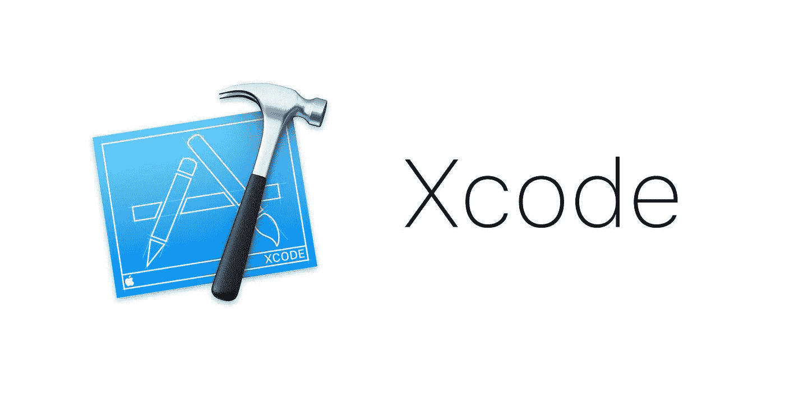
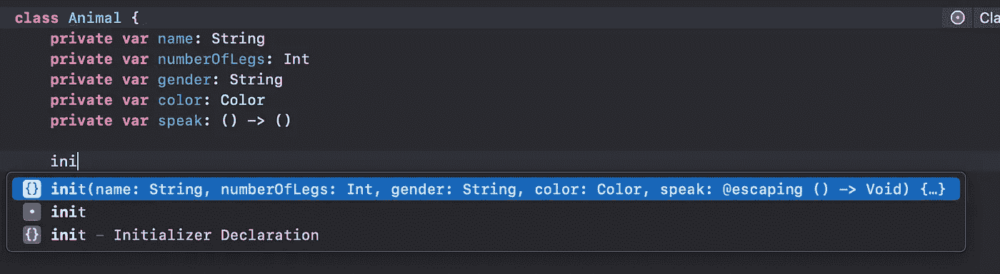
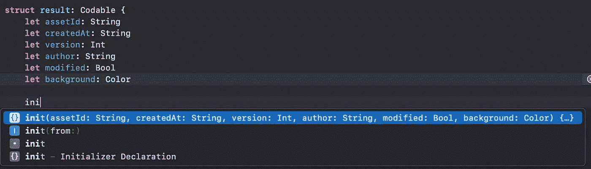
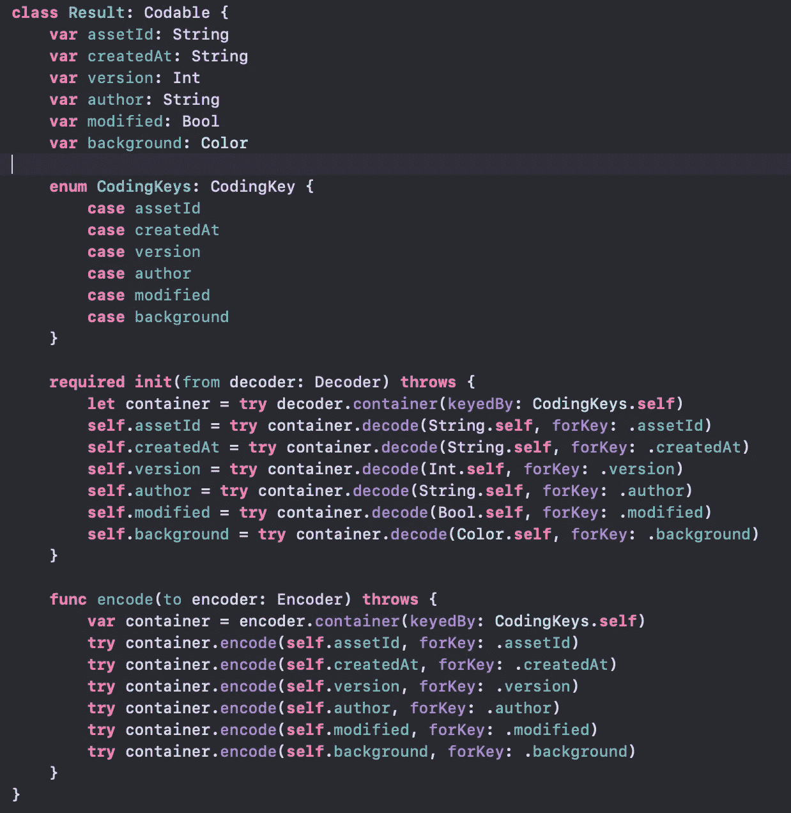
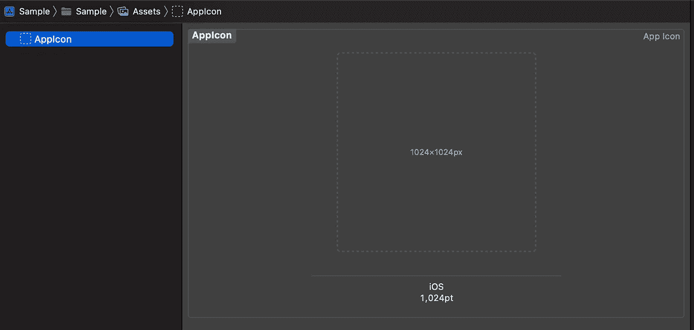
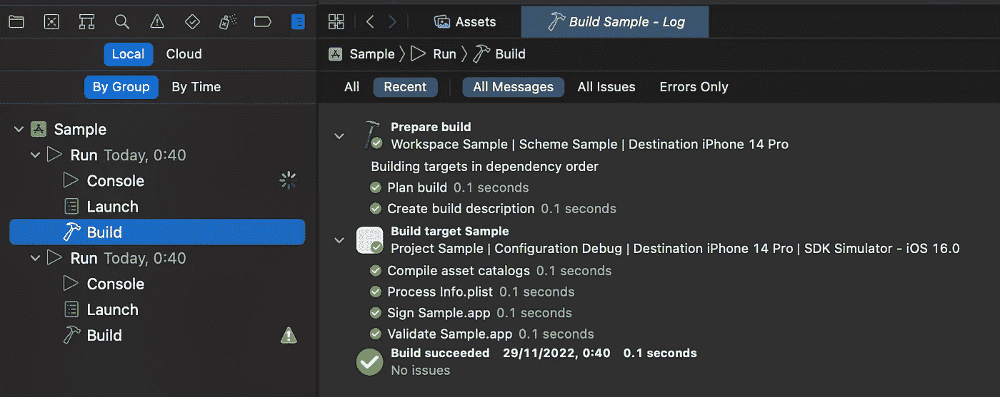

# Xcode 14，有进步！

> 原文：<https://medium.com/codex/xcode-14-its-improving-3834e046a0fd?source=collection_archive---------2----------------------->

9 月 12 日，苹果发布了新的 Xcode 版本 Xcode 14。
在本文中，我们将讨论苹果公司对其 IDE 所做的改变和改进。

## 尺寸很重要

苹果缩小了 Xcode 的尺寸，相比 Xcode 13，Xcode 14 轻了 30%。Xcode 13.4.1 重 10GB，而 Xcode 14.0 重 7.0GB，这是一个很大的变化，因为开发者对 Xcode 的大小有很多抱怨。

## 改进的自动完成

键入代码时自动完成的 IDE 是一种很好的开发体验，也是每个开发人员的必需品。在代码完成方面，Xcode 14 比 Xcode 13 有了很大的改进。

例如，当您定义了类和类成员时，Xcode 会自动完成整个 init 函数:

但这不是唯一的新功能，这也适用于符合`Codable`协议的对象，当你定义`init`函数时，Xcode 会建议完成`init(from decoder: Decoder) {…}`，并自动完成整个函数，如下例所示:

结果将会是:

你可以注意到我还添加了`encode`函数，如果你开始输入`encode`，Xcode 也会自动完成整个函数。

## 资产目录

在资产目录方面也有所改进，不再有各种各样的应用程序图标大小，在 Xcode 14 中只有 1024x1024:

现在，您可以双击资产目录中的图像以转到该文件。

您也可以将图像直接从剪贴板粘贴到资产目录。

## 缩短构建时间

新的 Xcode 版本带来了更多的改进，这次它将节省更多的时间。

构建时间得到了显著改善，更好的并行算法将速度提高了 2 倍，项目的构建时间总体上加快了 25%。
Mac 上的内核越多，你看到的改进就越大，在 M1 Ultra studio 上进行的测试显示，构建时间提高了 30%。

不仅如此，文档加载速度提高了 50%，如果使用界面构建器，公证速度提高了 4 倍，从设备栏在 iPads 和 iPhones 之间交换速度提高了 30%。

## 更强更快的“Xcode 预览”

当 SwiftUI 推出时，其关键功能之一是“Xcode 预览”，该功能可以帮助开发人员实时查看所有 UI 变化和代码。这意味着开发人员不需要切换上下文，返回和前进到用户界面，在模拟器上运行应用程序只是为了查看发生了什么变化，从而获得更好的开发体验。Xcode 14 带来的最大变化是交互式预览画布，这意味着开发人员可以与画布互动(点击按钮，在屏幕之间切换等)。
Xcode 14 带有全新的特定控件，可以帮助开发者在不同的方向、方案甚至黑暗模式下查看相同的 UI，你甚至可以同时在多达 12 个屏幕上看到不同字体大小的相同 UI。

## 构建时间线

在 Xcode 的早期版本中，我们只能看到构建日志作为一个大列表，没有关于步骤的太多信息，而 Xcode 14 可以准确地看到每个步骤花费了多少时间，我们可以看到完整的时间线。

## 模拟器

Xcode 14 还改进了模拟器，它现在支持在苹果硅或 T2 处理器的 macOS 13 上运行的 iOS 16 模拟器的远程通知。

也就是说，模拟器将只支持沙盒环境中的苹果推送通知。
APNS 令牌将是 Mac 硬件和模拟器的独特组合。

## 总结

Xcode 14 带来了各种新功能和改进，更快的编码(由于自动完成)，更快的构建时间，改善模拟器的使用，以及总体上更好的开发人员体验。

如果你想阅读完整的发行说明，你可以在这里找到它们。