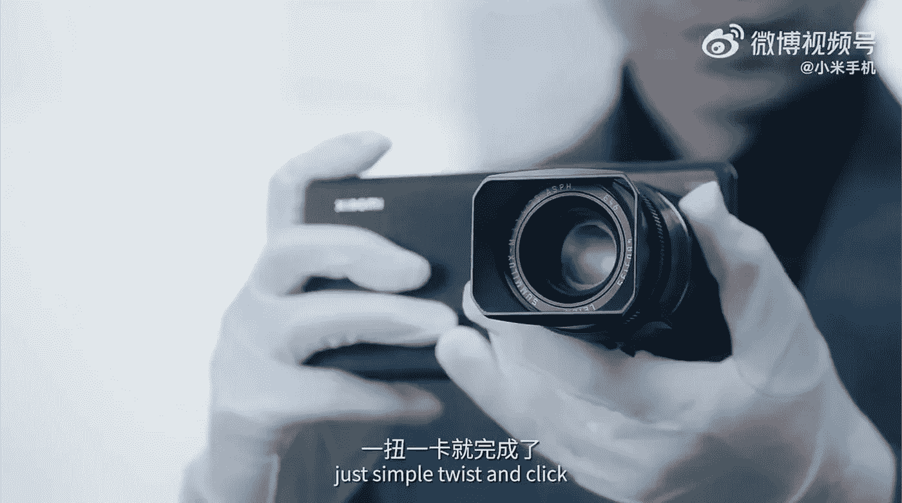

# 小米发布了一个迷人的摄影概念

> 原文：<https://medium.com/codex/xiaomi-has-released-a-fascinating-photography-concept-2c9ad9fd8059?source=collection_archive---------5----------------------->

## 智能手机摄影

## 一个全画幅镜头可以安装在手机上的世界。

所有的电话公司都会经历一个“概念阶段”。在这一时刻，他们决定执行一个违背初衷的想法，即使这意味着那一年要亏损。