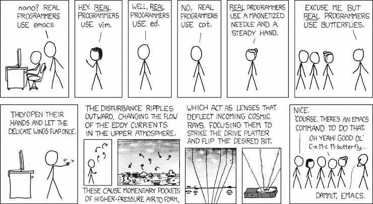

# 我经常发送的 XKCDs:第 2 部分

> 原文：<https://medium.com/codex/xkcds-i-send-a-lot-part-2-53e5e3f9d8ba?source=collection_archive---------1----------------------->

*免责声明:所有观点都是我自己的*

*免责声明:参见 XKCD 许可*[此处](https://creativecommons.org/licenses/by-nc/2.5/)

图片来源:xkcd.com

我在第一篇“[xkcd 我发送了很多](/codex/xkcds-i-send-at-least-once-a-month-1f6e9f9b6b89)”的帖子中获得了很多乐趣，但是当我一发表它，我就意识到我已经忘记了我发送的一堆 xkcd，嗯，很多。

# 标准

[https://xkcd.com/927/](https://xkcd.com/927/)

每当一个小组在讨论一种新的方式或方法时，我都会发送这封邮件。有时候你真的需要从头开始，但更多的时候，你只是得到了一个额外的竞争选项。

# 到 11 点了！

[https://xkcd.com/670/](https://xkcd.com/670/)

一般来说，每当我看到一个没有单位的图表或只是一个数字时，我都会想发这个。有时单位可以从上下文中理解，但并不总是如此。

没有单位的数字几乎没有用。

# 运动

这些并不是真正的技术，但我与一些关于体育的 XKCDs 有着深刻的联系

[https://xkcd.com/1107/](https://xkcd.com/1107/)

[https://xkcd.com/904/](https://xkcd.com/904/)

[https://xkcd.com/1859/](https://xkcd.com/1859/)

最后一个我不得不让我爸爸给我解释。

我认为现在少了，但运动类比在工作场所一直很常见，如果你不关注这项运动，它会非常无聊，或者非常令人困惑。

# 证明文件

[https://xkcd.com/293/](https://xkcd.com/293/)

文档是好的，但是它经常需要为不熟悉的人建立上下文。告诉某人去阅读文件，并拒绝与他们交谈，直到他们这样做可能会导致一些不幸的副作用，至少是他们不再想和你说话。

# 为了子孙后代(或者你未来的自己)

[https://xkcd.com/1421/](https://xkcd.com/1421/)

我曾经和一些工程师一起工作，他们坚持认为注释毫无价值，代码应该是不言自明的。

我在概念上同意——你应该编写易于阅读的代码——但是拒绝记录或评论任何东西只会让你自己(或其他工程师)在以后陷入难以置信的混乱。

# 真正的程序员

[https://xkcd.com/378/](https://xkcd.com/378/)

每当有人变得有点过于自负时，提醒他们这是一个滑坡，从“这个工具只是更好”到“如果你不使用这个工具，你就不够好。”

我发现这个 XKCD 很好地提醒了我们所有人(或者几乎所有人)都站在巨人的肩膀上，因为我们正在使用使我们的工作成为可能的抽象层。

# 估计

[https://xkcd.com/1658/](https://xkcd.com/1658/)

估算是*难*，并且很容易陷入分析瘫痪，花费太长的时间试图弄清楚一个项目何时完成。

出于商业目的，你需要一些时间感，但在某个时候，你会遇到收益递减，你应该开始工作了。

如果你喜欢我的写作，请考虑通过[加入媒体](/membership/@devblabs)来支持我。