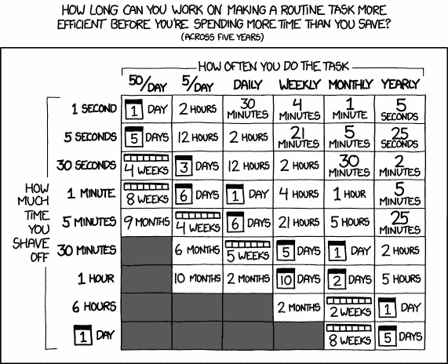

# XKCDs 我发了很多

> 原文：<https://medium.com/codex/xkcds-i-send-at-least-once-a-month-1f6e9f9b6b89?source=collection_archive---------0----------------------->

*免责声明:所有观点都是我自己的*

*免责声明:参见 XKCD 许可*[此处](https://creativecommons.org/licenses/by-nc/2.5/)

图片来源:xkcd.com

如果你不经常阅读 XKCD，你就错过了。这是一部关于科技、科学和一般常识的网络漫画。

它主要是幽默，但也有以轻松的视觉形式表现的有用的智慧。有一些 XKCDs 我经常发送(一个月一次可能有点夸张)，我想我会分享我最喜欢的一些和它们帮助沟通的原则。

# 饭桶

[https://xkcd.com/1597/](https://xkcd.com/1597/)

当你第一次作为软件工程师开始工作时，版本控制的概念是非常陌生的。在代码中，你必须跟踪每个字符的每一个变化，以便能够解释你正在处理的代码库的任何问题和动态。这不是你下半辈子都要做的事。

我定期与新的软件工程师进行交流，内容如下

新工程师:我…我的回购是…我想我搞砸了

我:我们来看看……..我的天啊。

新工程师:什么……..我该怎么办？怎么会变成这样？

我们花了一些时间解决这些问题，然后我给他们发了这个漫画来告诉他们

*   Git 很难，你不应该因为感到困惑而感到难过
*   过一段时间后，您确实习惯了这些模式以及如何使用它们

同样来自 alt 文字，我的 git 专家叫 Rob。

# 属国

[https://xkcd.com/2347/](https://xkcd.com/2347/)

几个月前，这个 XKCD 得到了很多关注，因为它在修复 Log4j 中的一个主要[漏洞的提交中被引用，但它也与其他不太严重的情况相关。](https://www.dynam.ac/log4j-vulnerbility/)

如果你是软件工程的新手，你可能还不熟悉，但是所有的软件都依赖于其他软件，而其他软件又依赖于其他软件。这是一系列令人费解的要求。从字面上看，没有一个工程师知道任何复杂程度的软件所使用的所有依赖关系。

令人震惊的是(我真的是令人震惊的)大量的软件是开源的，由没有报酬也很少得到感谢的工程师维护。

这个 XKCD 突出了

*   不要自大，要意识到你并不知道你所有的依赖
*   如果你免费使用开源软件，不要对维护它的志愿者太苛刻
*   所有的软件至少都有一点脆弱

# 值得花时间吗？

[https://xkcd.com/1205/](https://xkcd.com/1205/)

这个只是实用而已。作为工程师，我们希望自动化一切，但这并不总是值得的。有时候，留下一个过程手册真的比试图让它变得超级酷和自动化更好。

如果你想知道自动化是不是一个好主意，快速浏览一下这篇文章，看看是否值得一试。

# 沟通不畅

[https://xkcd.com/169/](https://xkcd.com/169/)

这一个需要一点小心，但是它非常相关。工程师谈论复杂的事情，一些工程师有一个错误的印象，认为在别人头上说话会让他们听起来更聪明，会让他们得到更多的报酬。

我不能说我曾经把这封信发给过实际上沟通不畅的人，因为这通常只会让他们比其他任何事情都更沮丧。但在有人这样对待你之后，拉起阅读是一种小小的宣泄。

# 机器学习

[https://xkcd.com/1838/](https://xkcd.com/1838/)

我相信大多数领域都有“流行语”的问题，但技术是过度使用流行语的罪魁祸首之一。一些最好的

*   DevOps
*   微服务
*   机器学习
*   大数据
*   CICD

如果你从事任何类型的数据科学、机器学习或面向人工智能的工作，你无疑会遇到人们对数据和机器学习如何交互做出广泛假设。

也要谨慎使用这一点——你不想贬低任何人和他们的知识，但一旦你与个人建立了融洽的关系和尊重，这有助于为关于数据如何工作的误解增添一些幽默。

# 内行

[https://xkcd.com/915/](https://xkcd.com/915/)

不管出于什么原因，工程师对非常小的事情都有非常强烈的看法。

*   制表符与空格
*   vim 与 emacs
*   动态与强类型
*   Mac vs Windows
*   iOS vs Android
*   同一行的花括号像`method() {}` vs 下一行的第一个花括号

如果有人对某个特定问题过于认真，提醒他们你可以对几乎任何事情形成深入的观点，包括乔·拜登吃三明治的系列照片。

# 抽象

[https://xkcd.com/676/](https://xkcd.com/676/)

如果你作为一名软件工程师感到无聊，厌倦了你正在做的事情，停下来看看这本漫画。

我们所做的是非常不可思议的，许多边缘的魔法必须一起工作才能实现。

感谢阅读！如果你喜欢我的内容，请考虑通过这个链接订阅媒体来支持我:[https://devblabs.medium.com/membership](/membership/@devblabs)