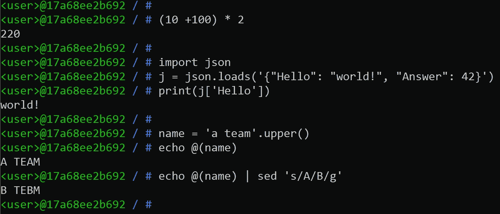

# xon sh——Python 驱动的 shell

> 原文：<https://medium.com/codex/xonsh-a-python-powered-shell-78170fcd9197?source=collection_archive---------1----------------------->

## 一种允许我们在外壳中使用 Python 和在 Python 中使用外壳的语言

Linux 命令行的世界是奇妙的。它给了你做无限事情的自由。在本文中，我将介绍一个 shell，它允许您将 Phyton 中编写的语句与常规命令混合使用。