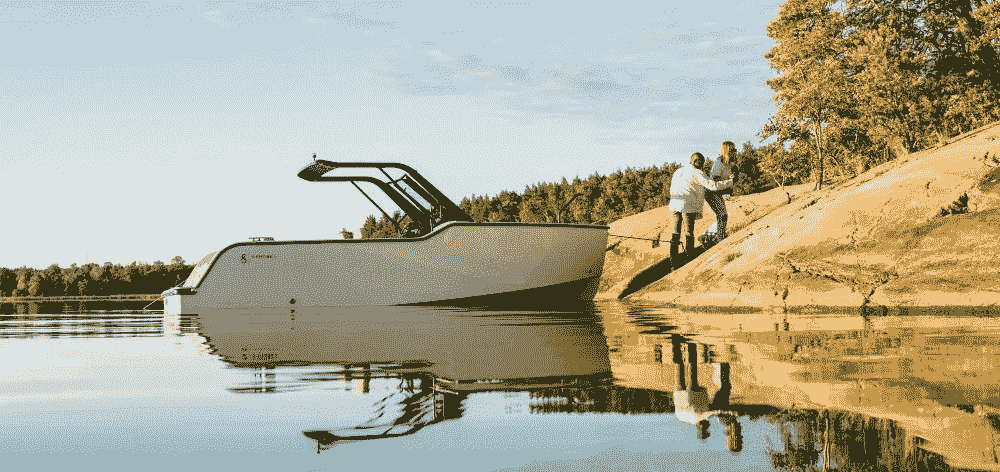

# XShore:将电动划船带给大众！

> 原文：<https://medium.com/codex/xshore-bringing-electric-boating-to-the-masses-df28b59c346f?source=collection_archive---------8----------------------->

## 介绍“经济实惠”的 X Shore 1？

[X Shore 1(媒体由 X Shore 提供)](https://xshore.com/pub/media/.renditions/wysiwyg/_DSC1390_kopia_.jpg)

造价 25 万美元的 [Eelex 8000](/@jclos2679/eelex-8000-an-electric-boat-to-reckon-with-b66779ab313a) 电动船的制造商推出了更便宜、“更实惠”的 X Shore 1。根据你对实惠的定义，X Shore 1 的价格大约是 [Eelex mode](/@jclos2679/eelex-8000-an-electric-boat-to-reckon-with-b66779ab313a) l 的 1/3，起价为 10 万美元，随着可选方案的增加，价格会迅速上涨。简单地说，就是…