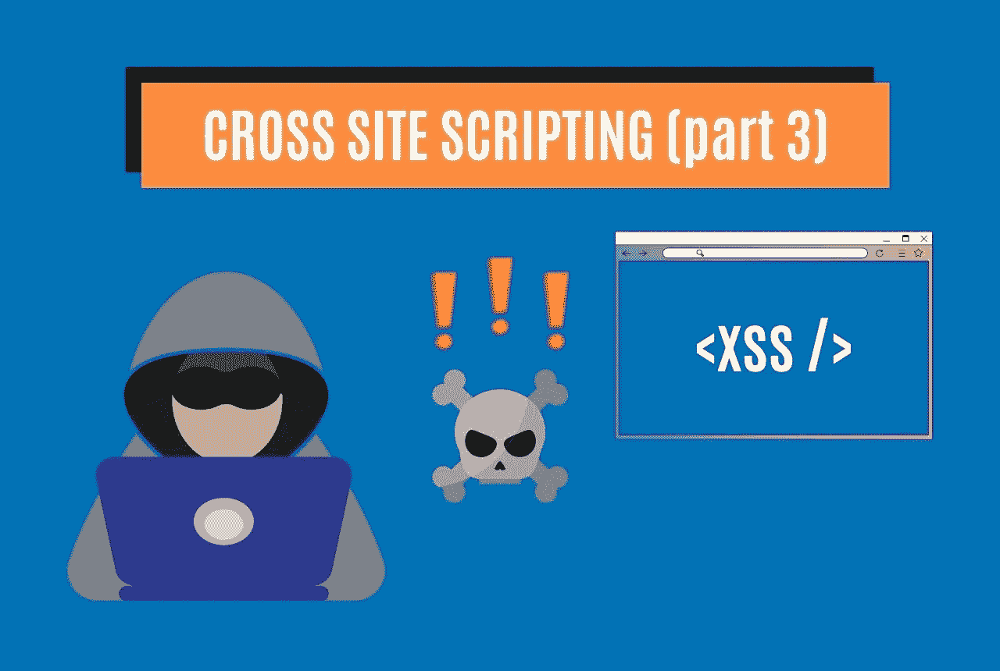

# 实践中的 XSS:如何在网络应用中利用 XSS

> 原文：<https://medium.com/codex/xss-in-practice-how-to-exploit-xss-in-web-applications-walktrought-into-google-xss-game-c939f30005ea?source=collection_archive---------10----------------------->

# 介绍

快速更新一下:跨站点脚本(XSS)是 Web 应用程序中常见的一种计算机安全漏洞。XSS 使得攻击者能够将客户端脚本插入到其他用户查看的网页中。攻击者可以使用跨站点脚本…