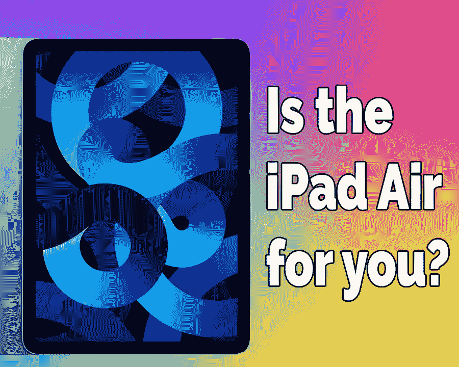
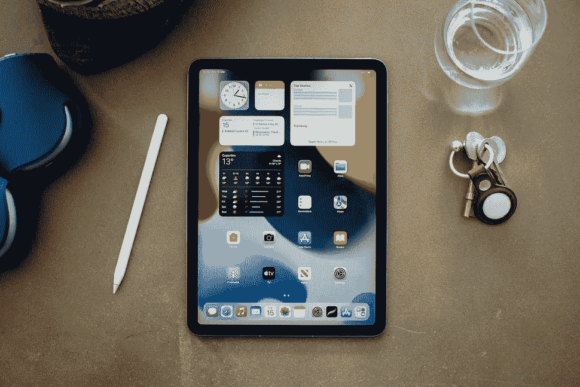
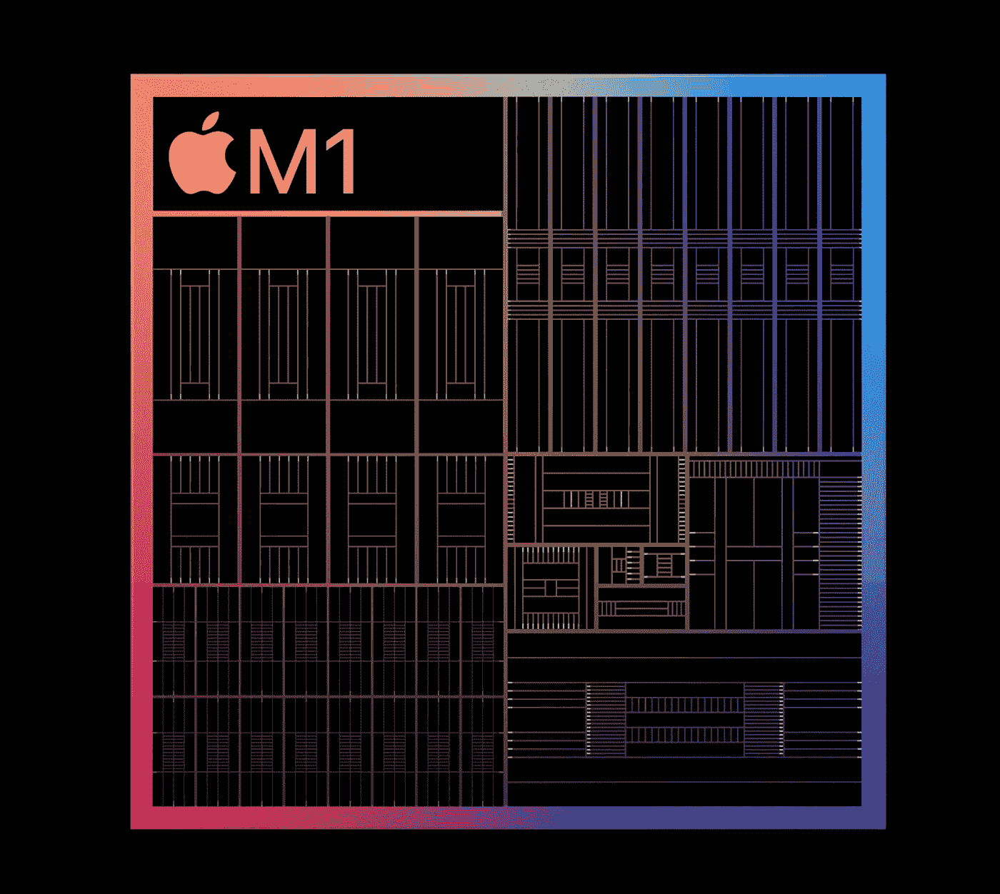
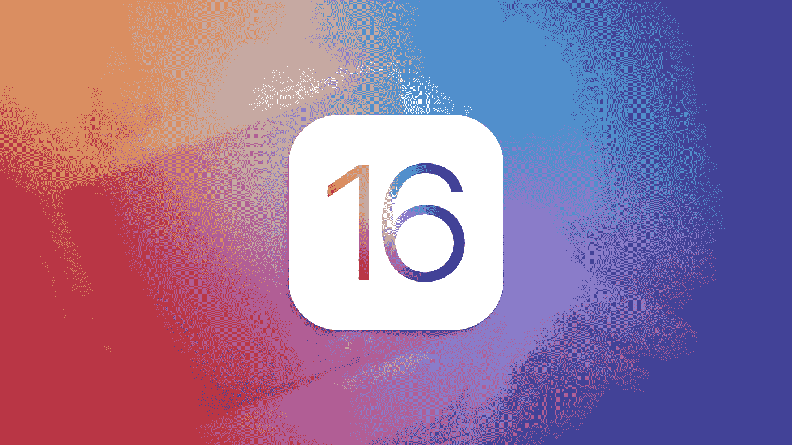
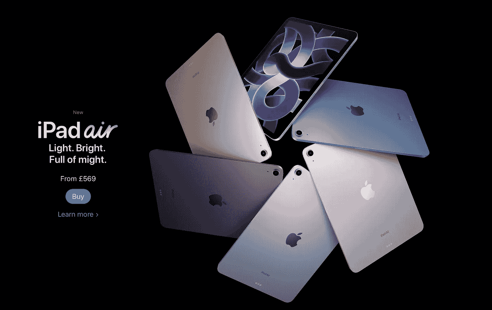
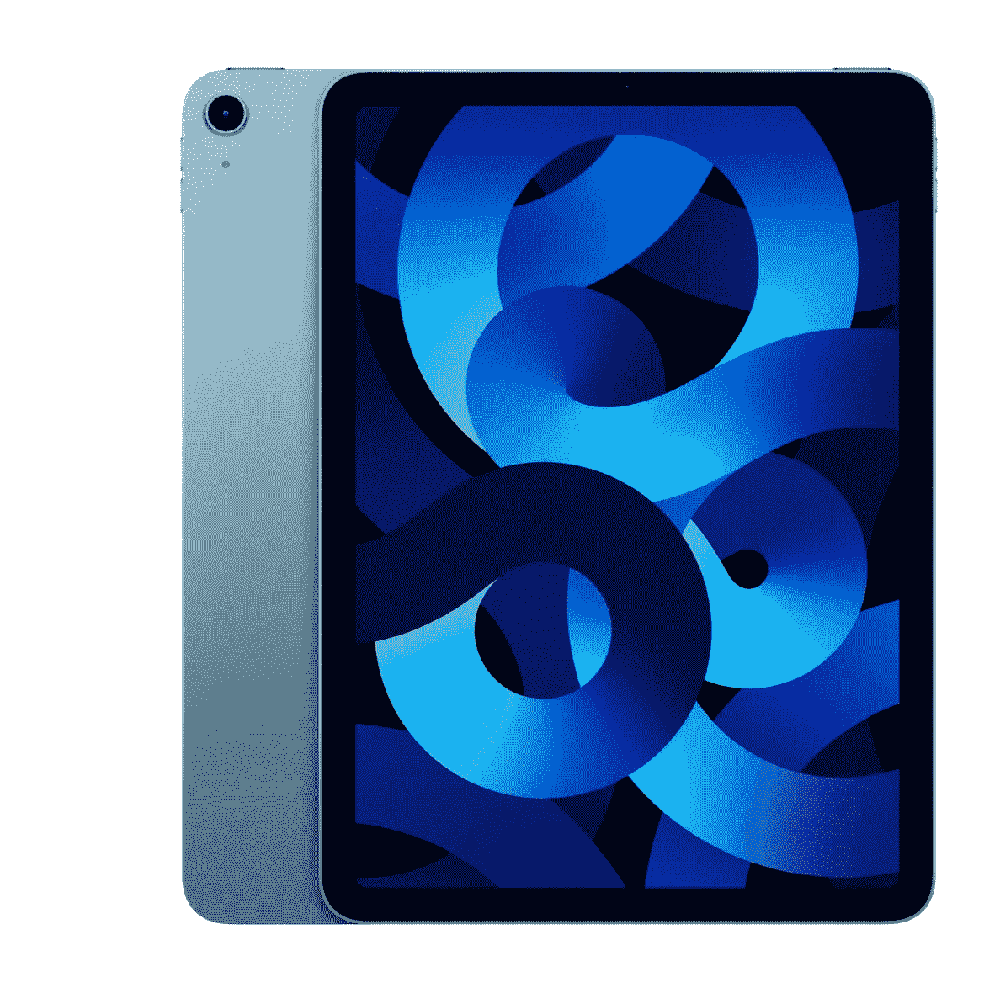

# 战斗开始了！

> 原文：<https://medium.com/codex/y-ipad-the-fight-is-on-b6a2ba27b898?source=collection_archive---------21----------------------->

## iPad Air 和 iPad Pro，哪一个更适合你？

在最近的苹果春季发布会上，展示的所有好东西中有最新版本的 iPad Air。今年，它内置了 M1 芯片。这与 Mac mini、MacBook Air 和 24 英寸 iMac 中的芯片相同。当然还有这款 iPad 的老大哥，iPad Pro。这让我想到了博客。*哪个适合你？*

## 基础

从最基本的价格来看，这款 iPad Air 物超所值。对于 569 来说，这是一款非常小巧、功能强大的移动设备。大部分基本设计和去年一样。你仍然有一个 10.9 英寸，背光 LED，亮度高达 500 尼特的真色调显示器。屏幕的边框和以前一样薄，没有 iPad Pro 薄，但也更薄了。您现有的许多配件，如神奇键盘和铅笔，在这款机型上仍然有效。为了进一步区分它和专业版，你还有一个新的有趣的蓝色。同样，相机方面，它与 2021 年的 iPad Air 非常相似，拥有 12MP 超宽前置摄像头，122°视野/2.4 光圈设置，支持中央舞台。虽然这个摄像头仍然没有移动，但是当 iPad 处于横向时，摄像头仍然在短边上。*当然，这种情况很快就会改变。后置摄像头，比 Pro 少一个摄像头，也没有激光雷达扫描仪。同样，我们发现同样的、未改变的电池是去年的 28.6 瓦时可充电锂聚合物电池，一般使用时间为 8-10 小时。*

## 性能、连接性和声音

以前，生产力可能是 Air 和 Pro 之间的一个考虑因素，但现在不再是这样了。现在两者内部都有相同的 M1 芯片。空气也不像是有一个装箱的版本。不，芯片都是 8 核 CPU/8 核 GPU，8 GB 内存芯片。因此，无论你想执行什么任务，它们都可以在任意一台 iPad 上执行。iPad Air 上的连接器是一个基本的 USB-C，而 iPad Pro 上的连接器是一个速度高达 40Gb/s 的 Thunderbolt USB 4 连接器。在 iPad Pro 上，你会得到两个额外的扬声器，总共有四个。

 [## iPad 丢了吗？

### 有这么多可选择的，真不知道该挑哪一个

medium.com](/codex/is-ipad-lost-31e14f61c1d6) 

## ios

iPadOS 仍然有限。有了这些强大的功能，您将会看到更多有创意的高端应用程序，如 Final Cut Pro。谁知道我们在六月的 WWDC 会得到什么，但是现在，选择还是有限的。但奇怪的是，这是 iPads 的缺点之一，它缺乏真正的多功能性，而这在某些情况下恰好是一个优势。例如，在 Mac 上写作很容易导致分心，因为很容易同时打开这么多应用程序和屏幕。虽然在 iPad 上，你可以多任务处理，但这是不一样的体验，当你想专注时，它可以真正发挥作用。

 [## 为什么我们就不能满足呢？

### 苹果工作室的展示才刚刚开始两周，但我们似乎已经不满足了。

medium.com](/codex/why-cant-we-just-be-satisfied-f70e6490095b) 

## 决定

那么，现在，在描述了基本的 iPad 之后，我们开始看看你在决定 iPad Air 是否适合你时需要做出的艰难决定。例如，较小的基于用户的功能，比如 iPad Air 没有 Face ID，可能会让你感到困扰。触控 ID 工作得很好，只是解锁时有点不方便，但 Face ID 似乎更流畅。根据您的使用情况，显示器可能是影响您决定的一个因素。如果我们看看 iPad Pro 12.9 英寸，例如，它配备了一个 XDR，迷你 LED 显示屏，峰值亮度高达 1600 尼特，以及 120 Hz 刷新率的 Pro Motion 面板。它也有一个 P3 广泛的色彩范围。如果你是一个经常使用这种设备工作的艺术家，所有这些都可能既有用又有关系。在屏幕上，铅笔的流畅感是首屈一指的。但这并不是我用来比较 iPad Air 的真正的 iPad。12.9 英寸版本的起价接近 iPad Air 的两倍，为 999 英镑。它是 iPad Pro 中最小的，规格也非常接近，主要区别归结为一点。那是储藏室。

 [## 我们看到了最后一台大型 iMac 了吗？

### 这些伟大的机器现在已经成为历史了吗？

medium.com](/codex/have-we-seen-the-last-of-the-big-imacs-5d63bb4bf839) 

## 多大空间？

iPad Air 面临的最大问题是存储。在这款 iPad 发布之前，没有一款 M1 产品的存储容量低于 128 GB。不过，这款 iPad 的基本版 569 配有 64 GB。我最近写了一篇关于这一点的文章，这看起来很可笑，64 GB 实际上仍然在选项列表中。下载一个游戏或电影，你的全新设备，将几乎达到极限。在 iPad Air 上，没有中途之家。您可以从标准的 64 GB 直接跳到 256 GB 和额外的 150 GB。

这就是棘手的地方。正如我在开头所说，569 英镑的 iPad 代表着惊人的价值。但是，在某种程度上，您将不得不考虑功能与存储。有了 256 GB 的 iPad Air，你就 719 了。再多花 30 美元，你就可以拥有一台 11.8 英寸、128 GB 存储空间的 iPad Pro。不仅如此，你将拥有更好的扬声器、更好的显示屏、Face ID 和更快的 Thunderbolt USB-C 连接器。所有这些都是为了 30 多块！当然，此时你只有 iPad Air 一半的存储空间，但是，我想我知道我的钱会花在哪里。

## 结束的

看，现在所有的 iPads 都很棒，从 Mini 开始。这实际上取决于你的工作流程是什么，以及你打算如何使用你的设备。但我认为，如果你打算在购物车中添加一台 iPad，那么了解这些事实可能是值得的。如果一款超值、低价的平板电脑是你的追求，那么新款 iPad Air 就是你的选择。不过，对我来说，iPad Pro 的未来优势和长期优势实在太诱人了。那你呢？你喜欢哪一款平板电脑，为什么？

 [## iPhone 怎么了？

### 在上周发布了另一款 iPhone 之后，让我们来看看今年晚些时候会有什么

medium.com](/codex/whats-up-with-iphone-307a15caac26) 

## **你订阅《灵媒》了吗？**

我只是高端博客网站 Medium 的众多作者之一。它是如此物有所值，你可以在这里加入 https://medium.com/membership(https://medium.com/membership)

**加入我的幕后邮件列表(******)****

**最初发表于 2022 年 3 月 29 日[https://www.talkingtechandaudio.com/blog](https://www.talkingtechandaudio.com/blog)([https://www.talkingtechandaudio.com/blog](https://www.talkingtechandaudio.com/blog))。**