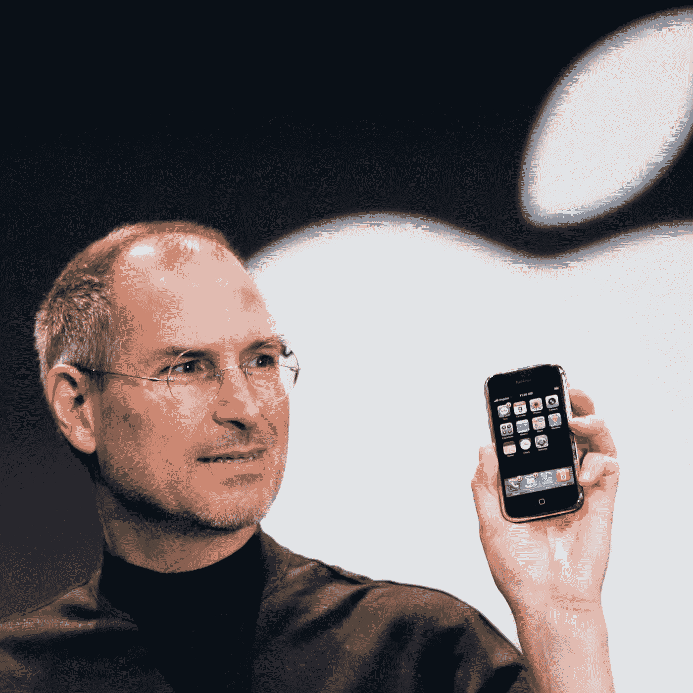
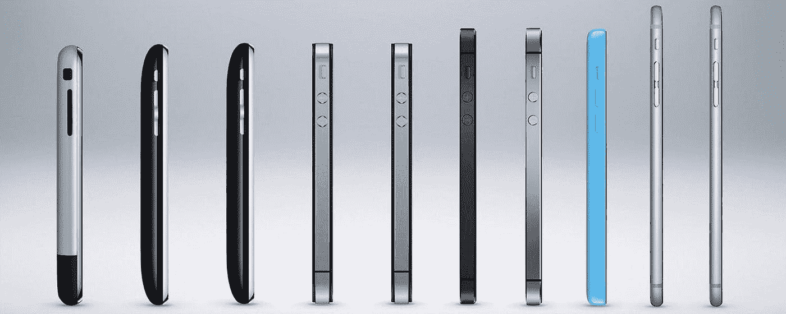
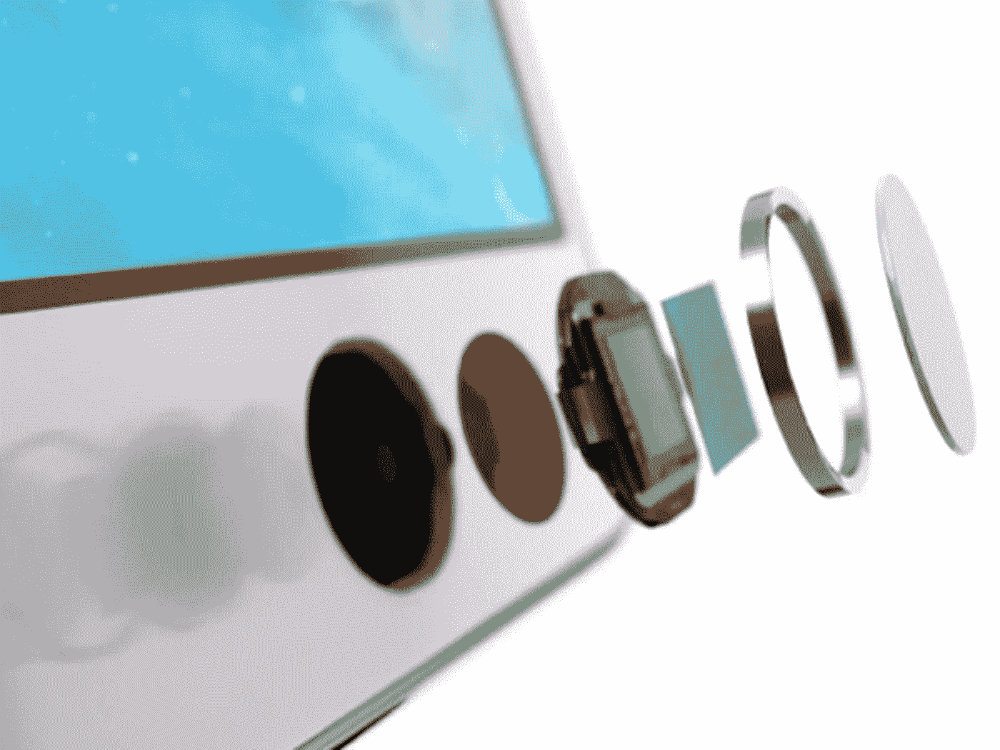
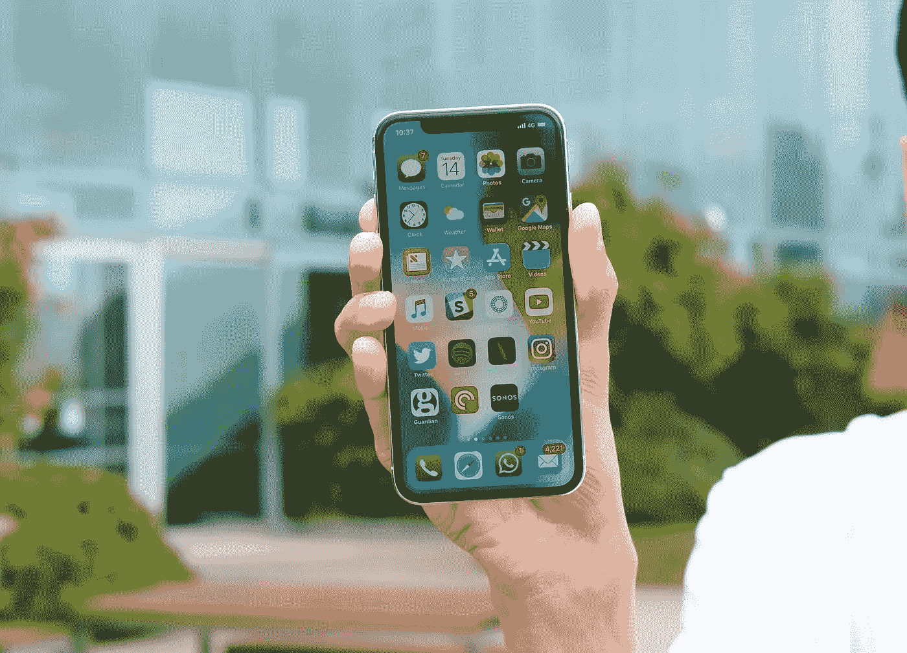
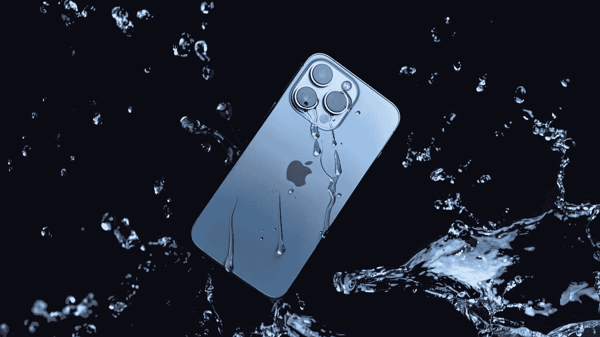

# iPhone 的 15 年:快速回顾

> 原文：<https://medium.com/codex/year-15-of-the-iphone-a-quick-recap-f2a9edea7492?source=collection_archive---------9----------------------->

## 塑造了一个行业的智能手机

15 年前，一个人的远见改变了世界。来源:连线。

“有一个应用程序可以做到这一点。”

触摸屏界面让键盘手机相形见绌，iPhone 在 2007 年可谓是革命性的产品。虽然史蒂夫·乔布斯的愿景受到了相当多的批评，但几乎不可能预测没有 iPhone 的智能手机今天会是什么样子。并非每一次迭代都让世界为之沸腾，但 iPhone 的遗产是不可否认的。

将 iPod 的音乐播放能力与智能手机的连接能力结合起来，为更引人注目的东西创造了条件。

虽然苹果的旗舰产品也有缺陷，但大胆的选择和更大胆的价格改变了智能手机行业的面貌。以下是 iPhone 15 年来的成长历程，从强大到强大:

## iPhone (2007 年)[售出 600 万部]

第一代 iPhone 感觉就像未来在你的手中。当然，它有一个笨重的框架，没有应用程序商店。620 MHz 处理器、4 GB 存储和 128 MB RAM 听起来也不令人振奋。但是使用第一个围绕触摸屏构建的操作系统感觉像是邀请变得更伟大。

iPhone 也是第一部不受无线运营商控制的手机。这是美国电话电报公司独有的(合同价 199 美元；499 美元，但苹果设定了条件:不再有设计糟糕的臃肿软件应用。

有了 iPhone，苹果将电脑放在人们手中的愿景有了全新的含义。

## iPhone 3G (2008 年)

苹果的第二代 iPhone 带来了许多值得注意的改进。

GPS 和 3G 连接完善了这款 599 美元智能手机的工具集。iPhone 3G 用聚碳酸酯换回了其前身的金属外壳。苹果还需要一年时间来引入多任务处理和更换主屏幕壁纸等主要功能。

请注意，这是在应用内购买出现之前。

## iPhone 3GS (2009 年)[售出 3500 万部]

3GS 中的 S 代表速度。

据报道，iPhone 3GS 的速度是 iPhone 3 的两倍，拥有更高分辨率的摄像头和更好的视频性能。Siri 的前身语音控制也首次亮相。16GB 的存储空间不是很大，但比 iPhone 3 好一倍。

3GS 也是第一款具有[疏油涂层](https://www.phonearena.com/news/Oleophobic-coating--what-it-is-how-to-clean-your-phone-what-to-do-if-the-coating-wears-off_id65974)的手机，可以将指纹留在玻璃面板上。

来源:iPhoneLife。

## iPhone 4 (2010 年)[售出 5000 万部]

作为当时最薄的智能手机(9.3 毫米)，iPhone 4 夹在多层玻璃之间的钢架仍然是一件标志性的工程作品。

它的设计元素继续影响着智能手机行业。iPhone 4 向世界介绍了视网膜显示屏，这是其前代产品在质量上的显著飞跃。

iPhone 4 也是第一款配备前置摄像头的 iPhone，它与苹果的 FaceTime 视频聊天功能一起首次亮相。这款手机是和 iPad 一起发布的，iPad 是会引发另一场革命的平板电脑。

不幸的是，iPhone 4 因其[天线问题](https://www.businessinsider.in/tech/news/aposantennagateapos-just-turned-10-hereaposs-how-the-iphone-4aposs-antenna-issues-became-one-of-appleaposs-biggest-scandals-of-all-time-/slidelist/77041786.cms)而臭名昭著，现在被称为 Antennagate。

## iPhone 4S (2011) [售出 6000 万部]

我永远不会忘记，在 iPhone 4S 发布的第二天，苹果公司的联合创始人史蒂夫·乔布斯失去了与胰腺肿瘤的斗争。他的努力将我们推进了一个新的计算时代，世界将永远感激他。

649 美元的 iPhone 4S 为苹果全新的语音助手 Siri 加了一个 S。将处理器升级为 A5，将摄像头升级为 800 万像素的 1080p 录制镜头，帮助 iPhone 4S 保住了旗舰宝座。

4S 是最后一款配备苹果 30 针连接器的 iPhone。

## iPhone 5 (2012 年)[售出 1.46 亿部]

iPhone 5 用 Lightning 端口取代了老化的 30 针连接器，这是现代 iPhone 的核心原则。

虽然粉丝们抱怨不得不购买新配件，但这是苹果一直坚持至今的决定。随着欧盟推动[采用 USB-C](https://www.theverge.com/2022/6/7/23156361/european-union-usb-c-wired-charging-iphone-lightning-ewaste)，这个 10 年历史的港口时日无多了。

其近 16:9 的宽高比和重新设计的铝制框架外观引人注目。从 4S 的玻璃背面回归金属是受欢迎的。除了更快的 A6 处理器之外，iPhone 5 还加入了 LTE 支持。

iPhone 5 在 24 小时内就有超过 200 万的预购订单，这是苹果打破销售记录的基础。它也是为用户提供五大 iOS 更新的两款 iPhones 之一(和 4S 一起)。

## iPhone 5S 和 5C (2013 年)[售出 1.64 亿部]

当然，智能手机中的第一个 64 位处理器听起来令人印象深刻。它的 M7 运动协处理器现在可以跟踪健身活动。但 iPhone 5S 给世界带来的真正礼物是触控 ID，一个改变了我们所知的智能手机安全性的指纹识别系统。

另一方面，549 美元的 iPhone 5C 实际上是一部彩色聚碳酸酯框架的 iPhone 5。有人认为它是 iPhone SE 和 XR 的前身。

苹果还免费推出了 iPhone 5S 附带的有线耳机 EarPods。iPhone 5S 和 5C 与 iOS 7 一起发布，这是一次分裂性的更新，它将早期版本中永恒的 skeuomorphic 外观换成了扁平而生动的元素。iOS 7 还带来了隔空投送，这是一个 WiFi 共享工具，仍然是苹果生态系统的核心部分。

得益于六大 iOS 更新，iPhone 5S 拥有令人难以置信的持久力。

iPhone 5S 的指纹传感器在几年内从新奇变得无处不在。来源:MacRumors。

## iPhone 6 和 6 Plus (2014 年)[售出 2.24 亿部]

苹果的八代 iPhones 瞄准了三星 Note 系列的成功。

随着更大的 4.7 和 5.5 英寸显示屏(从 4 英寸跃升)，iPhone 6 和 6 Plus 不再微小。随着更快的处理器、更好的摄像头和新的基于 NFC 的支付系统，规格表的其余部分也得到适度的提升。

视网膜显示屏开始显示出它的年龄，尤其是 iPhone 的竞争对手提供的更清晰的显示屏。它纤细的框架容易弯曲，被批评家们戏称为“弯曲门”。但这并没有阻止 iPhone 6 和 6S 成为迄今为止销量最成功的 iPhone。

一个周末就卖出 1000 万仍然是一个不可思议的壮举。

## iPhone 6S 和 6S Plus (2015 年)[售出 1.74 亿部]

苹果新 iPhones 的第一步行动是采用更强的铝合金来避免“弯曲门”。

除了常规的改进之外，6S 和 6S Plus 还展示了 3D Touch，这是一种新的压力感应输入系统。虽然这一功能后来出现在了 Macbooks 上，但 3D Touch 最终从苹果的 iPhones 上消失了。

七大软件更新意味着 6S 和 6S Plus 将会有一段漫长的旅程。它平庸的电池寿命并没有阻止它获得广泛的吸引力。在 6S 和 6S Plus 的发布周末，1300 万台设备从虚拟货架上飞了下来。

一小部分 iPhone 6S 用户遇到了电池故障，苹果很快通过免费更换电池来解决这个问题。

## iPhone SE、7 和 7 Plus (2016 年)[售出 1.6 亿部]

苹果的第十代 iPhone 放弃了 iPhone 体验中不可或缺的东西:Home 键。当然，一个静态的 home 键总比没有要好。但是 3D Touch 无法恢复其前辈的触感。

此外还有一个更大的变化:缺少 3.5 毫米耳机插孔。虽然闪电到 3.5 毫米适配器缓解了伤口，但这一决定将在消费者和制造商之间引起涟漪。一个很好的例子是，苹果与 iPhone 7 一起推出的无线蓝牙耳机 AirPods。

iPhone 7 和 7 Plus 带来了一些常见的改进，包括光学图像稳定和 7 Plus 独有的长焦镜头。防水和防尘是一个很好的接触，一个行业很快借用。

iPhone 系列现在从 32 GB 存储开始，而不是 16 GB。但 649 美元的 7 和 769 美元的 7 Plus 并不是苹果产品线中仅有的两款手机。平价 iPhone SE 实际上是 5S 机身中的 iPhone 6S。是的，这款 249 美元的手机保留了耳机插孔。

## iPhone 8 和 8 Plus，X (2017) [售出 124+6300 万部]

iPhone 8 和 8 Plus 是小的改进，除了现在标准的性能改进外，只增加了玻璃背面和无线充电。它们也是最后一款带有 Home 键的 iPhones，即使只是静态的。

iPhone 6 的设计已经过时了，所以苹果做了它最擅长的事情。它创造了一款更高端、更有争议的设备:iPhone X。为庆祝 iPhone 十周年，iPhone X 采用了不锈钢机身，并大幅减少了边框。iPhone 中的第一个有机发光二极管显示屏也具有现在可以立即识别的凹槽，其中装有苹果新的面部识别技术 [Face ID](https://en.wikipedia.org/wiki/Face_ID) 所需的传感器。

缺少主页按钮和最小边框的屏幕导致了新的基于手势的导航系统。基本的 64 GB 版本 999 美元的价格让人难以接受，但苹果才刚刚起步。iPhone X 的销量不如传统 iPhone，但也没必要如此。它传达了一个信息，即创新在苹果公司永远有一个家。

iPhone X 撼动了视觉和定价部门。来源:TrustedReviews

## iPhone XR、XS 和 XS Max (2018) [售出 1.51 亿部]

终于支持双卡了。

苹果的第十二代 iPhone 都分享了 iPhone X 的可识别标志，以及预期的一系列改进。

与 iPhone 5C 一样，售价 749 美元的新款 iPhone XR 也有多种颜色。这一次，它采用了与 XS 和 XS Max 相同的处理器。但 XR 没有升级到有机发光二极管显示器，而是沿用了过去的液晶视网膜显示器。

售价 999 美元的 iPhone XS(现在开始有 64 GB 的存储空间)和售价 1099 美元的 XS Max 也有不少缺陷。

被称为“充电门”的第一次投诉是指新手机在屏幕关闭时无法充电。用户还面临着 LTE 和 WiFi 连接问题，直到 iOS 更新解决了这些问题。该手机的摄像头有时也表现不稳定，导致皮肤变得光滑，被称为“美丽之门”

## iPhone 11、11 Pro 和 11 Pro Max (2019 年)[售出 1.59 亿部]

虽然来自 Cupertino 巨头的新手机这次看起来没有太大的不同(除了几个整洁的颜色)，但 iPhone 11 系列在引擎盖下进行了一些强大的升级。

例如，令人难以置信的 A13 仿生芯片和超宽相机。11 Pro 和 11 Pro Max 是第一批拥有 Pro 名称的 iPhones。它们采用了新的三镜头相机系统和磨砂玻璃表面。

虽然凹口仍然有其用途，但批评者开始将其与变得司空见惯的打孔相机进行比较。999 美元的入门价格成了难以下咽的苦果。

## iPhone 12、12 Mini、12 Pro、12 Pro Max 和 SE 第二代(2020 年)

苹果很快吸引了那些想要更小更实惠的 iPhones 的粉丝。699 美元的 iPhone 12 Mini 和 399 美元的 SE 第二代(iPhone 11 在 iPhone 8 机身中)就是在这个方向上做出的努力。

新款 iphone 终于在设计部门掀起了平边风潮，这是对苹果早期 iphone 的回归。虽然边框进一步缩小，但苹果还需要一年时间来缩小凹槽的尺寸。苹果还注重耐用性，除了背面现有的双离子交换强化玻璃之外，还采用了陶瓷硬化的正面玻璃。

12 Pro 和 12 Pro Max 增加了激光雷达传感器和以无损 ProRAW 格式捕捉照片的能力。Pro 机型还将最低存储提升至 128 GB。所有 iPhone 12 型号都采用了首款基于 ARM 的 5 纳米处理器 A14 Bionic。

苹果还推出了 MagSafe，这是一种用于充电器和外壳等配件的磁性连接器。iPhone 12 也可以使用 5G 通信。

iPhone 12 系列是第一批抛弃电源适配器和耳机的 iPhone。他们现在只捆绑了一根 USB-C 到 Lightning 电缆。雪上加霜的是“有机发光二极管门”，这个问题是 iPhone 的黑色像素在显示黑色色调时没有完全关闭。

## iPhone 13、13 Mini、13 Pro、13 Pro Max 和 SE 第三代(2021/2022)

第十五代 iPhones 除了小了一个档次之外，几乎没有超越其前辈。令人惊讶的是，在 iPhone 13 推出几个月后推出的 429 美元的 iPhone SE(第三代)借用了其 A15 仿生处理器。

iPhone 13 Pro 和 13 Pro Max 现在有 120 Hz 的显示屏，这一功能现在在竞争对手的智能手机中很常见。更大的电池加上自适应刷新率帮助 Pro 机型获得了更长的电池寿命。虽然更高的刷新率不是区分 iPhone 阵容的最佳方式，但它无疑提高了 Pro 版本的销量。

虽然苹果手机对行业的影响无可辩驳，但一些粉丝对这个库比蒂诺巨头的创新能力表示怀疑。

iPhone 13 Pro。下一步是什么？来源:CNet。

## iPhone 14？(2022)

随着欧盟对 USB-C 的要求日益逼近，苹果放弃可靠的 Lightning port 标准只是时间问题。

随着智能手机的摄像头和处理器越来越好，苹果需要一些不同的东西来庆祝 15 周年。像 iPhone X 这样有争议的东西。虽然 iPhone X 的 notch 在发布时被嘲笑，但它是一个可识别的设计元素，今天有数百万人自豪地炫耀。

有柔性显示屏的手机要求太高了吗？

为这家塑造了一代智能手机和手机用户的公司带来的更多惊喜干杯。尽管对它们的定价颇有微词，但我欣赏苹果对细节的关注，以及它致力于提供最好的产品。行业需要像苹果这样的公司来推进基线。

为苹果的与众不同干杯。