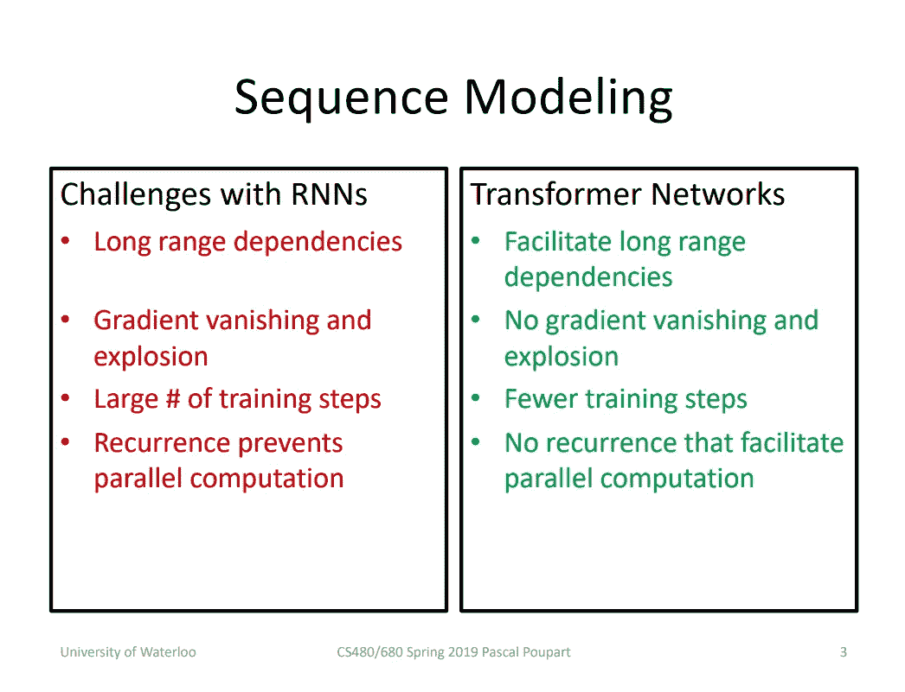
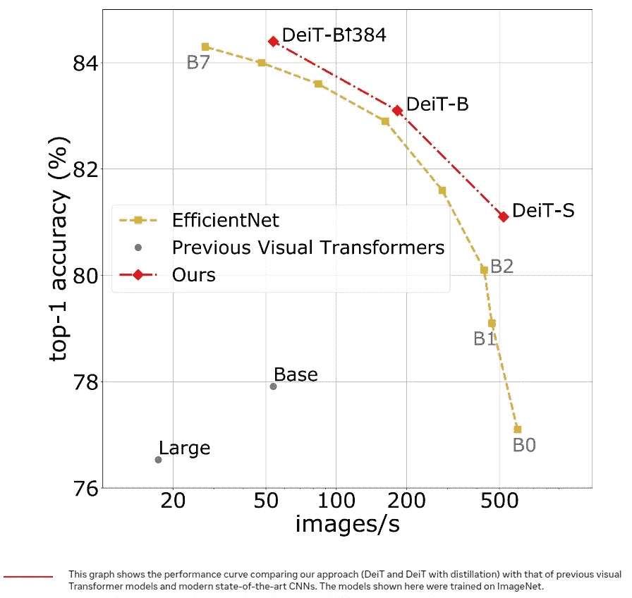

# 2020 年:变形金刚资料片

> 原文：<https://medium.com/codex/year-2020-the-transformers-expansion-in-the-cv-fed9e4c77b55?source=collection_archive---------16----------------------->

在过去的几年中，变压器在自然语言处理领域表现出色。他们显著提高了语言处理模型的性能，其效果可与 2012 年以来通过卷积神经网络对图像理解所做的工作相媲美。现在，在 2020 年底，我们有变形金刚进入知名计算机视觉基准的前四分之一，如 ImageNet 上的[图像分类](https://paperswithcode.com/sota/image-classification-on-imagenet)和 COCO 上的[物体检测](https://paperswithcode.com/sota/object-detection-on-coco-minival)。

继续上一篇关于基于 transformer 的 DETR 和稀疏 R-CNN 的话题，在这篇文章中，我们将概述最近脸书人工智能和索邦大学的联合研究[“训练数据高效的图像转换器&通过注意力的升华”](https://arxiv.org/abs/2012.12877)、他们的 DeiT 模型以及哪些科学成就预测了这项工作。

# 变压器架构

## 概观

用于图像分类的卷积网络的许多改进是受变压器的启发。例如，挤压和激励、选择性核心和分裂注意力网络利用类似于变形金刚**自我注意力机制**的机制。

2017 年推出[“注意力是你所需要的全部”](https://arxiv.org/abs/1706.03762)用于机器翻译的论文目前是所有自然语言处理任务的参考模型。这样的任务是越来越常见的家庭人工智能助理和呼叫中心聊天机器人的核心。Transformer 能够在任意长度的顺序数据中找到依赖关系，而不会使模型变得非常复杂。由此产生了它在序列任务中的出色表现，例如将文本从一种语言翻译成另一种语言，或者创建关于某个问题的答案。

在变压器出现之前，循环网络被用来完成这些任务。让我们来谈谈 rnn 与变压器相比的缺点。下面的幻灯片摘自 Pascal Plupart 的[讲座](https://www.youtube.com/watch?v=OyFJWRnt_AY&t)。

RNNs 与变压器特性的比较

在这里，我们可以看到以下细节:

1.  为了处理长序列并发现数据中的相关性，需要利用具有大递归度的 LSTM 或 GRU，这在实践中意味着具有非常深的神经网络。另一方面，变压器不必很深，以促进远程依赖
2.  在 transformer 的架构中没有渐变消失和爆炸，因为它不是像在 RNNs 中那样进行线性计算，而是同时对整个序列进行计算，实际上它的层数比 RNN 少得多。
3.  由于其架构，变压器不会采取那么多的训练步骤，RNN 和缺乏递归导致并行计算能力。这意味着它可以批量处理输入令牌。

## 结构

变压器有一个编码器-解码器结构

它将令牌输入编码器，并从解码器输出令牌。两部分都由复合块组成，编码器和解码器之间略有不同。

模块的第一部分是**自我关注**层，它帮助模块根据其他输入及其位置对输入进行编码。例如，输入句子中的一个单词。之后，输出进入**前馈**层，该层创建新的表示。解码器模块具有额外的**掩码**层，因为它对两个令牌序列都进行操作，并且它不应该看到下面尚未生成的令牌，即，它采用输入法语句子表示和迄今生成的英语输出单词的嵌入。

为了更好地理解 transformer 架构，看一看 transformer 作者之一的视频和插图丰富的帖子

## 自我关注

网络的这一部分对变压器非常重要，DeiT 架构也高度依赖于此。

简而言之，我们可以将注意力看作是使用查询从(key，value)存储中检索值。其中结果值是基于<query key="">相似性的值的加权和。</query>

这篇论文的作者对此进行了更精确的定义。

> 注意机制基于具有(键，值)向量对的可训练联想记忆。使用内积将查询向量 *q* 与一组 *k* 关键向量(一起打包成矩阵 *K* )进行匹配。然后用 softmax 函数对这些内积进行缩放和归一化，以获得 *k* 权重。一组 *k* 值向量的输出加权和可以写成:

[来源](https://arxiv.org/pdf/2012.12877.pdf)

其中 Softmax 函数应用于输入矩阵的每一行，并且
*d*项提供适当的归一化。

# DeiT 建筑

作者提出的神经网络是这篇[论文](https://arxiv.org/abs/2010.11929)中提出的**视觉转换器** (ViT)的后继者，事实上是其逻辑延续。研究人员提出的新颖性主要体现在以下三个方面。

1.  在没有大量精选数据的情况下，有效地训练可视转换器，而 ViT 的作者则相反。
2.  他们进行了各种实验，研究如何从卷积神经网络中提取知识，这得益于近十年的调整和优化。
3.  并且显示了在准确性和吞吐量之间的折衷方面，提取的模型优于它的老师。

在图中，您可以看到在 ImageNet 上的准确性以及建议的网络变化、EfficientNet (convnet)变化和 ViT 之间的推理速度方面的比较

[来源](https://ai.facebook.com/blog/data-efficient-image-transformers-a-promising-new-technique-for-image-classification)

## 视觉变压器

Visual transformer 有一个简单而优雅的架构，将输入图像视为一系列固定空间大小为 16 × 16 像素的 *N* 个图像块。每个面片都投影有一个线性层，保持其总尺寸为 3 × 16 × 16 = 768。

Transformer block 不知道补丁的顺序，这就是为什么在第一个编码器层之前，固定或可训练的**位置编码**被添加到补丁嵌入中。

为了从监督数据中学习，ViT 使用了 BERT [论文](https://arxiv.org/abs/1810.04805)中提出的**类标记**。班级令牌类似于 conv 网训练中的班级标签。

DeiT 有三种变体。它们的性能如下表所示

[来源](https://arxiv.org/pdf/2012.12877.pdf)

DeiT-B 是与 ViT 相同的型号，即它具有相同的架构，但经过不同的训练。DeiT-Ti 和 DeiT-S 是较小的型号，不同型号之间唯一不同的参数是**嵌入尺寸**和**多头自关注**中的头数。较小的型号具有较低的参数数量和较快的吞吐量。吞吐量是针对分辨率为 224×224 的图像测量的。

## 不同分辨率下的微调

作者采用了本文中[的微调程序。结果表明，使用较低的训练分辨率并以较高的分辨率对网络进行微调是可取的。这种方法加快了全面训练的速度，并在流行的数据扩充方案下提高了
的准确性，当您在 ImageNet1k 这样的相对较小的数据集上训练 transformer 时就存在这种情况。](https://arxiv.org/abs/1906.06423)

当增加输入图像的分辨率时，作者保持块大小不变，因此块的序列长度改变。Transformer 不需要固定长度的序列，但是需要调整面片的位置嵌入。为了做到这一点，作者采用了一种
双三次插值，在微调网络之前，近似保持向量的范数。

## 蒸馏

除了在更大的分辨率下进行数据扩充和微调，作者建议使用与 ViT 相比显著提高 DeiT 性能的技术。他们对 DeiT 进行知识提炼，以转移**的 [**感应偏置**](https://arxiv.org/abs/2006.00555)****。**

在进入性能表之前，我想让你先了解一些情况。

1.  作者提出了**提取令牌，**它与**类令牌**具有相同的性质，与分类令牌一样用于标签预测。提取令牌是一种嵌入，它作为类别令牌输入到网络中，并通过自我关注与其他输入交互。类和提取令牌之间的区别在于，它是从卷积网络的预测中获得的，而不是从基础真值标签中获得的。
2.  使用蒸馏令牌，作者尝试了**软蒸馏**和**硬蒸馏**。简单介绍一下，**软蒸馏**试图最小化教师的 softmax 和学生模型的 softmax 之间的 Kullback-Leibler 分歧，而**硬蒸馏**暗示着将教师的硬决策作为真实标签来调整学生的损失函数。他们在消融研究中显示，标签上的硬蒸馏加上蒸馏标记比其他组合效果更好。

[来源](https://arxiv.org/pdf/2012.12877.pdf)

从论文中可以看出，使用 convnet 作为教师，DeiT-B 获得了比教师更好的结果。例如， [RegNetY-8.0GF](https://paperswithcode.com/paper/designing-network-design-spaces) (注意，由于不同扩充，这份报告和原始报告之间的准确性有所不同)的表现比其学生的表现好两分

上表显示了在微调(第 3 和第 4 列)过程中，DeiT-B 的准确度如何根据蒸馏所用的教师(按行)而变化。教师的初始准确度显示在第二列。

# 给我看看代码！

像往常一样，在最后一部分，你可以找到一个链接，链接到论文的[代码](https://github.com/facebookresearch/deit)。但是如果你想知道这篇论文的主要建议是什么，那就是蒸馏，不幸的是它还没有提供，但是[的一期](https://github.com/facebookresearch/deit/issues/4)说它将很快发布。

# 参考

[1]训练数据高效的图像转换器&通过注意力进行提炼[https://arxiv.org/abs/2012.12877](https://arxiv.org/abs/2012.12877)

[2] CS480/680 第 19 讲:注意力和变压器网络[https://www.youtube.com/watch?v=OyFJWRnt_AY](https://www.youtube.com/watch?v=OyFJWRnt_AY)

[3]图解变压器[http://jalammar.github.io/illustrated-transformer/](http://jalammar.github.io/illustrated-transformer/)