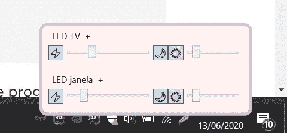
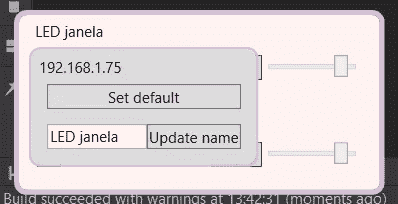
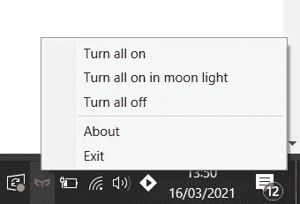

# 适用于 Windows 的 Yeelight LEDs 遥控器

> 原文：<https://medium.com/codex/yeelight-remote-control-for-windows-4d33dc553a96?source=collection_archive---------6----------------------->

## [法典](http://medium.com/codex)

## 我建了一个实用程序来控制 yee light/小米 LED 灯。可以从 Windows 系统托盘中访问它。

我是小米/yee light led 的粉丝，尤其是因为它们可以用作智能家居设备。你可以用小米之家、谷歌之家或 Yeelights 应用程序来控制这些灯，但我想要一些可以在我的 Windows PC 上使用的东西，这样我就不必寻找智能手机、解锁它、寻找应用程序并打开它。

我想象在 Windows 托盘中有什么东西，只需很少的点击，就能让我控制 led。我在网上搜索了一会儿，但什么也没有。我找到了 [Yeelight 控件](https://www.microsoft.com/pt-pt/p/yeelight-control/9n40l49vpdqh?activetab=pivot:overviewtab)(不工作) [Yeelight UWP](https://www.microsoft.com/en-us/p/yeelight-uwp/9nk1nf9zs4l4?activetab=pivot:overviewtab) ，以及 [Yeelight 工具箱](https://thirdparty.yeelight.com/topics/236/yeelight-toolbox#6-Open-source-github-address)(检出[所有 Yeelight 第三方工具](https://thirdparty.yeelight.com/))。没有一个应用程序位于系统托盘中，所有的应用程序都缺少重要的功能(例如切换日光/阳光)，并且需要大量的点击。一句话:**我最终创建了自己的应用**，因为我想尝试一下。NET Core，用 C#玩一会儿，用我想到的方法解决我的问题。

结果是这样的:

它静静地作为一个图标位于 Windows 托盘区

单击它后，它会显示一个 led 列表。您可以控制电源、亮度、温度和照明模式

您可以重命名和设置 LED 的默认状态

有一个功能可以同时作用于所有的发光二极管

📝*我只测试了带 LED 吸顶灯的应用，因为这是我自己的产品。*

您可以在项目的自述文件中找到进一步的说明。

你可以在我的 GitHub 上找到代码:

 [## iso ares/yee light-遥控

### 这个实用程序控制 yee light/小米 LED 灯。可以在 Windows 系统托盘中访问它。仅在 Windows 上运行…

github.com](https://github.com/lsoares/yeelight-remote-control) 

**我学到了什么？**

*   如果你使用它的[早期访问程序(EAP)版本](https://www.jetbrains.com/rider/nextversion/)，Rider IDE 是免费的。这适用于他们所有的 IDEs 。
*   与 Java 相比，C#是不错的，但是我想念很多我在 Kotlin 中用过的语法糖。
*   NuGet 是一个很棒的包管理器，它很好地集成到了 Rider 中。
*   莱德没有可视化编辑器，所以我不得不多次启动这个应用程序(每一个小的变化)，这让我更多地了解了 [WPF](https://en.wikipedia.org/wiki/Windows_Presentation_Foundation) 。